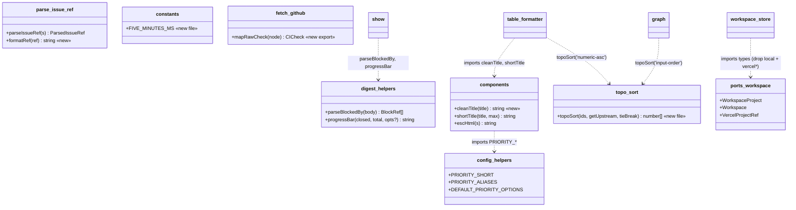
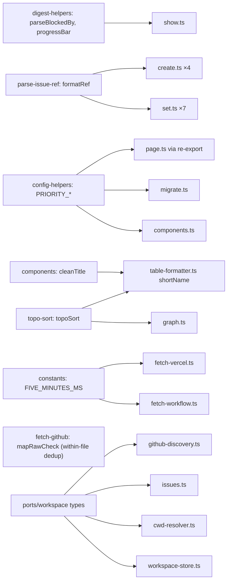

## Context

Promoted from [analysis #193](../analyses/193-extract-shared-ts-helpers-analysis.mdx).
Audit found 11 duplicated helpers in the `dev-core` plugin; analysis resolved 3
unknowns, dropped D19 (client-scope false positive), and confirmed dev-init is an
independent copy (untouched). Net = **10 extractions**, dev-core only, 2 new files.
Decision (approved): **strict behavior preservation** — where two impls differ
(D6, D9, D17), parametrize to preserve every caller's current output rather than
accept a cosmetic change.

## Goal

Each in-scope duplicated helper has exactly one definition, imported at every
former site, with byte-identical CLI output (or a deliberate change proven by test).

## Users

- **Primary:** dev-core maintainers — one edit point per helper, no silent drift.
- **Secondary:** none. dev-init excluded by design; no end-user-visible change.

## Out of Scope

- **D19 `escHtml`** — page.ts:636/649 are client-side JS inside a `<script>`
  template literal (browser runtime); a server-side `escHtml` import is impossible.
  False positive — left unchanged.
- **dev-init plugin** — intentional independent copies (extracted in `f24474e`,
  "self-contained imports"); already diverged (`spawnSync` vs `execSync`, extra
  `getSizeOptionId`; its `migrate.ts` is a wholly different file) and no sync
  mechanism exists. Untouched by #193.
- `CICheck` type dup (types.ts:22 vs shared/domain/types.ts:34) and `set.ts:120
  subjectStr` (primitive cousin of `formatRef`) — absent from the audit; optional
  follow-ups, not this issue.

## Expected Behavior

Pure refactor. For every `issues` / `issue-triage` / `cli` command, output is
identical before and after. Internally:
- D5/D8/D14/D16/D18 — a duplicated definition is deleted and replaced by an import
  of the single canonical one. No logic change.
- D6 `progressBar` gains an `opts` param so both the suffixed (`show.ts`) and
  bar-only (`digest`) call shapes are preserved.
- D9 — the shared 4-regex cleaning chain becomes `cleanTitle()`; each caller keeps
  its own truncation (different thresholds preserved).
- D10 — priority maps resolve to the canonical `config-helpers` definitions;
  `migrate.ts`'s 4-key subset is replaced by the superset `PRIORITY_ALIASES`
  (functionally safe for label parsing, test-locked).
- D13 — `workspace-store.ts` imports `WorkspaceProject`/`Workspace` from `ports/`
  (SSoT) and drops the two dead `vercel*` legacy fields.
- D17 — both topo-sorts call one `topoSort()`; each passes its own `tieBreak` so
  SVG-graph order and chain-display order are unchanged.
- D19 — explicitly NOT touched (client-side `<script>` scope).

## Data Model & Consumers

### Shared-symbol surface (post-refactor)

### Consumer map (who imports each canonical symbol)

### Consumer summary

| Canonical symbol | Home | Consumers (rewired) | Status |
|------------------|------|---------------------|--------|
| `parseBlockedBy` | digest-helpers.ts | show.ts:136 | this issue |
| `progressBar(_,_,opts)` | digest-helpers.ts | show.ts:181 (`{suffix:true}`), digest.ts callers | this issue |
| `formatRef` | parse-issue-ref.ts | set.ts ×7, create.ts ×4 | this issue |
| `cleanTitle` | components.ts | table-formatter.ts:217 (shortName) | this issue |
| `PRIORITY_SHORT/_ALIASES/_OPTIONS` | config-helpers.ts | components.ts:78,127; migrate.ts:157; page.ts:6 | this issue |
| `FIVE_MINUTES_MS` | constants.ts (new) | fetch-workflow.ts:49, fetch-vercel.ts:137 | this issue |
| `topoSort` | topo-sort.ts (new) | graph.ts:33, table-formatter.ts:245 | this issue |
| `mapRawCheck` | fetch-github.ts | fetch-github.ts:206,262 | this issue |
| `WorkspaceProject`/`Workspace` | ports/workspace.ts | workspace-store.ts, cwd-resolver.ts:2, issues.ts:7, github-discovery.ts:3 | this issue |

## Breadboard

Affordances = extraction units **E1–E10** (one per in-scope item). Each:
*source → canonical target → rewire action*.

| ID | Item | Source (file:line) | Canonical target | Rewire | Notes |
|----|------|-------------------|------------------|--------|-------|
| E1 | D5 | digest-helpers.ts:38 = show.ts:17 | digest-helpers.ts (already `export`) | show.ts: drop local, `import { parseBlockedBy }` | byte-identical |
| E2 | D6 | digest-helpers.ts:57 `progressBar` (def)+callers vs show.ts:53 `bar` (def), :181 (call) | digest-helpers.ts `progressBar(closed,total,opts?)` | **opts defaults reproduce current `progressBar` exactly** (`emptyBar=true`→`░░░░░`, `suffix=false`) ⇒ existing progressBar callers untouched; delete show.ts `bar`, repoint :181 → `progressBar(_,_,{suffix:true,emptyBar:false})` | opts `{suffix?=false,emptyBar?=true}` preserves both contracts |
| E3 | D8 | set.ts:210/220/230/240/255/265/291; create.ts:127/136/145/154 | parse-issue-ref.ts `formatRef(ref:ParsedIssueRef)` | replace 11 inline ternaries; import already wired (set.ts:34, create.ts:27) | file exists — **not new** |
| E4 | D9 | components.ts:44 `shortTitle` ≈ table-formatter.ts:217 `shortName` | components.ts `cleanTitle()` (shared 4-regex chain, exported) | components.ts:44 `shortTitle`→`cleanTitle()`+own truncate(max-1); table-formatter.ts:217 `shortName`→`cleanTitle()`+own truncate(17@20) | table-formatter.ts:34 `shortTitle` (truncate-only, **different fn, same name**) left **untouched** |
| E5 | D10 | config-helpers.ts:143/158/292 (canonical) vs components.ts:3/37 vs migrate.ts:157 | config-helpers.ts | components.ts:3 `PRIORITY_SHORT`→import from config-helpers (drop local); `PRIORITY_VALUES`→add `export const PRIORITY_VALUES = [...] as const` in config-helpers, components.ts re-exports it (**preserve `as const` tuple** for page.ts:58,596); migrate.ts:157→`PRIORITY_ALIASES` | migrate 4-key subset→superset sub (safe; test-lock P0–P3) |
| E6 | D13 | workspace-store.ts:9-24 (local + `vercel*`) | ports/workspace.ts (SSoT) | drop local interfaces + 2 dead fields; import from ports; repoint cwd-resolver.ts:2, issues.ts:7, github-discovery.ts:3 | `vercel*` confirmed dead |
| E7 | D14 | fetch-github.ts:206 = :262 | fetch-github.ts `mapRawCheck` (export, co-located) | both → `rawChecks.map(mapRawCheck)` | fetch-workflow has none |
| E8 | D16 | fetch-workflow.ts:19 = fetch-vercel.ts:124 | constants.ts (new) `FIVE_MINUTES_MS` | import in both | `5*60*1000` |
| E9 | D17 | graph.ts:33 (input-order) vs table-formatter.ts:245 (numeric-asc) | topo-sort.ts (new) `topoSort(ids,getUpstream,tieBreak)` | graph→`'input-order'`; table-formatter→`'numeric-asc'` | **order-equivalence tests required** |
| E10 | D18 | migrate.ts:201 `Row` = :628 `BackfillRow` | keep `BackfillRow` | migrate.ts:340 → `BackfillRow[]`; drop `Row` | internal, byte-identical |

**Dropped:** D19 `escHtml` — page.ts:636/649 are client-side JS; no rewire.

## Slices

Vertical increments; after each, `typecheck + lint + test` green and CLI output
unchanged → independently shippable.

| Slice | Includes | Theme | Verification |
|-------|----------|-------|--------------|
| **S1 · Mechanical** | E1, E3, E7, E8, E10 | byte-identical / inline moves, behavior-preserving | existing suite green; `grep -rl` per symbol = 1 |
| **S2 · Nuanced** | E2, E4, E5 | param/contract differences — preserve via opts/split | + new focused unit tests (progressBar opts, cleanTitle, priority resolution) |
| **S3 · Locked + reconcile** | E9, E6 | algo change (tie-break) + type reconciliation | + new topoSort order-equivalence tests; typecheck proves D13 type unification |

**Ordering & file-coupling constraints** (architect review):
- **S1 → S2 → S3 strictly sequential**; each slice commits as one unit (a slice's
  `grep`/new-file criteria only hold once all its sites are wired).
- `table-formatter.ts` is edited by **E4 (S2)** *and* **E9 (S3)** → S3 branches from
  an S2-green commit; **never** run E4 and E9 in parallel.
- `components.ts` is edited by **E4 and E5** within S2 → sequential, not parallelized.
- S1 items are file-disjoint from one another → safe to fan out across agents.

## Success Criteria

- [ ] Each deduped symbol (E1–E10) is **defined exactly once** in dev-core: `grep -rn` for the *definition* (`export function`/`export const`/`function`/`interface`) returns one site for `parseBlockedBy`, `progressBar`, `formatRef`, `cleanTitle`, `mapRawCheck`, `FIVE_MINUTES_MS`, `topoSort`; `PRIORITY_SHORT`/`PRIORITY_ALIASES`/`PRIORITY_VALUES` defined only in `config-helpers.ts` (components.ts re-exports, not redefines); `interface Row` removed.
- [ ] D17: a single `topoSort` is used by both `graph.ts` and `table-formatter.ts`, and new unit tests assert output ordering against **explicit expected-order cases** (linear / tie / cycle) that reproduce each caller's current ordering for both `input-order` and `numeric-asc` modes.
- [ ] D6/D9/D10 are behavior-preserving: unit tests confirm identical output for `progressBar` (suffix + `total=0` cases), `cleanTitle`/`shortName`, and priority resolution (P0–P3 via `PRIORITY_ALIASES`).
- [ ] D13: `vercelProjectId`/`vercelTeamId` deleted; `WorkspaceProject`/`Workspace` imported from `ports/workspace.ts`; `grep -rn '\.vercelProjectId\|\.vercelTeamId'` → 0 hits; typecheck green.
- [ ] D19 left unchanged and `plugins/dev-init/**` untouched (`git diff --stat` shows neither `page.ts` escHtml edits nor any `dev-init/` path).
- [ ] 2 new files exist (`skills/issues/lib/constants.ts`, `skills/issues/lib/topo-sort.ts`); `parse-issue-ref.ts` gains `formatRef` with **no** new file created for it.
- [ ] `bun run typecheck`, `bun run lint`, `bun run test` all pass.
- [ ] No behavior change to any `issues`/`issue-triage`/`cli` command output: the existing test suite — **including the `set`/`create` paths that exercise the 11 `formatRef` rewire sites (E3)** — remains green with zero output diffs (E3 is covered by the existing suite, no new test required).
