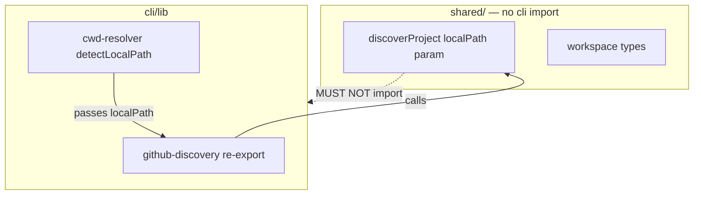

## Context

Source: [analysis](../analyses/195-architecture-ssot-fixes-in-dev-core-shared-layer-analysis.mdx)
(promoted) ← [frame](../frames/195-architecture-ssot-fixes-in-dev-core-shared-layer-frame.mdx).
7 audit findings; #3 is verify-only (already resolved in dev-core). Shape 1
(centralize-in-place) chosen; 5 review-hardened constraints carried below.

## Goal

Remove the dev-core shared-layer debt — one-way dependency arrow, live error hierarchy, one
SSoT per concern, zero Roxabi strings — with **no behavior change** to any skill, CLI, or hook.

## Users

- **Primary:** dev-core maintainers (pay the drift tax on every edit).
- **Secondary:** OSS plugin users (rely on project-agnostic behavior; #6 leaks Roxabi strings).

## Expected Behavior

After the change, all existing commands behave identically:
- `triage set --type <t>` validates against the centralized type list (same accepted values).
- `checkup`/doctor and the `format` hook parse `.claude/stack.yml` through one parser (same fields).
- `github-adapter` failures throw typed errors that still satisfy `catch (e: Error)`.
- `issues digest` lane assignment is unchanged for default patterns.
- license checks (TS + Python) accept the same `.license-policy.json` (old key still works).
- `git-workspace` resolves projects with no import reaching up into `cli/`.

## Data Model & Consumers

```mermaid
classDiagram
  class IssueTypes {
    <<shared/domain/issue-types.ts — pure>>
    +ISSUE_TYPE_NAMES: string[]  // feat,fix,docs,test,chore,ci,perf,refactor
    +EXTENDED_ISSUE_TYPES: string[]  // epic,research
  }
  class LanePatterns {
    <<shared/domain/lane-patterns.ts — pure>>
    +LANE_PATTERNS: {A: RegExp, C: RegExp}
  }
  class StackYml {
    <<hooks/lib/parse-stack-yml.js — CJS>>
    +parseStackYml(text): {formatters, platform, frontend, packageManager, standards}
  }
  class Errors {
    <<shared/domain/errors.ts — existing>>
    +GitHubApiError
    +ConfigError
    +DevCoreError
  }
  IssueTypes <.. set_ts : import
  IssueTypes <.. migrate_ts : import (names only)
  LanePatterns <.. digest_helpers_ts : import
  StackYml <.. format_js : require
  StackYml <.. doctor_ts : import
  Errors <.. github_adapter_ts : throw
```



### Consumer summary

| Consumer | Reads | When | Status |
|----------|-------|------|--------|
| `set.ts applyType` | `ISSUE_TYPE_NAMES` + `EXTENDED_ISSUE_TYPES` | `--type` validation | this issue |
| `migrate.ts` | `ISSUE_TYPE_NAMES` | legacy label backfill | this issue |
| `digest-helpers.ts lane()` | `LANE_PATTERNS` | digest lane assign | this issue |
| `format.js` (hook) | `parseStackYml` via require | pre-commit format | this issue |
| `doctor.ts` | `parseStackYml` via import | checkup | this issue |
| `github-adapter.ts` | typed error classes | on failure | this issue |
| `licenseChecker.ts` | `allowlist ?? allowedLicenses` | license scan | this issue |

## Breadboard — module wiring

| ID | Element (export) | New home | Consumers wired |
|----|------------------|----------|-----------------|
| N1 | `ISSUE_TYPE_NAMES`, `EXTENDED_ISSUE_TYPES` | `shared/domain/issue-types.ts` (new, pure) | `set.ts`, `migrate.ts` |
| N2 | `LANE_PATTERNS` | `shared/domain/lane-patterns.ts` (new, pure) | `digest-helpers.ts` |
| N3 | `parseStackYml()` | `hooks/lib/parse-stack-yml.js` (new, CJS) | `format.js` (require), `doctor.ts` (import) |
| N4a | `discoverProject(…, localPath?)` | moved into `shared/adapters/` | `cli/lib/github-discovery.ts` re-exports + passes `localPath` |
| N4b | `readWorkspace`/`writeWorkspace`/`getWorkspacePath`/`parseWorkspace` | moved into `shared/adapters/workspace-store.ts` | `git-workspace.ts` imports from shared; `cli/lib/workspace-store.ts` re-exports for back-compat |
| N4c | `WorkspaceProject`/`Workspace`/`VercelProjectRef` types | **collapse dup** → sole def in `shared/ports/workspace.ts` | workspace-store + github-discovery import the port type (delete the duplicate interfaces) |
| N5 | typed throws | `github-adapter.ts` + `config-helpers.ts:83,261` + `github-infra.ts:54` (edit) | catch sites (additive) |
| N6 | `allowlist ?? allowedLicenses` read | `tools/licenseChecker.ts` (edit) | `.license-policy.json` |

## Slices

| # | Slice | Findings | Files | Demo |
|---|-------|----------|-------|------|
| 1 | Wire error hierarchy (N5) | #2 | `github-adapter.ts`, `config-helpers.ts`, `github-infra.ts` | GitHub/config throws use typed classes; test asserts `instanceof` + `.statusCode` |
| 2 | Extract SSoT constants (N1,N2) | #4, #6 | new `issue-types.ts`, `lane-patterns.ts`; `set.ts`, `migrate.ts`, `digest-helpers.ts` | one list each; consumers import; behavior identical |
| 3 | Unify stack.yml parser (N3) | #5 | new `hooks/lib/parse-stack-yml.js`; `format.js`, `doctor.ts` | one parser, both runtimes; format + checkup unchanged |
| 4 | Break dependency cycle (N4a-c) | #1 | move `discoverProject` **and** workspace-store impl into `shared/`; collapse dup `WorkspaceProject` type → port; `git-workspace.ts`, `cli/lib/{github-discovery,workspace-store,cwd-resolver}.ts` | `grep -rE "from '.*cli/" shared/` = ∅ |
| 5 | Align license policy keys (N6) | #7 | `tools/licenseChecker.ts` | `allowlist` and `allowedLicenses` both parse |

Slices are independently committable; order is 1→5 (architect: do #2 before #4 so shared is clean).
Slice 4 must break **both** cli imports (`github-discovery` *and* `workspace-store`), not just `discoverProject`.

## Success Criteria

- [ ] **#1 (N4a-c)** `grep -rEl "from '.*cli/" plugins/dev-core/skills/shared/` returns **zero** files; `discoverProject` + `readWorkspace`/`writeWorkspace`/`getWorkspacePath`/`parseWorkspace` exist in `plugins/dev-core/skills/shared/adapters/` (verify file location, not just deleted import); `cli/lib/{github-discovery,workspace-store}.ts` re-export them; `discoverProject` accepts a `localPath` param that cli callers populate via `detectLocalPath()`; `WorkspaceProject`/`Workspace` defined only in `shared/ports/workspace.ts` (`grep -rc "export interface WorkspaceProject" plugins/dev-core` = 1).
- [ ] **#2 (N5)** `grep -rn "throw new Error" plugins/dev-core/skills/shared/adapters/{github-adapter,config-helpers,github-infra}.ts` returns **zero** GitHub/config-failure throws (each replaced by `GitHubApiError`/`ConfigError`/`DevCoreError`); a test asserts a `github-adapter` HTTP failure is `instanceof GitHubApiError` with a populated `.statusCode`.
- [ ] **#3 (verify-only)** `grep -cE "execSync|child_process" plugins/dev-core/skills/shared/adapters/config-helpers.ts` outputs `0` (machine-checked, recorded in PR body; no code change).
- [ ] **#4 (N1)** `ISSUE_TYPE_NAMES`+`EXTENDED_ISSUE_TYPES` defined once in `shared/domain/issue-types.ts` (pure literals, no module-scope call); `set.ts` `VALID_TYPES` composed from both; `migrate.ts` imports `ISSUE_TYPE_NAMES` only; `triage set --type` accepts the same 10 values as before (test).
- [ ] **#5 (N3)** one `parseStackYml` logic source consumed by `format.js` (require) and `doctor.ts` (import); a parser unit test against a **committed fixture** `plugins/dev-core/skills/shared/__tests__/fixtures/sample-stack.yml` asserts all 5 fields (formatters, platform, frontend, package_manager, standards); existing `format`/`checkup` tests stay green.
- [ ] **#6 (N2)** `lane()` body contains no inline Roxabi literals (`grep -n "brand\|lora\|pulid\|avatar" plugins/dev-core/skills/issues/lib/digest-helpers.ts` = 0); reads `LANE_PATTERNS`; existing `digest-helpers.test.ts` cases still pass with default patterns; a new test asserts (a) a default-pattern title → its current lane AND (b) the same title with an overridden `LANE_PATTERNS` → a different lane.
- [ ] **#7 (N6)** `tools/licenseChecker.ts` reads `policy.allowlist ?? policy.allowedLicenses`; a policy fixture using each key both pass; Python `license_check.py` unaffected (already `allowlist`).
- [ ] **Global** `bun run typecheck` + `bun run test` + `bun run lint` all green; no skill/CLI/hook behavior change.

## Edge Cases

| Edge | Handling |
|------|----------|
| Bun fails to import the CJS `parse-stack-yml.js` | Fallback: keep JS module for hook + thin TS wrapper re-exporting it for doctor (one logic source) |
| `cwd-resolver` still needed by other cli callers | Leave it in `cli/`; only `discoverProject` stops importing it (param injection) |
| Existing `.license-policy.json` uses `allowedLicenses` | `??` read keeps it working; canonical key documented as `allowlist` |
| `migrate.ts` legacy map must exclude epic/research | import `ISSUE_TYPE_NAMES` only, not `EXTENDED_ISSUE_TYPES` |
| dev-init holds diverged copies | out of scope (frame); record follow-up issue note |

## Out of Scope

- dev-init plugin copies (separate follow-up).
- Cross-plugin shared-package mechanism (Shape 3).
- Any new feature; behavior-preserving refactor only.
