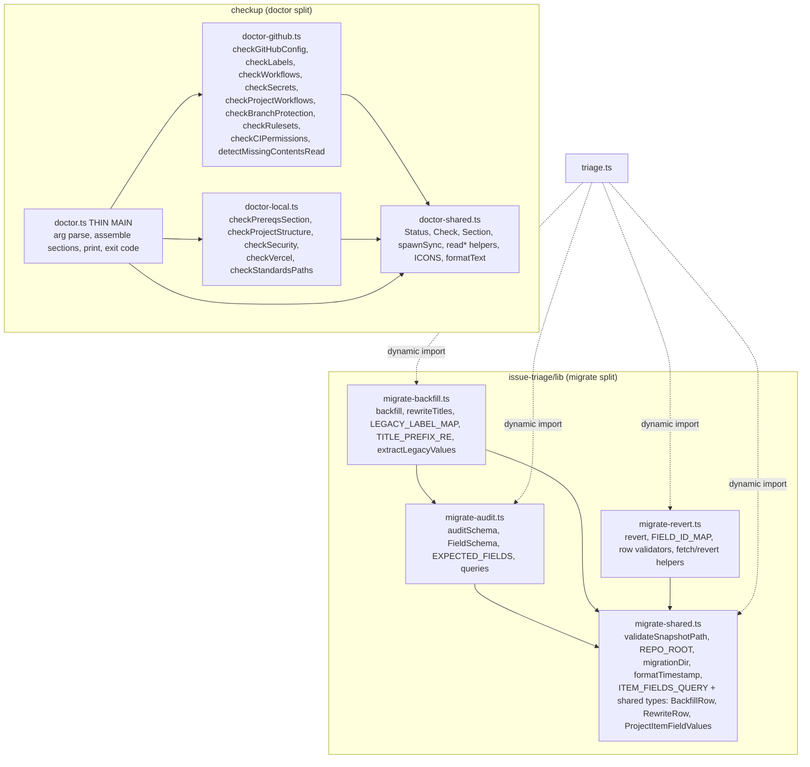
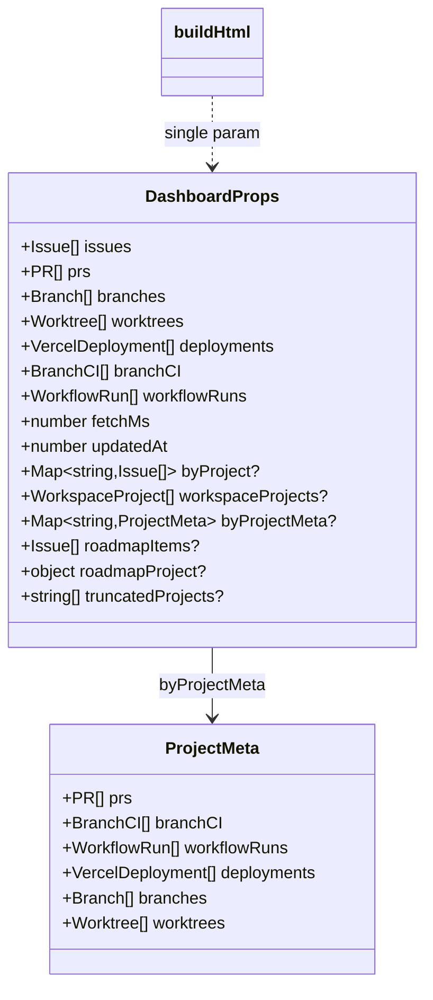

## Context

Source: [frame](../frames/196-split-oversized-files-frame.mdx) (analysis skipped — F-lite).
A dev-core audit flagged two oversized modules plus two adjacent code-quality smells.
This spec defines a **behavior-preserving** decomposition: no functional change, all existing
tests + typecheck stay green.

Current state (verified in worktree):

| File | Lines | Concern mix |
|------|-------|-------------|
| `skills/issue-triage/lib/migrate.ts` | 898 | audit + backfill/rewrite + revert in one module |
| `skills/checkup/doctor.ts` | 946 | GitHub checks + local checks + render + script main; **13×** inline `require('node:fs')` (issue said 15; 13 verified in worktree) |
| `skills/issues/lib/page.ts` | 979 | `buildHtml` 15 positional params; local `ProjectMeta` (dup) |
| `skills/issues/dashboard.ts` | — | duplicate `ProjectMeta` (L37); 2 `buildHtml` call sites |
| `cli/commands/dashboard.ts` | 80 | 2× `require('node:fs').unlinkSync` (L47, L62) despite static import at L1 |

## Goal

Decompose the two oversized modules along their natural concern boundaries and eliminate the
flagged smells, with zero behavior change.

## Users

- **Primary:** dev-core maintainers editing triage migration, checkup diagnostics, issues dashboard.
- **Secondary:** plugin users — behavior must remain identical.

## Expected Behavior

After the refactor:
- `triage.ts` CLI subcommands (`audit-schema`, `backfill`, `rewrite-titles`, `revert`) behave identically — they now dynamically import from the three `migrate-*.ts` modules instead of one `migrate.ts`.
- `checkup` (`doctor.ts`) produces byte-identical text/JSON output; the thin `doctor.ts` orchestrates section builders imported from `doctor-github.ts` / `doctor-local.ts`.
- The issues dashboard renders identically; `buildHtml` is called with one typed `DashboardProps` object instead of 15 positional args.
- `ProjectMeta` is defined once (in `lib/types.ts`) and imported by both `page.ts` and `dashboard.ts`.
- No inline `require('node:fs')` remains in the touched files — replaced by static `node:fs` ES imports.

## Data Model & Consumers

### New module decomposition

### DashboardProps + single ProjectMeta

Both `ProjectMeta` and `DashboardProps` live in `skills/issues/lib/types.ts` (already the
shared type module; defines `Issue`, `PR`, `Branch`, `WorkflowRun`, `VercelDeployment`, etc.).

### Consumer summary

| Consumer | Consumes | Status |
|----------|----------|--------|
| `triage.ts` | `auditSchema` / `backfill` / `rewriteTitles` / `revert` / `validateSnapshotPath` from `migrate-*` | this issue |
| `doctor.ts` (main) | section builders from `doctor-github.ts`, `doctor-local.ts`, `doctor-shared.ts` | this issue |
| `page.ts` `buildHtml` | `DashboardProps`, `ProjectMeta` from `lib/types.ts` | this issue |
| `dashboard.ts` (issues) | `DashboardProps`, `ProjectMeta` from `lib/types.ts`; 2 call sites pass props object | this issue |

## Breadboard

Refactor (no new UI/API affordances) — the "module map" above is the breadboard.
Wiring rules:

| ID | Place | Wire |
|----|-------|------|
| M1 | `migrate-shared.ts` | export `validateSnapshotPath`, `REPO_ROOT`, `migrationDir`, `formatTimestamp`, `ITEM_FIELDS_QUERY`, and the cross-boundary types `BackfillRow` / `RewriteRow` / `ProjectItemFieldValues` (used by both backfill and revert) |
| M2 | `migrate-{audit,backfill,revert}.ts` | each **exports its own** public fns directly (no barrel). Each imports shared symbols from M1. `migrate-backfill.ts` additionally imports `auditSchema` from `migrate-audit.ts` (backfill runs an audit first). No `index.ts` barrel — no re-export of M1 symbols. |
| M3 | `triage.ts` | currently uses **dynamic** `await import('./lib/migrate')` per subcommand. Keep dynamic style; change each path: `audit-schema`→`migrate-audit`, `backfill`→`migrate-backfill`, `rewrite-titles`→`migrate-backfill`, `revert`→`migrate-revert`. Import `validateSnapshotPath` from `migrate-shared` (separate dynamic import in the 3 branches that need it). |
| D1 | `doctor-shared.ts` | export `Status`, `Check`, `Section`, `spawnSync`, `read*` helpers, `ICONS`, `formatText`; static `import { existsSync, readFileSync } from 'node:fs'` at top |
| D2 | `doctor-{github,local}.ts` | import from D1; export their `check*` fns. **Each file that touches fs adds its own static `import { existsSync, readFileSync } from 'node:fs'`** — all 13 `require('node:fs')` call sites land in whichever split module owns them and switch to the static import (none remain inline). |
| D3 | `doctor.ts` | thin: import builders, assemble `sections`, print, exit code |
| P1 | `lib/types.ts` | add+export `ProjectMeta` and `DashboardProps`; type `roadmapProject` concretely as `{ label: string; projectId: string }` (not `object`) |
| P2 | `page.ts` | `buildHtml(p: DashboardProps)`; remove local `ProjectMeta` → import from `./types` |
| P3 | `dashboard.ts` (issues) | remove local `ProjectMeta` → import from `./lib/types`; both `buildHtml` call sites → single object literal |
| C1 | `cli/commands/dashboard.ts` | add `unlinkSync` to the L1 `node:fs` import; drop both `require('node:fs')` (L47, L62) |

## Slices

**Slice 0 (prep, before any edits):** capture a checkup baseline for the byte-comparison in Slice 2 —
`bun skills/checkup/doctor.ts --json > /tmp/doctor-baseline.json` (run from `plugins/dev-core`, against the current repo state). Not committed.

| # | Slice | Files | Demo (independently verifiable) |
|---|-------|-------|---------------------------------|
| 1 | Split `migrate.ts` | `migrate-{shared,audit,backfill,revert}.ts` (new), delete `migrate.ts`, `triage.ts` | `bun run typecheck` green; triage migrate subcommands unchanged; tests pass |
| 2 | Split `doctor.ts` + fix `require` | `doctor-{shared,github,local}.ts` (new), thin `doctor.ts` | `bun run typecheck` green; `doctor --json` diffs clean vs `/tmp/doctor-baseline.json` (same repo state); `grep -rc "require('node:fs')" skills/checkup` == 0 |
| 3 | `DashboardProps` + single `ProjectMeta` + cli require fix | `lib/types.ts`, `page.ts`, `dashboard.ts`, `cli/commands/dashboard.ts` | `bun run typecheck` green; no dup `ProjectMeta` (single definition); `grep -c "require('node:fs')" cli/commands/dashboard.ts` == 0 |

## Success Criteria

- [ ] `migrate.ts` is deleted; `migrate-{shared,audit,backfill,revert}.ts` exist; every new file ≤ 550 l; `triage.ts` imports the split modules and all four migrate subcommands (`audit-schema`, `backfill`, `rewrite-titles`, `revert`) run unchanged.
- [ ] `doctor.ts` is a thin main delegating to `doctor-github.ts` + `doctor-local.ts` (+ `doctor-shared.ts`); every new file ≤ 550 l; `bun skills/checkup/doctor.ts --json` produces a clean diff against the Slice-0 baseline (`/tmp/doctor-baseline.json`) for the same repo state.
- [ ] Zero inline `require('node:fs')` remains in the checkup split modules and in `cli/commands/dashboard.ts` (`grep -rc "require('node:fs')" skills/checkup cli/commands/dashboard.ts` == 0) — all replaced by static `node:fs` ES imports.
- [ ] `buildHtml` takes a single `DashboardProps` argument; both call sites in `skills/issues/dashboard.ts` pass one object literal.
- [ ] `ProjectMeta` is defined exactly once (in `skills/issues/lib/types.ts`) and imported by `page.ts` and `dashboard.ts` — no duplicate definition remains (`grep -rn "^type ProjectMeta\|^export type ProjectMeta\|ProjectMeta = {" skills/issues` shows one definition).
- [ ] `bun run typecheck`, `bun run lint`, and `bun run test` all pass with zero behavior change.
