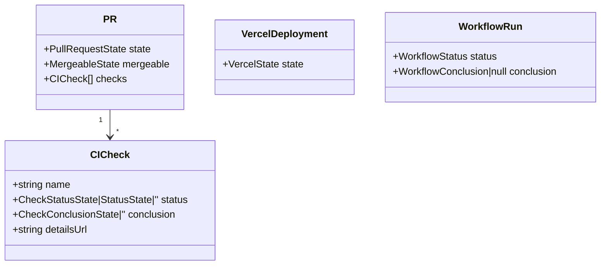
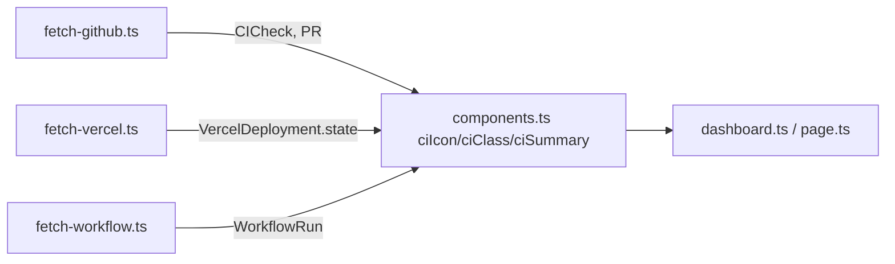

## Context

Source: `artifacts/frames/197-silent-errors-weak-types-perf-hotspots-frame.mdx`.
A dev-core audit (#197) enumerated robustness + perf debt in the `issues`
tooling and hooks. `/recheck` confirmed 6 of 7 items live against current code;
the 7th (`graph.ts` O(n²) topo) was resolved by #193 and is **out of scope**.

All cited paths are under `plugins/dev-core/`. Line numbers below are
current-HEAD (post-churn), not the issue's stale numbers.

## Goal

Eliminate silent fetch failures, replace `string`-typed GitHub/Vercel/workflow
state fields with enum literal unions checked by `tsc`, and remove three
redundant-IO perf hotspots — with zero behavioral regressions.

## Users

- **Primary:** dev-core maintainers running/debugging the `issues` dashboard,
  `show`, the license checker, and the security-check hook.
- **Secondary:** plugin consumers relying on accurate dashboard state and a fast
  pre-commit hook.

## Expected Behavior

1. When a `fetch*` call throws (network, auth, malformed payload), the failure is
   logged to **stderr** with a context tag, and the function still returns its
   empty fallback — the dashboard degrades gracefully **and** leaves a trail.
2. `tsc` rejects assigning an invalid literal (e.g. `state: 'OPN'`) to a typed
   state field; valid GraphQL/REST states + the existing `''` fallback compile.
3. The license checker reads each package's `package.json` **once**; output of
   `checkCompliance` is byte-identical to today.
4. `show.ts` produces identical output with **one** GraphQL roundtrip for
   sub-issues + blockers instead of two.
5. The security-check hook writes its state file only when a new warning is
   recorded; blocking decisions are unchanged.

## Data Model & Consumers

### Data structures (enum unions replace `string`)

Enum members (GraphQL = UPPER, REST = lower — divergence is intentional, not a bug):

| Type | Members |
|---|---|
| `CheckStatusState` | `QUEUED REQUESTED IN_PROGRESS COMPLETED WAITING PENDING` |
| `CheckConclusionState` | `ACTION_REQUIRED TIMED_OUT CANCELLED FAILURE SUCCESS NEUTRAL SKIPPED STARTUP_FAILURE STALE` |
| `StatusState` (commit status contexts) | `EXPECTED ERROR FAILURE PENDING SUCCESS` |
| `PullRequestState` | `OPEN CLOSED MERGED` |
| `MergeableState` | `MERGEABLE CONFLICTING UNKNOWN` |
| `VercelState` | `QUEUED BUILDING ERROR INITIALIZING READY CANCELED` |
| `WorkflowStatus` (REST) | `queued in_progress completed waiting requested pending` |
| `WorkflowConclusion` (REST) | `success failure neutral cancelled skipped timed_out action_required stale startup_failure` |

`''` is a union member of `CICheck.status`/`CICheck.conclusion` because
`fetch-github.ts` maps via `node.status || node.state || ''` and `?? ''`.

> **Out of scope (types):** `BranchCI.overallState` stays `string`. Its value
> comes from the `StatusCheckRollup.state` commit-level rollup (a separate
> field, not driven through the `ciIcon`/`ciClass` switch paths). Tightening it
> is deferred to avoid widening the diff on a hot file.

### Consumer map

| Consumer | Fields consumed | Status |
|---|---|---|
| `components.ts` `ciIcon`/`ciClass` | `CICheck.status`, `CICheck.conclusion` (string literals) | this issue — params stay `string`-compatible via union widening |
| `components.ts` `ciSummary` | `CICheck.status`/`conclusion` | this issue |
| `fetch-vercel.ts` | `VercelDeployment.state === 'READY'` | this issue |
| `dashboard.ts`/`page.ts` | render-only, no comparisons | unaffected |

> **Consumer-safety rule:** `ciIcon(status: string, ...)` callers pass union
> values — union ⊆ string, so signatures may stay `string` or tighten to the
> union; either compiles. Do **not** narrow consumer params in a way that breaks
> the `''` fallback paths.

## Breadboard

| ID | Affordance | Handler | Data |
|---|---|---|---|
| N1 | `safeAsync<T>(fn, fallback, context)` | new `skills/issues/lib/safe-async.ts` | logs `err.message` to stderr, returns `fallback` |
| N2 | 6 **outer** fetch try/catch → `safeAsync` | `fetch-github.ts` `fetchPRs`+`fetchBranchCI`, `fetch-git.ts` `fetchBranches`+`fetchWorktrees`, `fetch-vercel.ts` `fetchVercelDeployments`, `fetch-workflow.ts` `fetchWorkflowRuns` | wraps existing body, fallback `[]` |
| N3 | enum union types | `skills/issues/lib/types.ts` (+ optional `gh-enums.ts`) | the 8 unions above |
| N4 | `RawPackageInfo` carries `license`/`licenses` | `tools/licenseChecker.ts` `readPackageInfo` | populated at parse time (defensive `Object.create(null)`) |
| N5 | `detectLicense` reuses N4 fields | `tools/licenseChecker.ts` | re-read only if fields absent |
| N6 | merge 2 GraphQL → 1 | `show.ts` | single `issue(){ subIssues, trackedInIssues }` query |
| N7 | lift `loadState`/`saveState` to `main()` | `hooks/security-check.js` | `checkContent(content, path, state)`; dirty flag → conditional `saveState` |

Wiring: N1→N2 (helper before callers). N3 independent. N4→N5 (field before reuse). N6, N7 independent.

> **Intentional inner swallow-guards — NOT wrapped:** `fetchBuildLogs`'s inner
> catch (`fetch-vercel.ts`) and `getGitHubToken`'s inner catch
> (`fetch-workflow.ts`) deliberately return a local empty/`''` value and are
> already graceful by design. They are **excluded** from N2; SC2's grep targets
> only the 6 named outer functions.

## Slices

| # | Slice | Affordances | Files | Demo |
|---|---|---|---|---|
| 1 | Silent errors → `safeAsync` | N1, N2 | `safe-async.ts` (new), `fetch-github.ts`, `fetch-git.ts`, `fetch-vercel.ts`, `fetch-workflow.ts` | force a fetch throw → stderr log + `[]` returned; unit test on `safeAsync` |
| 2 | Weak types → enum unions | N3 | `types.ts` (+ `gh-enums.ts`), `fetch-*.ts` map sites, `components.ts` | `tsc` clean; bad-literal assignment fails typecheck |
| 3 | Perf hotspots | N4, N5, N6, N7 | `licenseChecker.ts`, `show.ts`, `security-check.js` | license report byte-identical; `show.ts` 1 roundtrip; hook skips redundant write |

Slices are independent and individually shippable. **Descope order under staging
churn** (per project convention): slice 3 perf items are the most deferrable;
slice 1 (silent errors) is the irreducible core. **Within slice 3** the three
items (N4/N5 licenseChecker, N6 show.ts, N7 security-check) are mutually
independent and individually deferrable — drop N7 first (lowest value: hook is
single-file-per-invocation), then N6, then N4/N5.

## Success Criteria

- [ ] `safeAsync<T>(fn, fallback, context)` exists in `skills/issues/lib/safe-async.ts`, logs `context` + error message to stderr, returns `fallback` on throw; has a unit test covering success + throw paths.
- [ ] The 6 named outer fetch functions (`fetchPRs`, `fetchBranchCI`, `fetchBranches`, `fetchWorktrees`, `fetchVercelDeployments`, `fetchWorkflowRuns`) route failures through `safeAsync` with a context tag; none retains a bare swallow. The 2 intentional inner guards (`fetchBuildLogs`, `getGitHubToken`) are left as-is. (verify by reading the 6 functions, not a blanket `catch` grep — `catch (e) {` forms also count as bare if unlogged.)
- [ ] `CICheck`, `PR`, `VercelDeployment`, `WorkflowRun` state/status/conclusion/mergeable fields are enum literal unions (no bare `string`); a deliberately-invalid literal fails `tsc`.
- [ ] `bun run typecheck`, `bun run lint`, `bun run test` all pass. Zero behavioral regression pinned per-slice: SC5 (license report unchanged), SC6 (`show.ts` output identical for the two fixture cases), SC7 (block decisions reproduce) — no separate global dashboard diff is required since the dashboard fetch paths are output-identical by construction (fallback values unchanged).
- [ ] `licenseChecker.ts` reads each `package.json` once: `detectLicense` consumes parsed fields from `RawPackageInfo` (re-read only when absent); `checkCompliance` output unchanged on this repo.
- [ ] `show.ts` issues exactly one `ghGraphQLExec` for sub-issues + blockers; output identical for an issue with sub-issues and one without.
- [ ] `security-check.js` loads state once and writes only when a new warning is added; existing block decisions reproduce on the known patterns.
- [ ] No new runtime deps; biome-clean; conventional commits per slice.
