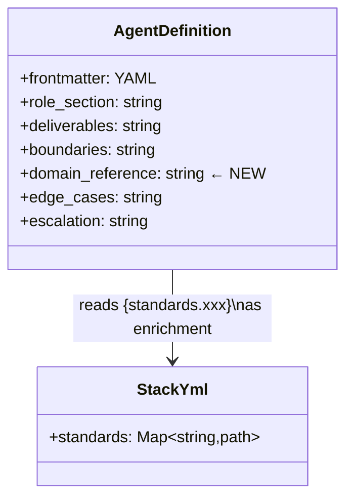
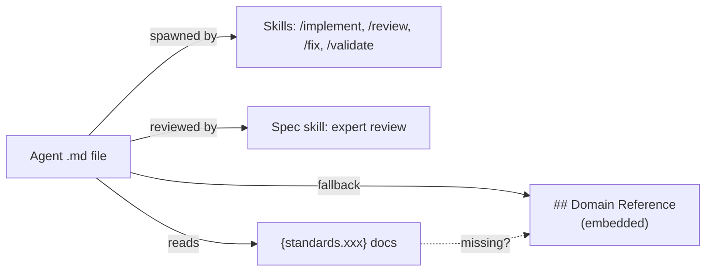

## Context

Promoted from [frame](../frames/21-enrich-agent-expertise-frame.mdx). Analysis skipped (F-lite — clear scope).

`security-auditor.md` (170 lines) is the only agent with embedded domain expertise (OWASP checklist, severity matrix, exclusions). The other 8 agents (55–82 lines) delegate to `{standards.xxx}` and produce generic output when those paths are missing.

## Goal

Every agent has an embedded domain reference section (≥30 lines of actionable content) that serves as fallback knowledge when `stack.yml` standards are unavailable, following the `security-auditor.md` pattern: structured checklists, severity/classification tables, concrete examples.

## Users

- **Primary:** dev-core plugin users — teams running agents for architecture, implementation, review, and ops tasks
- **Secondary:** plugin maintainers — self-contained agents are easier to validate and debug

## Expected Behavior

When a user spawns any agent (e.g., `architect`, `backend-dev`), the agent has embedded checklists and patterns it can reference even if `{standards.xxx}` docs don't exist. The embedded section sits between the existing `## Deliverables`/`## Boundaries` and `## Edge Cases` sections as a new `## Domain Reference` section. Agents still read `{standards.xxx}` when available — embedded content is the baseline, not a replacement.

## Data Model & Consumers

| Consumer | Fields consumed | When | Status |
|----------|----------------|------|--------|
| Skills (/implement, /review, /fix) | Full agent definition | Agent spawn | This issue |
| Spec skill (expert review) | Agent role + domain ref | Step 4 review | This issue |
| stack.yml standards | `{standards.xxx}` paths | Agent init | Existing (unchanged) |

## Breadboard

### Affordances

| ID | Element | Location |
|----|---------|----------|
| A1 | `## Domain Reference` section | Each agent .md file |
| A2 | Checklists (structured bullets) | Within A1 |
| A3 | Classification/severity tables | Within A1 (where applicable) |
| A4 | Anti-patterns list | Within A1 |
| A5 | Concrete examples (what to flag/ignore) | Within A1 |

### Wiring

| From | To | Trigger |
|------|-----|---------|
| A1 | Agent behavior | Agent spawned; `{standards.xxx}` missing → use A1 as fallback |
| A1 | Agent behavior | Agent spawned; `{standards.xxx}` exists → A1 supplements |
| A2–A5 | Agent output quality | Agent applies checklists/patterns to its task |

## Slices

| # | Slice | Agents | Demo |
|---|-------|--------|------|
| 1 | Core architects | `architect.md`, `backend-dev.md` | Architect has Clean Architecture + Hexagonal patterns; backend-dev has REST + ORM + error handling patterns |
| 2 | Interface builders | `frontend-dev.md`, `devops.md` | Frontend-dev has component design + a11y patterns; devops has CI/CD + Docker + secrets patterns |
| 3 | Process owners | `product-lead.md`, `doc-writer.md` | Product-lead has triage matrix + spec checklist; doc-writer has quality checklist + framework patterns |
| 4 | Quality enforcers | `tester.md`, `fixer.md` | Tester has enriched test strategy patterns; fixer has fix classification + scope rules |

Each slice is independently demo-able: validate by reading the agent file and confirming ≥30 lines of actionable embedded content.

## Success Criteria

- [ ] `architect.md` has `## Domain Reference` with Clean Architecture layers, dependency rule, hexagonal patterns (ports/adapters), anti-patterns to flag
- [ ] `backend-dev.md` has `## Domain Reference` with RESTful conventions (status codes, naming, idempotency), ORM best practices (N+1, transactions), domain exception → HTTP mapping
- [ ] `frontend-dev.md` has `## Domain Reference` with component design (smart vs dumb, co-location), state management signals, WCAG 2.1 AA baseline, performance patterns (lazy loading, bundle splitting)
- [ ] `devops.md` has `## Domain Reference` with CI/CD pipeline stages + gate ordering, secret management rules, Docker best practices (multi-stage, non-root, layer caching), dependency update strategy
- [ ] `product-lead.md` has `## Domain Reference` with severity × impact triage matrix, spec completeness checklist, stakeholder escalation triggers
- [ ] `doc-writer.md` has `## Domain Reference` with documentation quality checklist, cross-reference validation, framework-specific patterns
- [ ] `tester.md` has enriched `## Domain Reference` with test isolation patterns, mock boundary rules, coverage anti-patterns, flaky test classification
- [ ] `fixer.md` has enriched `## Domain Reference` with fix classification (cosmetic vs behavioral vs security), scope violation detection rules, regression risk signals
- [ ] All agents remain under 250 lines
- [ ] All agents remain functional when `stack.yml` is missing (embedded knowledge as fallback, existing Phase 0 guard unchanged)
- [ ] Existing behavior (escalation thresholds, communication boundaries, Phase 0 guards, tool permissions) is unchanged
- [ ] Each `## Domain Reference` section uses compressed notation and structured format (checklists, tables) matching `security-auditor.md` style
