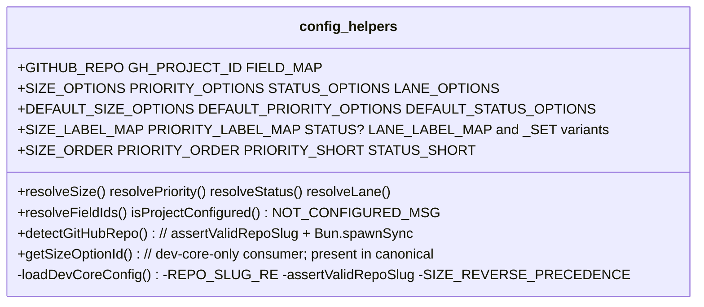
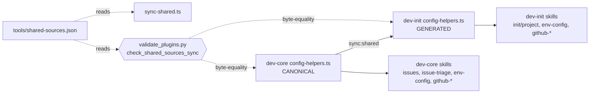

## Context

Source: `artifacts/frames/214-dedup-config-helpers-frame.mdx` (approved, re-framed post-#216).

Two parallel copies of the dev-pipeline config adapter exist:
`plugins/dev-core/skills/shared/adapters/config-helpers.ts` (412 L) and
`plugins/dev-init/skills/shared/adapters/config-helpers.ts` (383 L), plus two byte-identical
`config.test.ts` copies (486 L each). PR #216 closed the security gap (#213); the residue is
a maintainability problem: independently-editable siblings that **re-drift** (cosmetic
divergence already present after #216) — the `parallel-path-drift` class.

dev-init's copy is a strict **subset** of dev-core's (dev-core adds the module-private
`SIZE_REVERSE_PRECEDENCE` + exported `getSizeOptionId`, which dev-init never imports). No
dev-init-only content exists. dev-core's file is therefore a valid **superset canonical**.

## Goal

Collapse the two `config-helpers.ts` (+ their `config.test.ts`) into one canonical source
synced into both plugins, gated by a byte-equality check, with the residual hygiene/hardening
folded into the canonical copy — so a single edit propagates to both plugins and drift cannot
recur silently.

## Users

- **Primary:** `roxabi-plugins` maintainers — edit one file, run `bun run sync:shared`, done.
- **Secondary:** plugin users — consistent adapter behavior across dev-core & dev-init.

## Design Decisions (resolved at spec — no open χ)

**D1 — Canonical location: dev-core copy is canonical; dev-init copy is generated.**
The marketplace *self-contained plugin* principle forbids a cross-plugin runtime import; all
consumers use relative imports to `skills/shared/adapters/config-helpers.ts`, so each plugin
keeps a physical copy. dev-core is already the content superset and the primary plugin, so it
is the natural canonical (vs. a neutral repo-root dir, which adds a third copy + tsconfig/vitest
excludes for no benefit at 2 plugins). Mirrors the repo's existing `roxabi_sdk/paths.py` ↔
`validate_plugins.py check_vendored_paths` filecmp pattern. Trade-off accepted: a maintainer
opening the dev-init copy must follow the header to the canonical (header makes this explicit).

**D2 — Sync manifest SSoT: `tools/shared-sources.json`.**
A single JSON file is the one definition of canonical→targets, read by BOTH the TS sync script
(`with { type: 'json' }`) and the Python check (`json.load`) — no duplicated path list, no
cross-language import. Schema:
```json
[
  {
    "canonical": "plugins/dev-core/skills/shared/adapters/config-helpers.ts",
    "targets": ["plugins/dev-init/skills/shared/adapters/config-helpers.ts"]
  },
  {
    "canonical": "plugins/dev-core/skills/shared/__tests__/config.test.ts",
    "targets": ["plugins/dev-init/skills/shared/__tests__/config.test.ts"]
  }
]
```
A future 3rd plugin = one new entry; no code change.

**D3 — Generated header + biome must not touch the generated copy.**
The sync script prepends a deterministic header to each target:
```
// @generated by `bun run sync:shared` from
//   plugins/dev-core/skills/shared/adapters/config-helpers.ts
// DO NOT EDIT — run `bun run sync:shared` after editing the canonical.
```
To prevent lefthook's `biome check --write` (pre-commit) from reformatting the generated copy
and permanently breaking byte-equality, the **generated target paths are excluded from biome
formatting in `biome.json`** (formatter ignore / negated include). The canonical is the
biome-formatted SSoT; the generated copy is canonical-bytes + header, never independently
reformatted. Files are written **LF** explicitly; add `.gitattributes` (`*.ts text eol=lf`).

**D4 — Drift gate is the Python check only (no dual gate).**
`check_shared_sources_sync` in `validate_plugins.py` is the single gate (CI + lefthook).
`bun run sync:shared --check` exists as a fast local helper but is NOT wired into CI, to avoid
two implementations that can disagree. Comparison strips the known header block, then byte-compares.

**D5 — `REPO_SLUG_RE` reconciliation.** The issue body's hand-written regex
`/^[A-Za-z0-9][A-Za-z0-9-]*\/[A-Za-z0-9._-]+$/` does **not** actually match the form in
`plugins/dev-core/cli/lib/cwd-resolver.ts:6`, despite the body claiming it does. The stated
intent is repo-wide consistency, so we adopt **cwd-resolver's exact form**:
`/^[A-Za-z0-9][A-Za-z0-9._-]*\/[A-Za-z0-9][A-Za-z0-9._-]*$/` (both segments must start
alphanumeric; rejects leading `.`/`-`). This is a deliberate, documented deviation from the
issue's hand-written regex (which would have additionally barred `._` in the owner segment).
Fully GitHub-accurate owner rules (no dots/underscores in owner) across *both* `REPO_SLUG_RE`
definitions is noted as a possible follow-up, out of scope here.

## Expected Behavior

1. Maintainer edits the canonical `plugins/dev-core/.../config-helpers.ts` (or `config.test.ts`).
2. Runs `bun run sync:shared` → overwrites each target with canonical content + generated header.
3. `bun run typecheck`, `bun run test`, `bun run lint` pass for both plugins (biome skips the
   generated copies for formatting; tsc + vitest still cover them).
4. If they forget to sync, lefthook pre-commit (`taxonomy-sync` runs `validate_plugins.py`,
   whose `checks` list now includes `check_shared_sources_sync`) and CI fail with a clear
   message naming the stale target + the `bun run sync:shared` fix command.
5. Direct edits to a generated copy are caught by the same gate.

## Data Model & Consumers

### Shared module exports (canonical = dev-core superset)



### Consumer map



### Consumer summary

| Consumer | Symbols (representative) | Uses canonical-only `getSizeOptionId`? | Status |
|----------|--------------------------|----------------------------------------|--------|
| dev-core `issue-triage/lib/{set,create}.ts` | `getSizeOptionId`, resolvers, OPTIONS | ✅ yes | this issue |
| dev-core `issues/*`, `env-config`, `github-*` | `detectGitHubRepo`, OPTIONS, maps | no | this issue |
| dev-init `init/lib/project.ts` | `DEFAULT_*_OPTIONS` | no | this issue |
| dev-init `env-config`, `github-*` | `detectGitHubRepo`, maps, `GH_PROJECT_ID` | no | this issue |

## Breadboard

| ID | Affordance (place) | Handler | Data |
|----|--------------------|---------|------|
| N0 | `tools/shared-sources.json` | manifest (canonical→targets) | the SSoT list |
| N1 | `package.json` script `sync:shared` | new `tools/sync-shared.ts` (bun) | reads N0 |
| N2 | `tools/sync-shared.ts` | read manifest; for each: read canonical, prepend header, write LF to targets; `--check` exits 1 on drift | N0 |
| N3 | `tools/validate_plugins.py` `check_shared_sources_sync` | read manifest; strip header; filecmp canonical vs each target; handle missing target → exit 1 w/ fix hint | N0 |
| N4 | `.github/workflows/ci.yml` + `validate_plugins.py` argparse/dispatch/`checks` | CI step `--check shared-sources-sync`; lefthook `taxonomy-sync` (bare run) auto-includes via `checks` list | — |
| N5 | `biome.json` formatter ignore + `.gitattributes` | exclude generated targets from format; enforce LF for `*.ts` | target paths |
| N6 | canonical `config-helpers.ts` `REPO_SLUG_RE` | tighten to D5 form | regex |
| N7 | canonical `config.test.ts` | remove dead `execSyncSpy`/`vi.mock`; fix env-shadow; add gh-success test | test file |
| N8 | `CLAUDE.md` + `docs/plugin-cache.md` | document generated-file / `sync:shared` convention | docs |

Wiring: N0 is read by N2 (sync) and N3 (gate) — single definition. N1→N2 (entry). N4 runs N3.
N5 protects the byte-equality invariant from biome + CRLF. N6/N7 edit the canonical, then N2
propagates. N8 documents the new maintainer step.

## Slices

| # | Slice | Demo | Depends |
|---|-------|------|---------|
| 1 | **Canonical + manifest + sync script + biome/LF guards** — add `tools/shared-sources.json` (N0), `tools/sync-shared.ts` + `--check` (N1/N2), `package.json` script, `biome.json` formatter-ignore for generated targets + `.gitattributes` LF (N5). Run `sync:shared` so the dev-init copies = canonical (+header, +`getSizeOptionId`). dev-init's pre-existing cosmetic divergences (comment wording, query line-wrap) are **overwritten by sync, not merged**. Both plugins typecheck/test/lint green. | `bun run sync:shared` → `git diff` shows dev-init now matches canonical+header; `bun run sync:shared --check` exits 0; `bun run lint` does not modify the generated copy | — |
| 2 | **Drift gate** — add `check_shared_sources_sync` (N3) to `validate_plugins.py` `checks` list + a `shared-sources-sync` `--check` alias/dispatch; add CI step (N4). Missing target handled as exit-1 (model on `check_vendored_paths`). | drift a generated copy → `git commit` blocked by lefthook + `validate_plugins.py --check shared-sources-sync` exits 1 naming file + `sync:shared`; re-sync → passes | 1 |
| 3 | **Tighten `REPO_SLUG_RE`** (N6) in canonical → `sync:shared` → both copies updated; add/adjust unit tests for newly-rejected inputs (leading `.`/`-`). Sequencing: edit canonical → `bun run sync:shared` → verify both. | test proves `.foo/bar`, `-x/y` rejected; valid slugs (incl. `a.b/c`) still pass; both copies reflect it | 1 |
| 4 | **Test hygiene + coverage** (N7) in canonical `config.test.ts` → `sync:shared`: remove dead `execSyncSpy`+`vi.mock('node:child_process')`; fix self-shadowed `originalEnv`/`=undefined` coercion (rely on describe-level `beforeEach`/`afterEach`); add `gh`-success happy-path test for `detectGitHubRepo` tier-3 branch. | `bun run test` green for both; no `node:child_process` mock remains; happy-path asserts a returned slug; both test copies in sync | 1 |
| 5 | **Document the convention** (N8) — CLAUDE.md "Editing Plugins" gains a bullet on shared-source files requiring `bun run sync:shared` before commit; `docs/plugin-cache.md` gains a section distinguishing the new repo-source TS sync from the SDK cache sync. | grep CLAUDE.md / plugin-cache.md shows the `sync:shared` step + generated-file note | 1 |

> **Smart-splitting (Gate 2.5) evaluated → not applied.** Triggers fire (>3 slices, >8 AC) but
> all slices are tightly coupled around the single canonical source and are sequential (2–5 each
> depend on 1); splitting into sub-issues would add coordination overhead with no parallelism
> gain. Kept as one F-lite issue.

## Success Criteria

- [ ] `tools/shared-sources.json` exists and lists both `config-helpers.ts` and `config.test.ts` canonical→target mappings; it is the only place the path list is defined.
- [ ] `tools/sync-shared.ts` + `bun run sync:shared` regenerate each dev-init target from the dev-core canonical with the `// @generated` header; files are written with LF endings.
- [ ] After sync, each dev-init target equals its canonical except the known generated header (byte-identical otherwise) — for both `config-helpers.ts` and `config.test.ts`.
- [ ] `bun run sync:shared --check` exits 0 when in sync, exits 1 (naming the stale file + `bun run sync:shared`) when drifted.
- [ ] `biome.json` excludes the generated target paths from formatting; `bun run lint` (biome `--write`) does not modify a freshly-synced generated copy. `.gitattributes` enforces `eol=lf` for `*.ts`.
- [ ] `validate_plugins.py` gains `check_shared_sources_sync` in its `checks` list and a `shared-sources-sync` `--check` alias; it fails on a drifted or missing target and passes when synced.
- [ ] `.github/workflows/ci.yml` runs `python3 tools/validate_plugins.py --check shared-sources-sync`; lefthook pre-commit (`taxonomy-sync` bare run) also enforces it. No `bun run sync:shared --check` is wired into CI (single gate).
- [ ] `REPO_SLUG_RE` equals `/^[A-Za-z0-9][A-Za-z0-9._-]*\/[A-Za-z0-9][A-Za-z0-9._-]*$/` (matches `cwd-resolver.ts:6`); leading `.`/`-` in either segment is rejected; previously-valid slugs still pass.
- [ ] `config.test.ts` contains no `execSyncSpy` and no `vi.mock('node:child_process')`.
- [ ] The `throws when no env var` test no longer self-shadows `originalEnv` and never assigns `undefined` to `process.env.GITHUB_REPO`; it relies on the describe-level `beforeEach`/`afterEach`.
- [ ] A `gh`-success happy-path test covers `detectGitHubRepo` returning a valid slug via the `gh repo view` branch.
- [ ] CLAUDE.md "Editing Plugins" + `docs/plugin-cache.md` document the `sync:shared` step and the generated-file convention.
- [ ] `bun run lint`, `bun run typecheck`, `bun run test` pass; `python3 tools/validate_plugins.py` passes; no public export signature of `config-helpers.ts` changes.

## Edge Cases

| Edge | Handling |
|------|----------|
| Generated header breaks byte-equality | Gate strips the known header block before compare; sync writes the header deterministically. |
| Biome `--write` reformats the generated copy | `biome.json` excludes generated targets from formatting (D3); canonical is the formatted SSoT. |
| CRLF on a non-Linux contributor | Sync writes LF; `.gitattributes` `*.ts text eol=lf` normalizes; filecmp is byte-exact. |
| Generated target missing on disk | `check_shared_sources_sync` reports it + exits 1 (no crash), modeled on `check_vendored_paths`. |
| dev-init gains unused `getSizeOptionId` export | Acceptable — no bundle/tree-shake concern for skill scripts; tsc/biome allow unused exports; documented in header rationale. |
| First PR adds canonical + generated + gate together | Run `sync:shared` before commit → both on disk + matching → gate passes; otherwise gate correctly blocks until synced. |
| Cluster 2c (flat `mockReturnValue` → conditional gh→fail form) | **Deferred — optional, no AC.** Not required for the dedup; left to a future test-quality pass. |
| PR #215 touches dev-core shared layer | Rebase before merge; canonical is dev-core's file, so conflicts resolve once, in dev-core. |
