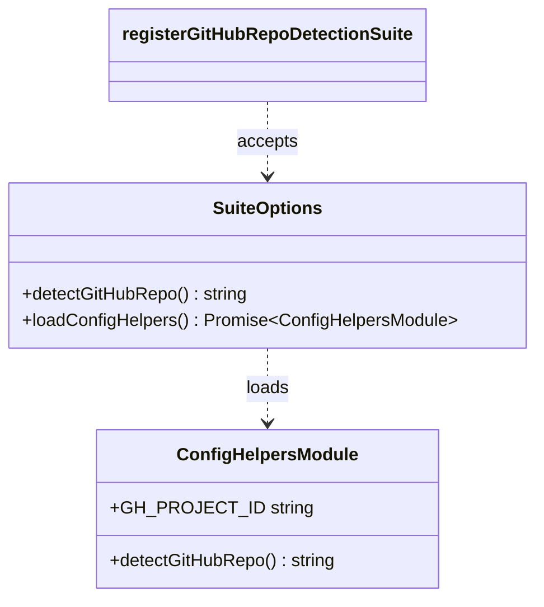
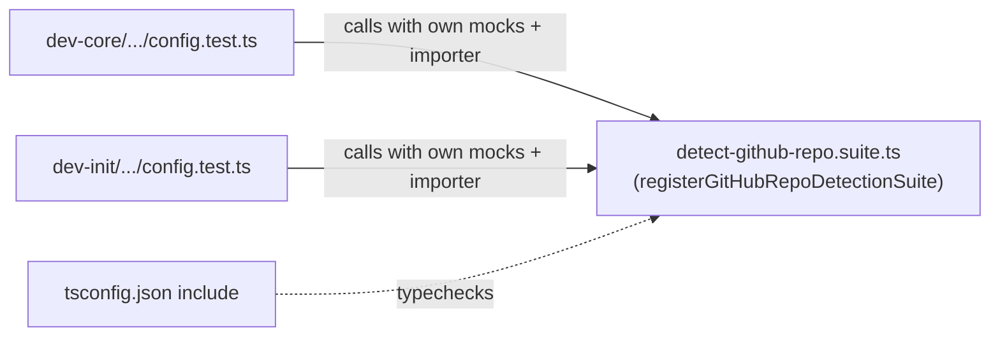

## Context

Source: frame `218-dedup-gh-project-id-test-util-frame.mdx`.

The two shared-config test files are currently **100% byte-identical** (513 lines each):

- `plugins/dev-init/skills/shared/__tests__/config.test.ts`
- `plugins/dev-core/skills/shared/__tests__/config.test.ts`

The recurring-churn region is lines **255–513** (259 lines) — two adjacent blocks:

1. `describe('gh_project_id auto-detect')` — GraphQL slug-injection hardening (re-imports the
   adapter via `vi.resetModules()` + `await import('../adapters/config-helpers')`, asserts on
   `GH_PROJECT_ID`).
2. `describe('detectGitHubRepo')` — `GITHUB_REPO` parsing + slug validation (calls the
   statically-imported `detectGitHubRepo()`).

These blocks have been touched in lock-step by #213, #202, #208 and **#217** — each edit applied
twice. **Scope correction vs frame:** #217 (the deferred dependency) **has since merged to
staging** (`8c6d406`, PR #220) — it added 27 lines to *both* files (the exact drift this issue
targets) and its edge cases (`123/456`, `owner/my.repo_name`, dot/underscore rejection) are now
**real tests already present**. Nothing remains to "fold in"; scope is a pure mechanical dedup.

## Goal

Extract the two churn-prone blocks into a single shared suite factory that both test files call,
so any future repo-detection test is written once and runs in both plugins.

## Users

- **Primary:** dev-core / dev-init maintainers editing repo-detection coverage — today must edit
  two files in lock-step or silently diverge.
- **Secondary:** plugin users relying on correct `detectGitHubRepo` / `GH_PROJECT_ID` behaviour.

## Expected Behavior

A new module `plugins/shared/__tests__/detect-github-repo.suite.ts` exports
`registerGitHubRepoDetectionSuite(opts)`. Calling it inside a test file registers both `describe`
blocks against the calling file's mocked module graph.

Each `config.test.ts` keeps its **file-scoped** preamble (lines 1–61) unchanged — the
`vi.mock('node:fs')` / `vi.mock('node:child_process')` calls (hoisted, file-scoped), the
`process.env` setup, and the static `await import('../adapters/config-helpers')`. It then replaces
lines 255–513 with one call:

```ts
registerGitHubRepoDetectionSuite({
  detectGitHubRepo,                                   // static import, top of file
  loadConfigHelpers: () => import('../adapters/config-helpers'),  // per-file dynamic importer
})
```

**Why parameterized, not a plain shared file:**
- `vi.mock(...)` is hoisted to the top of the *importing* file and is file-scoped → mocks cannot
  move into the shared module; they stay in each `config.test.ts`.
- `import('../adapters/config-helpers')` resolves relative to the file that contains the literal →
  if it lived in the shared module it would resolve to the non-existent
  `plugins/shared/adapters/config-helpers`. It is therefore injected as a closure.
- Block 2 asserts on the statically-imported `detectGitHubRepo` (call-time env read) → injected as
  a function reference.

Run-from-cache is a non-concern: test files are never synced into a plugin runtime cache (vitest
runs only in the monorepo). The shared module is dev-time only.

## Data Model & Consumers

Factory contract (defined in the shared suite module):



Consumer map:



| Consumer | Uses | When | Status |
|----------|------|------|--------|
| `dev-core/skills/shared/__tests__/config.test.ts` | factory + own `loadConfigHelpers`/`detectGitHubRepo` | `vitest run` | this issue |
| `dev-init/skills/shared/__tests__/config.test.ts` | factory + own `loadConfigHelpers`/`detectGitHubRepo` | `vitest run` | this issue |
| `tsconfig.json` (`include`) | adds `plugins/shared/**/*.ts` so the suite is typechecked | `tsc --noEmit` | this issue |

> Note: `tsconfig.include` is `plugins/dev-core/**` only, so dev-init test files are **not**
> typechecked today (pre-existing). This change brings the new shared suite under typecheck and
> keeps dev-core covered; dev-init typecheck scope is unchanged (out of scope for #218). The `Bun`
> global resolves project-wide via `bun-types`, so the suite's `vi.spyOn(Bun, ...)` typechecks.

## Breadboard

| ID | Affordance | Handler / wiring | Data |
|----|-----------|------------------|------|
| N1 | `plugins/shared/__tests__/detect-github-repo.suite.ts` | exports `registerGitHubRepoDetectionSuite(opts)`; imports vitest globals; declares `ConfigHelpersModule` interface | the two `describe` bodies, verbatim, with `mod`/`detectGitHubRepo` sourced from `opts` |
| N2 | dev-core `config.test.ts` | import N1; replace lines 255–513 with one factory call | `detectGitHubRepo`, `() => import('../adapters/config-helpers')` |
| N3 | dev-init `config.test.ts` | same edit as N2 (identical relative import path `../../../../shared/__tests__/detect-github-repo.suite`) | same |
| N4 | `tsconfig.json` | add `plugins/shared/**/*.ts` to `include` | — |

Wiring: N2 + N3 import N1. N4 brings N1 under typecheck.

## Slices

| # | Slice | Affordances | Demo |
|---|-------|-------------|------|
| 1 | Create shared suite factory + wire dev-core + tsconfig | N1, N2, N4 | `vitest run plugins/dev-core/...config.test.ts` green; `tsc --noEmit` green |
| 2 | Wire dev-init to the same factory | N3 | `vitest run plugins/dev-init/...config.test.ts` green; both files identical & minimal |

## Success Criteria

- [ ] `plugins/shared/__tests__/detect-github-repo.suite.ts` exists and exports `registerGitHubRepoDetectionSuite`.
- [ ] Both `config.test.ts` files contain **zero** inline `describe('gh_project_id auto-detect'` and `describe('detectGitHubRepo'` bodies — each replaced by a single factory call (grep returns 0 inline matches).
- [ ] Both `config.test.ts` files remain byte-identical to each other after the change (`diff` empty).
- [ ] `bun run test` passes; the total `it` count for the two blocks is unchanged vs pre-change (no test dropped).
- [ ] `bun run typecheck` (`tsc --noEmit`) passes, including the new shared module.
- [ ] `bunx biome check .` passes (single quotes, no semicolons).
- [ ] `plugins/dev-core/skills/shared/adapters/config-helpers.ts` and the dev-init equivalent are **unchanged** (test-only change).
- [ ] The file-scoped `vi.mock(...)` and `process.env` preambles remain in each test file (not moved into the shared module).

## Complexity

**Tier: F-lite** — 4 files (1 new suite, 2 test files, 1 tsconfig), single domain (test code), one
resolved design unknown (factory parameterization for file-scoped mocks + per-file dynamic import).
No runtime/impl change.
