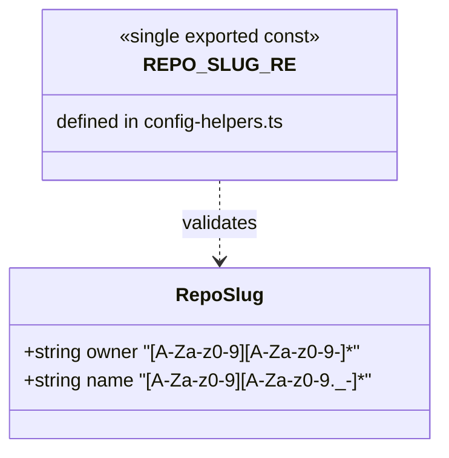
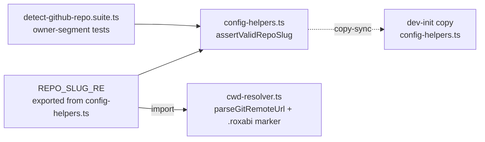

## Context

Source: [frame](../frames/229-residual-hygiene-214-frame.mdx). Three deferred parity gaps from the #214 reconcile re-review. Each is independent and self-contained. Two refinements vs the issue text, both from expert review (see `## Deviations from issue text`).

## Goal

Close three TS/Python (and local/CI) parity gaps so the same input is treated identically by both sides, with no silent local skips and no re-drift.

## Users

- **Primary:** roxabi-plugins maintainers — gate consistency.
- **Secondary:** contributors without local `.venv` — currently ship un-synced copies caught only in CI.

## Deviations from issue text

| Item | Issue said | Spec does | Why |
|------|-----------|-----------|-----|
| 2 | "reconcile the two regexes to one canonical **form**" | one canonical **symbol** — export from `config-helpers.ts`, import in `cwd-resolver.ts` | byte-identical literals re-drift with no gate (frame failure mode b). Single source = drift impossible. Intra-dev-core import (cli→skills/shared), allowed by self-containment. |
| 3 | mirror `taxonomy-class-list-sync` (`.venv`-gated `validate_plugins.py`) | run `bun run sync:shared --check` (bun-native, no `.venv`) | the `.venv`-gated form still silently skips without `.venv` (frame failure mode a) — and the bare `taxonomy-sync` already runs that Python check. The bun check needs no `.venv` → actually closes the silent-skip gap. |

## Expected Behavior

**Item 1 — symlink deref (`tools/sync-shared.ts`).**
`assertInRepo` resolves the real (symlink-dereferenced) path via `realpathSync` before the containment check, matching `validate_plugins.py`'s non-strict `.resolve()`. A path that is a symlink pointing outside the repo is **rejected**. A path that does not yet exist (not-yet-written copy, write mode) must **not** throw on resolution — `realpathSync` `ENOENT` is caught and the check falls back to the lexically-resolved `abs` already passed in. Applies to **both** call sites (`canonicalAbs` and `targetAbs`).

Precondition (documented invariant): the fallback is safe because manifest `rel` paths contain no `..` segment, so `resolve(REPO_ROOT, rel)` is unconditionally inside the repo. A future manifest entry with `..` would need its own guard.

**Item 2 — `REPO_SLUG_RE` reconcile (`config-helpers.ts` → `cwd-resolver.ts`).**
`config-helpers.ts` becomes the single definition; `cwd-resolver.ts` imports it (no longer declares its own). Canonical form:

```
/^[A-Za-z0-9][A-Za-z0-9-]*\/[A-Za-z0-9][A-Za-z0-9._-]*$/
```

- Owner = `[A-Za-z0-9][A-Za-z0-9-]*` — alphanumeric + hyphen, must start alphanumeric (GitHub's real username rule). Rejects dots/underscores in owner.
- Name = `[A-Za-z0-9][A-Za-z0-9._-]*` — allows dots/underscores after first char (preserves `my.repo_name`), must start alphanumeric.

Behavioral deltas vs today (verified against the suite by the architect — no valid slug regresses):
- `config-helpers`: name now must start alphanumeric (was `[A-Za-z0-9._-]+`, accepted `.hidden`). Hardening.
- `cwd-resolver`: owner now rejects `.`/`_` (was `[A-Za-z0-9._-]*`). Real GitHub owners never contain these → safe; a `.roxabi` marker / remote with such an owner now silently falls through (no throw), unchanged failure semantics.

Export of `REPO_SLUG_RE` from the canonical also lands (byte-identically) in the dev-init copy via copy-sync — an unused export there, harmless.

**Item 3 — scoped lefthook hook (`lefthook.yml`).**
A new `shared-sources-sync` pre-commit command runs `bun run sync:shared --check`, globbed so editing either the canonical or the dev-init copy triggers it locally. Bun is the project runtime → always present → no `.venv` gate, no silent skip. CI continues to enforce unconditionally (and the bun check additionally now backs the local gate).

## Data Model & Consumers





| Consumer | Uses | When | Status |
|----------|------|------|--------|
| `config-helpers.assertValidRepoSlug` | `REPO_SLUG_RE` (defines) | yaml/env + git-remote fallback validation | this issue |
| `cwd-resolver.parseGitRemoteUrl` / `.roxabi` marker | `REPO_SLUG_RE` (imports) | repo-slug resolution from cwd | this issue |
| dev-init `config-helpers.ts` copy | byte-identical via copy-sync | CI + lefthook gate | this issue (re-sync) |
| `detect-github-repo.suite.ts` | owner-segment assertions | test run | this issue (extend) |

## Breadboard

| ID | Affordance | Handler | Data |
|----|-----------|---------|------|
| N1 | `assertInRepo(abs, rel)` | `realpathSync(abs)`, catch ENOENT → fall back to `abs`; then containment check | abs path, REPO_ROOT; fallback = lexical `abs` |
| N2 | exported `REPO_SLUG_RE` in config-helpers | add `export`; cwd-resolver imports, deletes its local const | regex literal |
| N3 | dev-init copy-sync | `bun run sync:shared` → byte-equality (now also re-exports the const) | config-helpers.ts |
| N4 | `shared-sources-sync` lefthook command | `bun run sync:shared --check`, glob `**/skills/shared/adapters/config-helpers.ts` | staged shared-source files |
| U1 | suite owner-segment tests | extend: add leading-special-char rejection case | test cases |

Wiring: N1 standalone (Item 1). N2 → N3 (export from canonical, re-sync copy) → U1 (tests stay green / extended) — Item 2. N4 standalone (Item 3), validates N3's gate.

## Slices

| # | Slice | Affordances | Demo |
|---|-------|-------------|------|
| 1 | Symlink deref parity | N1 | `assertInRepo` rejects out-of-repo symlink; ENOENT target still passes |
| 2 | Regex single-source + copy-sync + tests | N2, N3, U1 | cwd-resolver imports the regex; `sync:shared --check` green; suite green |
| 3 | Scoped lefthook hook | N4 | editing a shared-source file fires `shared-sources-sync` locally without `.venv` |

Slices are independent across slices — any order. **Within Slice 2**, ordering is fixed: export from `config-helpers.ts` → update `cwd-resolver.ts` import → `bun run sync:shared` → update suite.

## Success Criteria

- [ ] `assertInRepo` dereferences symlinks via `realpathSync` before the containment check (both call sites); an out-of-repo symlink target is rejected.
- [ ] `realpathSync` `ENOENT` (not-yet-written target) is caught and does not throw; the not-yet-existing in-repo target still passes.
- [ ] `REPO_SLUG_RE` is defined once (`config-helpers.ts`, exported) and imported by `cwd-resolver.ts`; `cwd-resolver.ts` no longer declares its own; the literal is `/^[A-Za-z0-9][A-Za-z0-9-]*\/[A-Za-z0-9][A-Za-z0-9._-]*$/`.
- [ ] dev-init `config-helpers.ts` copy is re-synced; `bun run sync:shared --check` exits 0.
- [ ] `detect-github-repo.suite.ts` owner-segment tests pass (incl. existing dot/underscore-owner rejection); a leading-special-char rejection case is added to the suite.
- [ ] `lefthook.yml` has a `shared-sources-sync` pre-commit command running `bun run sync:shared --check`, glob-scoped to `**/skills/shared/adapters/config-helpers.ts` (no `.venv` gate).
- [ ] `bun run test`, `bun run typecheck`, `bun run lint`, and `bun run sync:shared --check` all pass.
