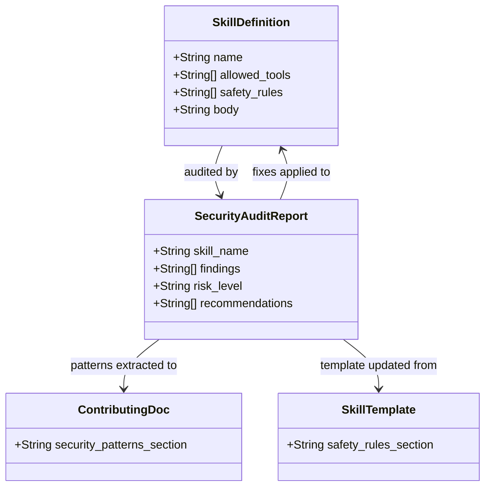

## Context

Promoted from [frame #23](../frames/23-security-audit-hooks-frame.mdx). Dev-core skills perform high-risk git operations (push, merge, reset, branch delete) but lack a systematic security audit against Claude Code best practices.

### Knowledge Resources

Three knowledge resources drive the audit checklist:

| ID | Source | Key patterns |
|----|--------|-------------|
| `32be5f8e` | Sécurité hooks — bloquer merges PR accidentels | `.bashrc` hooks to intercept `git push` / accidental merges by agents |
| `4e56c7f3` | 15 best practices Claude Code en production | Hooks, permissions, isolation, review gates |
| `47a21af1` | claude-code-best-practice repo | Hooks, skills, commands, permission architecture |

The audit in S1 must enumerate the applicable best practices from these resources and check each against the current skill set.

## Goal

Audit all dev-core skills for security compliance, fix identified gaps, update the SKILL.md template with best practices, and document guardrails in CONTRIBUTING.md.

## Users

- **Primary:** Developers using dev-core skills in production repos — they trust skills to be safe by default.
- **Secondary:** Repo maintainers reviewing agent-generated PRs — need confidence in guardrails.

## Expected Behavior

A developer running `/implement`, `/pr`, `/promote`, or `/review` should never encounter:
- A force-push without explicit per-action confirmation
- A `git reset --hard` without a preceding AskUserQuestion gate
- A `--no-verify` flag on any commit/push
- An automatic PR merge without user confirmation
- Excessive `allowed-tools` beyond what the skill needs

After this work, every skill that performs destructive git operations has:
1. An explicit AskUserQuestion gate before the action
2. A documented safety rule in its SKILL.md
3. Minimal `allowed-tools` in frontmatter

The SKILL.md template in CLAUDE.md includes a "Safety Rules" section for new skills. CONTRIBUTING.md documents the security patterns for contributors.

## Data Model & Consumers



```mermaid
flowchart LR
    Audit[Audit Report] -->|findings| Skills[SKILL.md files]
    Audit -->|patterns| CONTRIB[CONTRIBUTING.md]
    Audit -->|template rules| CLAUDE[CLAUDE.md template]
    Skills -->|consumed by| DevLoop[/dev lifecycle]
    CONTRIB -->|read by| Contributors
    CLAUDE -->|read by| SkillAuthors[New skill authors]
```

| Consumer | Fields consumed | When | Status |
|----------|----------------|------|--------|
| Skill authors | Safety rules template section | Creating new skills | This issue |
| Contributors | Security patterns in CONTRIBUTING.md | Contributing to repo | This issue |
| /dev lifecycle | Updated SKILL.md safety rules | Running skills | This issue |
| CI/linting | allowed-tools validation | Future: automated check | Future |

## Breadboard

### Affordances

| ID | Element | Type |
|----|---------|------|
| U1 | Audit checklist (per skill) | Checklist |
| U2 | Findings report | Document |
| U3 | Fix applied to SKILL.md | Edit |
| U4 | CONTRIBUTING.md security section | Document |
| U5 | CLAUDE.md template safety rules | Edit |

### Wiring

| Trigger | Handler | Data |
|---------|---------|------|
| U1: Check each skill | Scan SKILL.md for dangerous patterns | `--no-verify`, `--force`, `--hard`, `--amend`, `git push`, `gh pr merge`, `git branch -D`, `git reset` |
| U1: Check allowed-tools | Compare frontmatter tools vs actual tool usage in body | Excess = tools listed but never referenced. **Atomic pairs:** `ToolSearch` + `AskUserQuestion` count as a single unit — neither is excess if the other is present. |
| U2: Generate findings | Aggregate per-skill results into report | risk_level, pattern, line, mitigation present/missing |
| U3: Apply fixes | Edit SKILL.md to add AskUserQuestion gates, safety rules | Per finding from U2 |
| U4: Write security section | Extract patterns from fixes into reusable guidelines | Patterns + rationale |
| U5: Update template | Add "Safety Rules" subsection to SKILL.md template in CLAUDE.md | Template text |

## Slices

| Slice | Description | Deliverables | Deps |
|-------|-------------|-------------- |------|
| S1 — Audit | Full security audit of all 22 skills + 9 agents | Findings report in `artifacts/analyses/23-security-audit-findings.md` | — |
| S2 — Fix | Apply fixes to skills, update template, update docs | Edited SKILL.md files, CONTRIBUTING.md section, CLAUDE.md template update | S1 |

## Success Criteria

- [ ] All 22 dev-core skills audited for dangerous git patterns (`--no-verify`, `--force`, `--hard`, `--amend`, `git reset --hard`, `gh pr merge` without gate)
- [ ] All 9 dev-core agents audited for direct git command usage
- [ ] `promote/SKILL.md` line 87: AskUserQuestion gate added before `git reset --hard`
- [ ] `promote/SKILL.md` line 86: AskUserQuestion gate added before `gh pr merge` (changelog auto-merge)
- [ ] `review/SKILL.md` line 176: `--force-with-lease` rationale documented in safety rules
- [ ] No skill has `allowed-tools` listing tools it never uses in its body (a tool is "used" if it appears in the body as a tool name, or is part of an atomic pair: `ToolSearch` + `AskUserQuestion`)
- [ ] SKILL.md template in CLAUDE.md includes a "Safety Rules" subsection
- [ ] CONTRIBUTING.md includes a "Security Patterns" section covering at minimum: force-push prohibition, AskUserQuestion gate placement for destructive actions, `--no-verify` prohibition, `allowed-tools` minimality rule, and the ToolSearch/AskUserQuestion atomic pair convention
- [ ] Skills performing `git push` (fix, pr, promote, review) each have an explicit safety rule: `¬force-push` (or `--force-with-lease` with documented rationale for review)

### Regression Guards

These are already passing and must remain so:

- [ ] Zero `--no-verify` flags across all skills (after fixes applied)
- [ ] Zero `--force` flags (only `--force-with-lease` permitted, with rationale)
