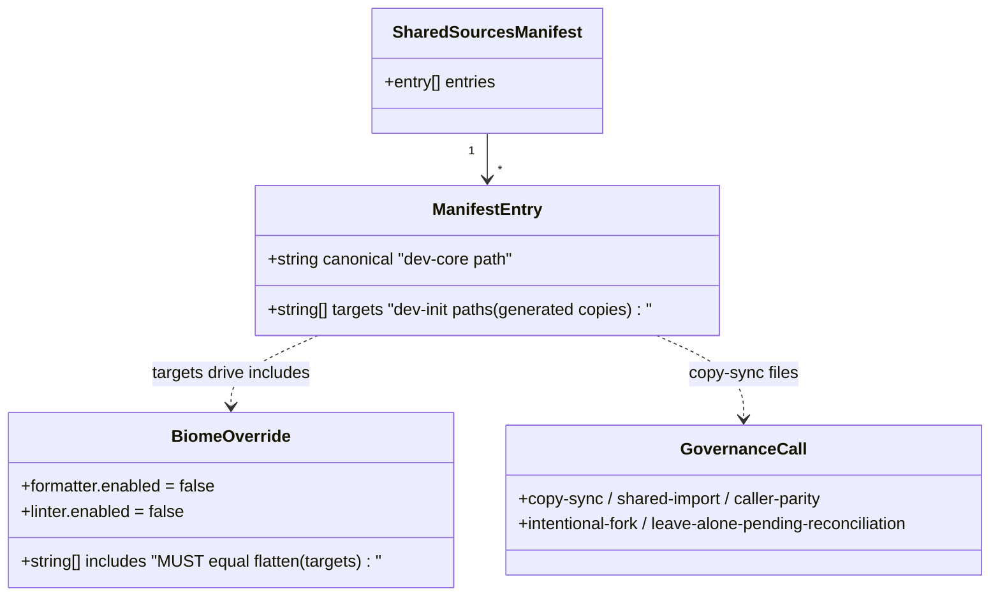
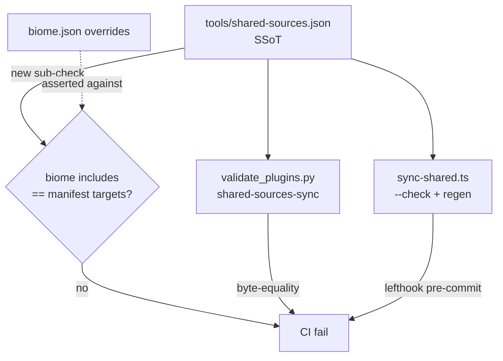

## Context

Promoted from [analysis](../analyses/232-evaluate-broader-copy-sync-scope-for-shared-analysis.mdx)
(Shape 2, approved). `plugins/dev-init/skills/shared/` is a vendored subset of
`plugins/dev-core/skills/shared/`; only 3 of 25 TS files are governed, and the
ungoverned ones already drift silently (dev-init lagging dev-core). The issue's
biome-glob premise was disproven: a `**/*.ts` glob would un-lint 8 genuinely
hand-written files. This spec encodes the governance fix and its mechanical
application.

## Goal

Every byte-identical `shared/` pair has a recorded governance call, future drift is
CI-gated, and biome's generated-copy suppression is derived from a single source of
truth that cannot silently swallow hand-written files.

## Users

- **Primary:** roxabi-plugins maintainers editing `shared/` TS files — gain a
  manifest-driven, gated answer to "which mechanism governs this file."
- **Secondary:** future contributors adding files under `dev-init/skills/shared/` —
  protected from silently losing biome (the glob trap is rejected).

## Expected Behavior

1. **biome list = manifest, asserted.** `biome.json` `overrides[0].includes` lists
   exactly the copy-sync manifest's target paths. `validate_plugins.py
   --check shared-sources-sync` fails if the biome list and the manifest targets
   disagree (set-equality, repo-root-relative). biome.json stays hand/script-edited;
   the check is a **drift gate, not a generator**. The broad `**/*.ts` glob is
   explicitly rejected and documented as a rejected option.
2. **7 runtime pairs gated.** The 7 byte-identical runtime files
   (`adapters/env-config.ts`, `adapters/workspace-store.ts`, `ports/artifacts.ts`,
   `ports/config.ts`, `prereqs.ts`, `queries.ts`, `types.ts`) are added to
   `tools/shared-sources.json` (dev-core canonical → dev-init target). dev-init
   copies gain the 2-line `@generated` header (biome list grows 3 existing + 7 new
   = 10 entries via slice 1's mechanism); `bun run sync:shared` regenerates
   them; both the lefthook (`sync:shared --check`, TS) and CI (Python validator)
   gates cover them automatically. The two validators MUST strip the identical
   2-line `@generated` header — this equivalence is asserted by a documented header
   contract comment in both `sync-shared.ts` (`makeHeader()`) and
   `validate_plugins.py` (`check_shared_sources_sync`).
3. **6 test pairs — call recorded, execution deferred.** The 6 actionable
   byte-identical test pairs (`github.test.ts`, `parse-issue-ref.test.ts`,
   `prereqs.test.ts`, `priority-labels.test.ts`, `resolveFieldIds.test.ts`,
   `resolveSize-legacy-schema.test.ts`) get their **documented governance call**
   (shared-import, via suite factories under `plugins/shared/__tests__/` like
   `detect-github-repo.suite.ts`) recorded in the ADR/CLAUDE.md, but the
   **execution is split to a follow-up issue** — it is a separate test-infra
   refactor (12 file rewrites + 6 suite factories) with zero dependency on slices
   1–2 and independent churn risk on the hot `shared/` subtree. `config.test.ts`
   stays caller-parity (excluded).
4. **Governance recorded + follow-ups filed.** An ADR + a CLAUDE.md "Shared-source
   TS files" update record: the biome SSoT decision (glob rejected), the
   runtime-gating call, the test shared-import call (deferred), and explicit call
   values for the divergent files — `intentional-fork` (`github-adapter.ts`) and
   `leave-alone-pending-reconciliation` (`github-infra.ts`, `parse-issue-ref.ts`,
   `ports/workspace.ts`, `__tests__/domain.test.ts`). Two follow-up issues are
   filed: (a) execute test shared-import for the 6 pairs, (b) reconcile the 4
   drifted/divergent files. Both linked to #232.

## Data Model & Consumers

| Consumer | Reads | When | Status |
|----------|-------|------|--------|
| `validate_plugins.py --check shared-sources-sync` | manifest + biome.json | CI | extend (this issue) |
| `sync-shared.ts --check` / regen | manifest | lefthook pre-commit + `bun run sync:shared` | reuse (this issue adds entries) |
| `biome.json overrides[0].includes` | — (asserted target) | biome lint/format | regenerate list (this issue) |
| ADR + CLAUDE.md | governance calls | human reference | new (this issue) |

## Breadboard

| ID | Affordance | Handler | Data |
|----|-----------|---------|------|
| N1 | `shared-sources.json` +7 runtime entries | `sync-shared.ts` regen | canonical→target paths |
| N2 | biome-vs-manifest sub-check (inside `check_shared_sources_sync`, **exit 1 = drift** on mismatch, not exit 2) | `validate_plugins.py::check_shared_sources_sync` | `set(biome includes) == set(flatten(manifest targets))` |
| N3 | `biome.json` includes ← manifest targets (10 entries) | hand/script edit, gated by N2 | target path list |
| N4 | `@generated` headers on 7 dev-init runtime copies | `bun run sync:shared` | 2-line header |
| N6 | ADR `docs/.../adr/` + CLAUDE.md "Shared-source TS files" update | doc-writer | governance calls |
| N7a | follow-up issue: execute test shared-import for 6 pairs (suite factories under `plugins/shared/__tests__/`) | `issue-triage` | deferred scope |
| N7b | follow-up issue: reconcile 4 drifted/divergent files | `issue-triage` | reconciliation scope |

## Slices

| # | Slice | Affordances | Independently demo-able |
|---|-------|-------------|-------------------------|
| 1 | **biome SSoT gate** — add biome-vs-manifest assertion inside `check_shared_sources_sync` (exit 1 on mismatch); rewrite biome list as manifest-derived (no-op with current 3 entries, proves mechanism) | N2, N3 | `validate_plugins.py --check shared-sources-sync` fails if biome list ≠ manifest targets |
| 2 | **Runtime gating** — add 7 runtime pairs to manifest, regen with `@generated` headers; biome list grows 3→10 via slice-1 mechanism; document the 2-line header contract in both validators | N1, N3 (extends), N4 | `bun run sync:shared --check` green; editing a dev-core canonical fails both gates until synced |
| 3 | **Governance doc + follow-ups** — ADR, CLAUDE.md update (incl. deferred test shared-import call), file 2 follow-up issues | N6, N7a, N7b | ADR merged; CLAUDE.md lists all call values; both follow-up issues exist + linked to #232 |

All 3 slices land in **one PR** — they are logical increments, not separate PRs;
CI evaluates the final PR state (so the biome=10-entry list and the gate are
consistent at merge). The test-shared-import execution (formerly a 4th slice) is
**split out to a follow-up issue** (N7a) — separate test-infra domain, independent
churn risk; its governance call is still recorded here. This keeps #232 at 3 slices
(no Gate 2.5 split) and tightens scope to governance + runtime gating + docs.

## Success Criteria

- [ ] `validate_plugins.py --check shared-sources-sync` exits non-zero (exit 1,
      drift) when `biome.json overrides[0].includes` does not equal the flattened
      manifest targets; a unit test exercises the mismatch path (CI-observable).
- [ ] The broad `**/*.ts` glob is **not** used; the rejection is documented in the
      ADR with the 8-hand-written-files rationale.
- [ ] The 7 runtime pairs appear in `tools/shared-sources.json` and their dev-init
      copies carry the `@generated` header; `bun run sync:shared --check` is green;
      `biome.json overrides[0].includes` has all 10 entries.
- [ ] Editing any of the 10 gated runtime canonicals without re-syncing fails both
      the lefthook check (`sync:shared --check`) and the CI `shared-sources-sync`
      check; both validators strip the same 2-line `@generated` header, asserted by
      a documented contract comment in `sync-shared.ts` and `validate_plugins.py`.
- [ ] `bun run test`, `bun run lint`, `bun run typecheck` all pass;
      `config.test.ts` is unchanged (caller-parity).
- [ ] An ADR and the CLAUDE.md "Shared-source TS files" section record all
      governance calls — copy-sync (7 runtime), shared-import (6 test, deferred),
      intentional-fork (`github-adapter.ts`), leave-alone-pending-reconciliation
      (`github-infra.ts`, `parse-issue-ref.ts`, `ports/workspace.ts`,
      `__tests__/domain.test.ts`) — every divergent file assigned a value.
- [ ] Two follow-up issues filed and linked to #232: (a) execute test
      shared-import for the 6 pairs; (b) reconcile `github-infra.ts`,
      `parse-issue-ref.ts`, `ports/workspace.ts`, `__tests__/domain.test.ts`.
