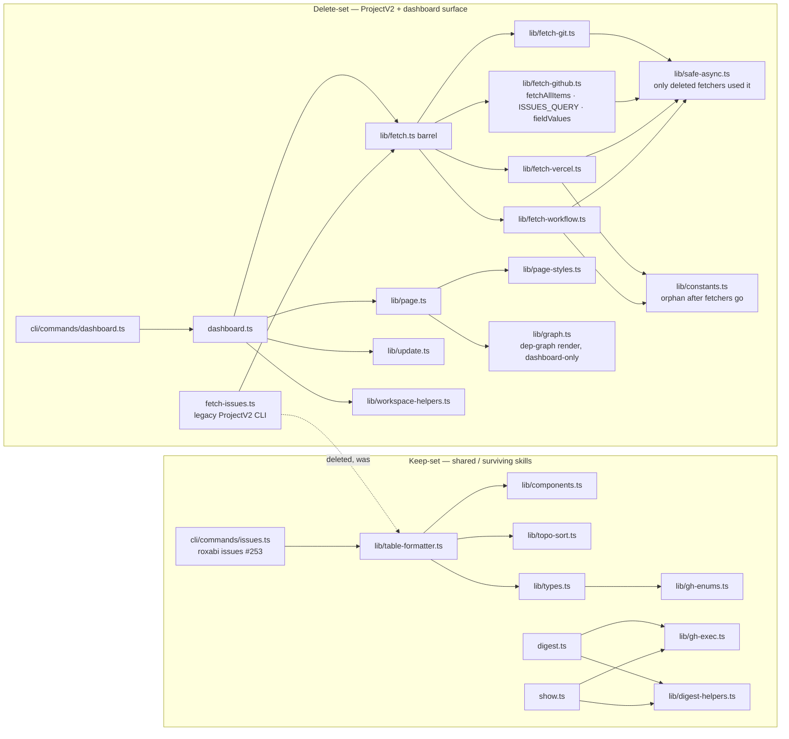

## Context

Promoted from [frame](../frames/252-drop-projectv2-dashboard-frame.mdx). Issue
#252. The `roxabi dashboard` command and its ProjectV2 data layer are removed
wholesale; `roxabi issues` (repo-centric since #253), `digest`, and `show`
survive untouched. Expert review (architect + doc-writer, 2026-06-08) added the
`smoke.test.ts` guard, the `graph.ts`/`safe-async.ts` orphans, and the wider
doc-cleanup set; incorporated below.

## Goal

Remove every ProjectV2-coupled file reachable from a `roxabi` command path
(dashboard + legacy `fetch-issues.ts`), leaving zero
`ProjectV2`/`GH_PROJECT_ID`/`fetchAllItems`/`fieldValues`-fetch code in
`skills/issues/`, with `roxabi issues|digest|show` still working and QG green.

## Users

- **Primary:** Mickael — operator. `roxabi dashboard` ceases to exist; ~16 files
  + ~1k lines of ProjectV2 code leave the tree.
- **Secondary:** `roxabi issues` (#253, repo-centric) — must keep compiling and
  passing; shares `lib/table-formatter.ts` (+ closure) with the deleted surface.

## Expected Behavior

1. `roxabi dashboard` → no longer a registered command (dropped from `cli/index.ts`
   dispatch + help text). The `cli/__tests__/smoke.test.ts` `dashboard --help`
   case is removed in lockstep so QG stays green.
2. `roxabi issues`, `roxabi issues -A`, `--json/--tree` → unchanged output
   (repo-centric path from #253; `table-formatter` intact).
3. `digest.ts` / `show.ts` scripts → unchanged (never ProjectV2-coupled).
4. `grep -rn 'ProjectV2\|GH_PROJECT_ID\|fetchAllItems' plugins/dev-core/skills/issues`
   → no hits in non-deleted files (shared `config-helpers`/`shared/queries`
   ProjectV2 plumbing used by `issue-triage` is out of scope — see frame).
5. `bun run lint && bun run typecheck && bun run test` → exit 0; no dangling
   imports, no orphaned test files.

## Data Model & Consumers

The "data model" here is the **module import graph** partitioned into a
delete-set and a keep-set. Removal is correct iff every file in the delete-set's
exclusive dependency closure has no surviving non-test importer outside the
delete-set, and every kept file does.

> **Pre-existing orphan (not in either runtime path):** `lib/config.ts` has zero
> importers today (independent of this change). It is swept by N7 as opportunistic
> dead-code cleanup; it is not a ProjectV2 file.

### Consumer summary

| Consumer | Depends on (keep-set) | Status after removal |
|----------|-----------------------|----------------------|
| `roxabi issues` (#253) | `table-formatter` → components/topo-sort/types | unchanged (this issue) |
| `digest.ts` | `digest-helpers`, `gh-exec`, `components` | unchanged (this issue) |
| `show.ts` | `digest-helpers`, `gh-exec` | unchanged (this issue) |
| `roxabi dashboard` | (deleted) | removed (this issue) |
| `fetch-issues.ts` CLI | (deleted) | removed — superseded by `roxabi issues` |

## Breadboard

Affordances are the removal operations and their guards.

| ID | Affordance | Handler / action | Guard (data) |
|----|------------|------------------|--------------|
| N1 | Delete dashboard entry | rm `skills/issues/dashboard.ts`, `cli/commands/dashboard.ts` | no external importer (verified) |
| N2 | Drop `dashboard` command + smoke test | edit `cli/index.ts` (remove `case 'dashboard'` + help line); edit `cli/__tests__/smoke.test.ts` (remove the `dashboard --help` `it(...)` case) | `roxabi issues` dispatch untouched; smoke suite still green |
| N3 | Delete legacy ProjectV2 CLI | rm `skills/issues/fetch-issues.ts` | only referenced in SKILL.md |
| N4 | Delete ProjectV2 fetch layer | rm `lib/fetch.ts` barrel + `fetch-github/git/vercel/workflow.ts` | importers ⊆ delete-set |
| N5 | Delete dashboard render/write | rm `lib/page.ts`, `page-styles.ts`, `graph.ts`, `update.ts`, `workspace-helpers.ts` | `graph.ts` importers = {page.ts (del), topo-sort.test.ts}; rest 0 |
| N6 | Delete dead tests + fix shared test | rm `__tests__/dashboard.test.ts`, `__tests__/fetch-github.test.ts`, `__tests__/safe-async.test.ts`, `lib/page.test.ts`, `lib/update.test.ts`; edit `__tests__/topo-sort.test.ts` to drop the `buildDepGraph`/`graph` import + its cases (keep the `topoSort` cases) | target modules deleted; `topoSort` coverage retained |
| N7 | Orphan sweep | rm `lib/safe-async.ts`, `lib/constants.ts`, and pre-existing `lib/config.ts`; then assert no remaining `skills/issues/**` file has importer-count 0 (non-test) | `tsc --noEmit` clean + grep importer-count = 0; shared files (table-formatter/components/topo-sort/types/digest-helpers/gh-exec/gh-enums) retain ≥1 surviving importer |
| N8 | Doc cleanup | edit `skills/issues/SKILL.md` (drop dashboard daemon + `fetch-issues.ts`), `skills/issues/README.md`, `skills/github-setup/SKILL.md` (lines ~136/140 "Run `roxabi dashboard`" + "multi-project dashboard"), `references/issue-taxonomy.md` (drop `dashboard` consumer rows), `plugins/dev-core/README.md` (dashboard wording) | `grep -rn 'roxabi dashboard\|fetch-issues' plugins/dev-core --include='*.md'` returns no live instruction |
| N9 | Guard shared keep-set | `table-formatter`, `components`, `topo-sort`, `types`, `gh-enums`, `gh-exec`, `digest-helpers`, `digest.ts`, `show.ts` NOT deleted | QG green |

## Slices

| Slice | Affordances | Demo-able increment |
|-------|-------------|---------------------|
| S1 | N1, N2 | `roxabi dashboard` gone from dispatch + help; smoke test updated; `roxabi issues` still runs; typecheck + smoke suite green |
| S2 | N3, N4, N5, N6, N7 | ProjectV2 fetch layer + render/write + dep-graph + legacy CLI + dead tests removed; orphans swept; shared test fixed; full QG green; zero ProjectV2 grep hits in `skills/issues` |
| S3 | N8, N9 | docs reference no dashboard/`fetch-issues`; keep-set intact; final QG green |

## Success Criteria

- [ ] `roxabi dashboard` is not a registered command — `case 'dashboard'` and its help line are removed from `cli/index.ts`.
- [ ] `cli/__tests__/smoke.test.ts` no longer contains a `dashboard` test case, and the smoke suite passes.
- [ ] `skills/issues/dashboard.ts` and `cli/commands/dashboard.ts` no longer exist.
- [ ] `skills/issues/fetch-issues.ts` no longer exists (legacy ProjectV2 CLI superseded by `roxabi issues`).
- [ ] The ProjectV2 fetch layer (`lib/fetch.ts`, `fetch-github.ts`, `fetch-git.ts`, `fetch-vercel.ts`, `fetch-workflow.ts`) and dashboard render/write (`lib/page.ts`, `page-styles.ts`, `graph.ts`, `update.ts`, `workspace-helpers.ts`) no longer exist.
- [ ] `lib/safe-async.ts`, `lib/constants.ts`, and `lib/config.ts` (with their dead tests) no longer exist; `__tests__/topo-sort.test.ts` no longer imports `../lib/graph` and still tests `topoSort`.
- [ ] `grep -rn 'ProjectV2\|GH_PROJECT_ID\|fetchAllItems\|fetchAllItemsForProject\|fetchAllProjects' plugins/dev-core/skills/issues` returns zero matches.
- [ ] No `skills/issues/**` source file has zero non-test importers after the sweep (verified by importer-count grep).
- [ ] Keep-set intact: `lib/table-formatter.ts`, `components.ts`, `topo-sort.ts`, `types.ts`, `gh-enums.ts`, `gh-exec.ts`, `digest-helpers.ts`, `digest.ts`, `show.ts` all still exist.
- [ ] `roxabi issues` (and `-A`, `--json`, `--tree`) produce unchanged output — the existing `cli/__tests__/issues.test.ts` suite passes.
- [ ] `bun run lint && bun run typecheck && bun run test` exit 0.
- [ ] No live `roxabi dashboard` or `fetch-issues.ts` instruction remains in docs: `skills/issues/SKILL.md`, `skills/issues/README.md`, `skills/github-setup/SKILL.md`, `references/issue-taxonomy.md`, `plugins/dev-core/README.md` are all updated.
