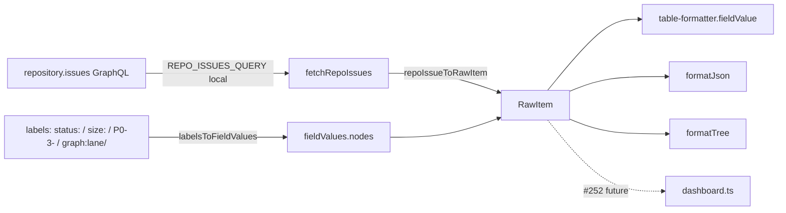

## Context

Source: [frame](../frames/253-switch-cli-repo-centric-frame.mdx) (analysis skipped, F-lite).

`cli/commands/issues.ts` reads issues from `ProjectV2.items` GraphQL — single-project via
`fetchProjectItems(projectId)` (cursor-paginated) and `-A` via `buildBatchedQuery(projectIds)`
(100-item cap). Both require every workspace repo to carry a `projectId` and be attached to a
board. Under the issues-only model (#260) the board is redundant: `status`/`size`/`priority`/`lane`
live as labels. Switch the read path to read issues directly from the repository.

This is the foundational shape #252 (dashboard) consumes; it defines the repo-centric fetch +
label→`RawItem` mapping.

## Goal

`roxabi issues` and `roxabi issues -A` list open issues read directly from each workspace repo —
no ProjectV2 board, no `projectId` required in the read path — with table/tree/json output
unchanged.

## Users

- **Primary:** maintainers running `roxabi issues` / `-A` to triage across workspace repos.
- **Secondary:** #252 (dashboard) — builds on `fetchRepoIssues` + label mapping.

## Expected Behavior

1. `roxabi issues` (no flag) — resolve cwd → workspace project (`resolveCurrentProject`), fetch that
   repo's **open** issues via `fetchRepoIssues(repo, token)`, render the table. Unmatched cwd → same
   "not registered" hint as today.
2. `roxabi issues -A` — loop over `ws.projects`, call `fetchRepoIssues(p.repo, token)` per repo,
   group by `label`, render each.
3. `--tree`/`-T`, `--json` behave as today; output is byte-identical for a given set of issues
   because the rendered `RawItem` shape is unchanged.
4. A repo with **no `projectId`/board** returns its open issues normally (the read path never touches
   `projectId`).
5. `fetchRepoIssues` paginates with `first: 100, after: cursor` (no 100-item cap, unlike the old
   batched `-A`).

**Behavior delta (intentional):** top-level results are **OPEN issues only** (query filters
`states: [OPEN]`). The old board path returned whatever was added to the board (incl. closed items);
`formatJson` therefore no longer emits closed top-level issues. Nested `blockedBy`/`blocking`/
`parent`/`subIssues` still carry `{number, state}` for any state (unchanged rendering of deps).

## Data Model & Consumers

`RawItem` is **unchanged**. `fieldValues.nodes` is **synthesized** from issue labels so every
existing consumer keeps reading `fieldValue(item, 'Status'|'Size'|'Priority'|'Lane')` with zero change.

```mermaid
classDiagram
  class RawItem {
    id?: string
    content: RawContent
    fieldValues: { nodes: RawFieldValue[] }  %% UNCHANGED — synthesized from labels
  }
  class RawContent {
    number: int
    title: string
    state: string
    url: string
    labels?: { nodes: { name }[] }   %% source of synthesized fieldValues
    subIssues?: nodes[]
    parent?: { number, state }
    blockedBy?: nodes[]
    blocking?: nodes[]
  }
  class RawFieldValue {
    name?: string        %% canonical field value (e.g. "In Progress", "P0 - Urgent")
    field?: { name }     %% "Status" | "Size" | "Priority" | "Lane"
  }
  RawItem --> RawContent
  RawItem --> RawFieldValue : fieldValues.nodes (synthesized)
```



| Consumer | Fields consumed | When | Status |
|---|---|---|---|
| `table-formatter` (`formatTable`/`formatTree`/`fieldValue`) | `content.*`, `fieldValues` (Status/Size/Priority) | every render | this issue |
| `formatJson` | full `RawItem` | `--json` | this issue |
| `issue-triage/lib/list.ts` | `fieldValue(item, …)` | unrelated path (board) | unchanged |
| `dashboard.ts` | `RawItem` via `rawItemsToIssues` | future | #252 |

## Breadboard

| ID | Affordance | Handler | Data |
|----|-----------|---------|------|
| N1 | `labelsToFieldValues(labels)` | new pure fn (issues.ts) | `{name}[]` → `RawFieldValue[]`. Canonical value = **map key** (e.g. `'P0 - Urgent'`), obtained by **reverse-lookup** of `*_LABEL_MAP` (`Object.entries(M).find(([,v]) => v === label)?.[0]`), **not** a string transform. Status/Size/Lane are prefix-strippable; **Priority is not** (`P1-high` → `P1 - High` only via reverse-lookup). |
| N2 | `repoIssueToRawItem(issue)` | new pure fn (issues.ts) | repo issue node → `RawItem` (synthesizes `fieldValues`) |
| N3 | `REPO_ISSUES_QUERY` | new const **local to issues.ts** | `repository(owner,name).issues(states:[OPEN], first:100, after)` |
| N4 | `fetchRepoIssues(repo, token)` | new fn (issues.ts) | cursor pagination → `RawItem[]` |
| N5 | `runIssuesCommand` single | `resolveCurrentProject` → `fetchRepoIssues(matched.repo)` | replaces `fetchProjectItems(matched.projectId)` |
| N6 | `runIssuesCommand` `-A` | loop `ws.projects` → `fetchRepoIssues(p.repo)` | replaces `buildBatchedQuery` path |
| U1 | flags `--tree`/`-T`/`--json`/`-A` | `run()` | unchanged |

Wiring: U1 → N5/N6 → N4 → N3 + N2 → N1 → consumers. `fetchProjectItems`, `buildBatchedQuery`/
`buildBatchedVariables` imports, and `ISSUES_QUERY` usage are **removed from issues.ts**.

## Slices

| # | Slice | Demo |
|---|-------|------|
| S1 | Pure mapping layer: `REPO_ISSUES_QUERY` (local) + `labelsToFieldValues` + `repoIssueToRawItem` + unit tests | given a repo-issue node with `status:`/`size:`/`P1-high`/`graph:lane/x` labels → returns a `RawItem` whose `fieldValue(item,'Status'/'Size'/'Priority'/'Lane')` yields canonical values. **Unit test must assert `P1-high → 'P1 - High'` (reverse-lookup), guarding against a naive string transform.** |
| S2 | `fetchRepoIssues(repo, token)` + rewire `runIssuesCommand` single & `-A` loop; delete project-fetch code | `roxabi issues` / `-A` (mocked GraphQL) render tables from repo-centric fetch; no `projectId` read |
| S3 | Update `cli/__tests__/issues.test.ts`: label fixtures + GraphQL mock routes `REPO_ISSUES_QUERY`; QG green | full suite green; golden table/json output matches |

## Success Criteria

- [ ] `fetchRepoIssues(repo, token)` exists with `first:100/after:cursor` pagination; `fetchProjectItems` deleted from `issues.ts`.
- [ ] Both paths fetch repo-centric: `grep -E 'ISSUES_QUERY|buildBatchedQuery|buildBatchedVariables|node\.items|\.projectId' issues.ts` returns **0** in the read path.
- [ ] `labelsToFieldValues` maps `status:*`/`size:*`/`P[0-3]-*`/`graph:lane/*` → `{field:{name},name}` with canonical field values, **reusing exported `*_LABEL_MAP`** (reversed) — no new label constants defined.
- [ ] Synthesized `RawItem` shape unchanged; `formatTable`/`formatTree`/`formatJson` produce the same output for a label-only fixture as the equivalent fieldValue-based fixture (golden test).
- [ ] Zero diff in `shared/types.ts`, `shared/queries.ts`, `shared/ports/workspace.ts` (`REPO_ISSUES_QUERY` local to issues.ts; `projectId` untouched — deferred to #240/#252).
- [ ] `cli/__tests__/issues.test.ts` updated: label-based fixtures + mock routes the local repo query; suite passes.
- [ ] `roxabi issues` (mocked) returns open issues for a workspace project with **no `projectId`/board** configured.
- [ ] QG green: lint + typecheck + test.
