## Context

Source: the #268 frame. Two entangled cleanups land together because they live in the same files:

1. **Board purge** (original #268) — #267 dropped the ProjectV2 board and orphaned every board
   operation (0 callers outside `skills/shared/` + tests). The dead plumbing remains in dev-core's
   shared layer, dev-init's `init scaffold`, and stale docs.
2. **Hexagonal reconciliation** ([ADR-015](../../docs/architecture/adr/015-direct-call-over-role-interface-ports-typescript.mdx))
   — dev-core consolidated ADR-005's `IssuePort`/`ProjectPort`/`services` DI back to direct-call
   functions in #192, but never recorded it; dev-init was extracted 3 days earlier and froze the
   Phase-1 scaffolding (`ports/issue`, `ports/project`, `services`, a `GitHubAdapter` class — all
   0-consumer, classified `intentional-fork` in ADR-014 for sync-governance only).

Pure subtraction, **no behaviour change** to any live skill. The board ops and the port/DI layer
are both verified dead.

## Goal

(a) `grep -rE 'ProjectV2|GH_PROJECT_ID|_FIELD_ID|isProjectConfigured|resolveFieldIds|<board ops>'`
over both plugins' source returns 0; (b) dev-init's abandoned port/DI scaffolding is deleted and
`github-adapter.ts` converges to dev-core (rejoining copy-sync where byte-equal); (c) ADR-005/006
carry the supersession; build + `sync:shared --check` green.

## Users

- **Primary:** dev-core/dev-init maintainers — the dead board code + abandoned ports are a re-wire
  trap; ADRs that no longer match the code are a correctness hazard for future architectural work.
- **Secondary:** anyone running `/init` — today it (a) still writes board field IDs and (b)
  orchestrates `github-setup`, a skill deleted in #267 → partially broken.

## Expected Behavior

- No user-observable change for `/dev`, `/pr`, `/checkup`, issue-triage, `github-discovery`.
- `/init` no longer prompts/writes board field IDs and no longer references `github-setup`.
- `ConfigPort` loses its 4 board methods (keeps `getRepo`/`resolveStatus/Priority/Size`);
  `IssuePort` + `ProjectPort` are deleted (dev-init only).
- `dev-init/skills/shared/` loses `ports/issue.ts`, `ports/project.ts`, `adapters/services.ts`,
  and the `GitHubAdapter` class; `github-adapter.ts` rejoins copy-sync if byte-equal to dev-core.
- ADR-005/006 show partial-supersession; ADR-014 + CLAUDE.md governance reflect the smaller fork.

## Data Model & Consumers

### Surface map — purge / delete / keep

```mermaid
flowchart TB
  subgraph DC["dev-core/shared (canonical) — BOARD PURGE"]
    CH["config-helpers: drop board exports,\ntrim resolveSize SIZE_OPTIONS branches;\nkeep label/repo/DEFAULT_*/CANONICAL_*"]
    EC["env-config: drop 4 board methods"]
    CP["ports/config (ConfigPort): drop 4 board methods"]
    Q["queries: drop 33 ProjectV2 GraphQL"]
    T["domain/types: drop board types"]
    WP["ports/workspace: drop projectId/fieldIds"]
    WS["workspace-store: drop projectId persistence"]
    GA["github-adapter: drop board ops (already functional/direct-call)"]
  end
  subgraph DI["dev-init/shared — DELETE abandoned hexagonal (ADR-015)"]
    PI["ports/issue.ts ⌫"]
    PP["ports/project.ts ⌫"]
    SV["services.ts ⌫"]
    GAcls["github-adapter: delete GitHubAdapter class\n→ converge to dev-core functional version"]
  end
  subgraph GOV["governance"]
    MAN["shared-sources.json: add github-adapter (copy-sync)"]
    BIO["biome includes: derived (auto)"]
    CMD["CLAUDE.md §shared-source: shrink intentional-fork list"]
    A14["ADR-014: github-adapter/domain.test fork→copy-sync"]
  end
  GA -. sync:shared .-> GAcls
  GAcls --> MAN --> BIO
```

### Consumer verification (all DEAD — confirmed)

| Surface | Consumers (non-self, non-test) | Verdict |
|---|---|---|
| board ops (`addToProject`, `getBoardIssueNumbers`, `updateField`, …) | 0 | orphaned by #267 |
| `createServices()` | 0 | DI never adopted |
| `ProjectPort` / `IssuePort` | 0 | only adapter-self + type-level test checks |
| `/init` skill → fossil layer | 0 | init imports none of it |
| `WorkspaceProject.projectId/fieldIds` | board code only (Vercel `projectId` is unrelated) | board-only |

## Breadboard

| ID | Surface | Action | Slice |
|---|---|---|---|
| N1 | dev-core `config-helpers.ts` | drop board exports + `resolveSize` board branches; keep label/repo | S1 |
| N2 | dev-core `env-config.ts` + `ports/config.ts` (ConfigPort) | drop 4 board methods (atomic, same commit) | S1 |
| N3 | dev-core `github-adapter.ts` + `queries.ts` + `domain/types.ts` | drop board ops / GraphQL / types | S1 |
| N4 | dev-core `ports/workspace.ts` + `workspace-store.ts` | drop `projectId`/`fieldIds` + persistence | S1 |
| N5 | dev-init `init/lib/scaffold.ts` + `init/init.ts` | drop board flags + yml/env writes | S2 |
| N6 | dev-init `ports/issue.ts`, `ports/project.ts`, `services.ts` | **delete** (ADR-015) | S2 |
| N7 | dev-init `github-adapter.ts` | delete `GitHubAdapter` class → converge to dev-core | S2 |
| N8 | `tools/shared-sources.json` + biome + CLAUDE.md + ADR-014 | add github-adapter to copy-sync (if byte-equal); shrink intentional-fork docs | S3 |
| N9 | dev-init `init/SKILL.md` + `README.md` | drop `github-setup` orchestration line; declare dev-core dep | S4 |
| N10 | `checkup/cookbooks/devcore-checks.md`, `stack-setup/SKILL.md` | scrub stale board remediation | S4 |
| T1 | tests: `config`, `adapters`, `github-adapter`, `github`, `scaffold`, `domain` (.test.ts) + checkup fixtures | drop board/port assertions | S1/S2 |

## Slices

| # | Slice | Contains | Demo-able |
|---|---|---|---|
| S1 | **dev-core board purge** | N1–N4 + dev-core/checkup test trims | grep-clean dev-core source; typecheck + `bun test` green |
| S2 | **dev-init port removal + scaffold** | N5, N6, N7 + scaffold/domain test trims | `ports/issue\|project`, `services` gone; `GitHubAdapter` class gone; `/init` typecheck + test green |
| S3 | **converge + governance** | N8 — `bun run sync:shared`, manifest/biome/CLAUDE.md/ADR-014 update | `sync:shared --check` green; intentional-fork list shrunk |
| S4 | **docs + /init bug** | N9, N10 | no stale board docs; `/init` no longer names `github-setup`; dep declared |

Order: S1 ∥ S2 (different plugins) → S3 (needs both: converges from purged canonical) → S4 (∥, doc-only).

## Success Criteria

- [ ] `grep -rE 'ProjectV2|GH_PROJECT_ID|_FIELD_ID|isProjectConfigured|resolveFieldIds|getSizeOptionId|fieldIdForSlot|getBoardIssueNumbers|addToProject|removeFromProject|getProjectTitle|updateField|clearField|linkProjectToRepo|listOrgProjects|getProjectId|getFieldMap|NOT_CONFIGURED_MSG' plugins/dev-core/skills plugins/dev-init/skills` (excl. `artifacts/`) returns 0
- [ ] `plugins/dev-init/skills/shared/ports/issue.ts`, `ports/project.ts`, `adapters/services.ts` deleted
- [ ] no `class GitHubAdapter`, `IssuePort`, `ProjectPort` references remain in either plugin
- [ ] `ConfigPort` has no `getProjectId`/`getFieldMap`/`resolveFieldIds`/`isProjectConfigured`
- [ ] `/init` (`scaffold`) accepts/writes no board field; `init/SKILL.md` + `README.md` no longer reference `github-setup`
- [ ] issues-only surface intact + tested: `resolveStatus/Priority/Size`, `*_LABEL_MAP`, `detectGitHubRepo`, `addBlockedBy`, `addSubIssue`
- [ ] `github-adapter.ts` reconciled: rejoined copy-sync (in `shared-sources.json`) **or** documented residual fork with the class removed; ADR-014 + CLAUDE.md §shared-source updated accordingly
- [ ] `bun run typecheck` green
- [ ] `bun test` green — all remaining suites pass; board/port suites removed, not skipped
- [ ] `bun run sync:shared --check` green; biome includes still derive from manifest
