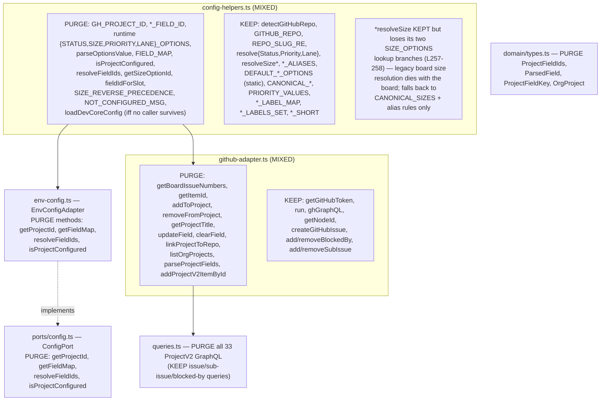
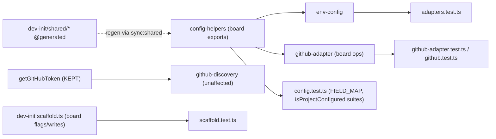

## Context

Source: `artifacts/frames/268-purge-projectv2-plumbing-frame.mdx`. Follow-up to #267
(dropped ProjectV2 board, relocated issue management to `roxabi-issues`, issues-only model).
#267 stripped the board path from `/dev`, `/pr`, `/checkup` and removed the board skills, so
**every board operation is already orphaned** — verified: 0 callers of board ops
(`addToProject`, `getBoardIssueNumbers`, `updateField`, `resolveFieldIds`,
`isProjectConfigured`, …) outside `skills/shared/` + their tests. This spec is pure
subtraction with **no behaviour change** to any live skill.

Two modules are **mixed** (board + still-used issues-only surface) → surgical extraction,
not file deletion.

## Goal

Remove all ProjectV2 / board plumbing from `dev-core` (canonical) and `dev-init` so that
`grep -rE 'ProjectV2|GH_PROJECT_ID|_FIELD_ID|isProjectConfigured|resolveFieldIds'` over both
plugins' source returns zero, while the issues-only label/relation path and the build stay green.

## Users

- **Primary:** dev-core / dev-init maintainers — the shared layer is read by `/init`, `/dev`,
  `/pr`; the dead board code is a re-wire trap.
- **Secondary:** anyone running `/init` on a fresh repo — today it still prompts for / writes
  board field IDs (`GH_PROJECT_ID`, `*_FIELD_ID`) for a board that no longer exists.

## Expected Behavior

- Nothing user-observable changes for `/dev`, `/pr`, `/checkup`, issue-triage,
  `github-discovery` — the board callers are already gone.
- `/init` (dev-init `scaffold`) no longer accepts `--project-id` / `--status-field-id` /
  `--size-field-id` / `--priority-field-id` and no longer writes `gh_project_id` /
  `*_FIELD_ID` to `.claude/dev-core.yml` or `.env`.
- `ConfigPort` loses its 4 board methods; the issues-only methods (`getRepo`,
  `resolveStatus/Priority/Size`) remain.
- `dev-init/skills/shared/*` regenerated from the purged canonical via `bun run sync:shared`;
  `sync:shared --check` green.

## Data Model & Consumers

### Surface map — board (purge) vs issues-only (keep)

### Consumer map (solid = touched here; all internal/tests — no external skill)

### Consumer summary

| Consumer | Board surface it touches | When | Status |
|---|---|---|---|
| `env-config.ts` (EnvConfigAdapter) | `GH_PROJECT_ID`, `FIELD_MAP`, `resolveFieldIds`, `isProjectConfigured` | adapter impl | **purge methods** (this issue) |
| `ports/config.ts` (ConfigPort) | 4 board methods in interface | port contract | **trim contract** (this issue) |
| `github-adapter.ts` | board ops + `GH_PROJECT_ID` import | dead | **purge ops** (this issue) |
| `github-discovery.ts` | `getGitHubToken` only | live | **untouched** (infra, not board) |
| `checkup` doctor | none (local file structure only) | live | **untouched** |
| dev-init `scaffold.ts`/`init.ts` | board field flags + yml/env writes | **live** | **purge** (this issue) |
| `*.test.ts` (config, adapters, github-adapter, github, scaffold) | board assertions | tests | **trim** (this issue) |
| dev-init `shared/*` | `@generated` mirror of canonical | build | **regenerate** via `sync:shared` |

## Breadboard

### Affordances — surfaces to purge / preserve

| ID | Surface | Action | Wiring |
|---|---|---|---|
| N1 | `config-helpers.ts` board exports | remove: `GH_PROJECT_ID`, `*_FIELD_ID`, runtime `{STATUS,SIZE,PRIORITY,LANE}_OPTIONS`, `parseOptionsValue`, `FIELD_MAP`, `isProjectConfigured`, `resolveFieldIds`, `getSizeOptionId`, `fieldIdForSlot`, `SIZE_REVERSE_PRECEDENCE`, `NOT_CONFIGURED_MSG`, and `loadDevCoreConfig` iff no caller survives. **Internal trim:** `resolveSize` keeps but loses its two `SIZE_OPTIONS` branches (L257-258). **Keep** `DEFAULT_*_OPTIONS` (static), `CANONICAL_*`, all label/repo/resolve symbols. | feeds N2, N3 |
| N2 | `env-config.ts` `EnvConfigAdapter` board methods | remove `getProjectId`, `getFieldMap`, `resolveFieldIds`, `isProjectConfigured`. **Atomic with N4** (same commit) or typecheck breaks. | implements N4 |
| N3 | `github-adapter.ts` board ops + `queries.ts` ProjectV2 GraphQL (33 refs, verified) + `domain/types.ts` board types | remove | consumed by N3-tests |
| N4 | `ports/config.ts` `ConfigPort` | remove `getProjectId`, `getFieldMap`, `resolveFieldIds`, `isProjectConfigured` from interface. **Atomic with N2.** | implemented by N2 |
| N5 | dev-init `init/lib/scaffold.ts` + `init/init.ts` board field flags/writes | remove flags, prompts, yml/env writes | feeds S1-test |
| N6 | dev-init `skills/shared/*` mirror | `bun run sync:shared` regenerate | derives from N1/N3/N4 |
| T1 | board-assertion suites: `scaffold.test.ts` (→ S1); `config.test.ts`, `adapters.test.ts`, `github-adapter.test.ts`, `github.test.ts` (→ S2) | drop board suites (incl. `NOT_CONFIGURED_MSG` assertion — tests-only symbol) | guards N1–N5 |

## Slices

| # | Slice | Contains | Independently demo-able |
|---|---|---|---|
| S1 | **dev-init live scaffold** | N5 + scaffold.test.ts | `/init` no longer prompts/writes board fields; `bun test` green in dev-init |
| S2 | **dev-core shared surgery** | N1, N2, N3, N4 + their tests (T1) | grep-clean dev-core source; `bun run typecheck` + `bun test` green |
| S3 | **mirror regen + gates** | N6 + full validate | `bun run sync:shared` then `sync:shared --check` + typecheck + lint + test all green; grep-clean both plugins |

Order: S1 ∥ S2 independent (different plugins); **S3 depends on S1 + S2** — it regenerates the
mirror from the purged canonical (needs S2) and its grep-clean gate spans both plugins (needs S1).

## Success Criteria

- [ ] `grep -rE 'ProjectV2|GH_PROJECT_ID|_FIELD_ID|isProjectConfigured|resolveFieldIds|getSizeOptionId|fieldIdForSlot|getBoardIssueNumbers|addToProject|removeFromProject|getProjectTitle|updateField|clearField|linkProjectToRepo|listOrgProjects|getProjectId|getFieldMap|NOT_CONFIGURED_MSG' plugins/dev-core/skills plugins/dev-init/skills` (board-symbol sweep; `queries.ts` + `domain/types.ts` are under `skills/shared/`, in scope) returns 0 matches
- [ ] `dev-init` `init scaffold` no longer accepts `--project-id` / `--status-field-id` / `--size-field-id` / `--priority-field-id`
- [ ] `dev-init` `init scaffold` writes no `gh_project_id` / `*_FIELD_ID` keys to `.claude/dev-core.yml` or `.env`
- [ ] `ConfigPort` interface contains no `getProjectId` / `getFieldMap` / `resolveFieldIds` / `isProjectConfigured`
- [ ] issues-only surface intact: `resolveStatus/Priority/Size`, `*_LABEL_MAP`, `detectGitHubRepo`, native-relation ops (`addBlockedBy`, `addSubIssue`) still exported and tested
- [ ] `bun run typecheck` green
- [ ] `bun test` green — all remaining suites pass (no regressions); board-assertion suites removed, not skipped
- [ ] `bun run sync:shared --check` green (dev-init mirror matches purged canonical)
