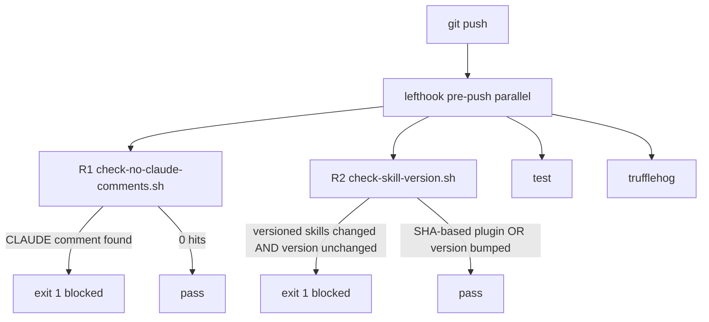
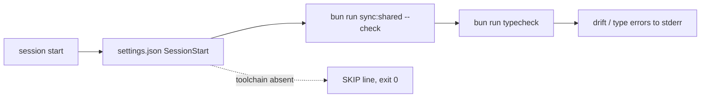
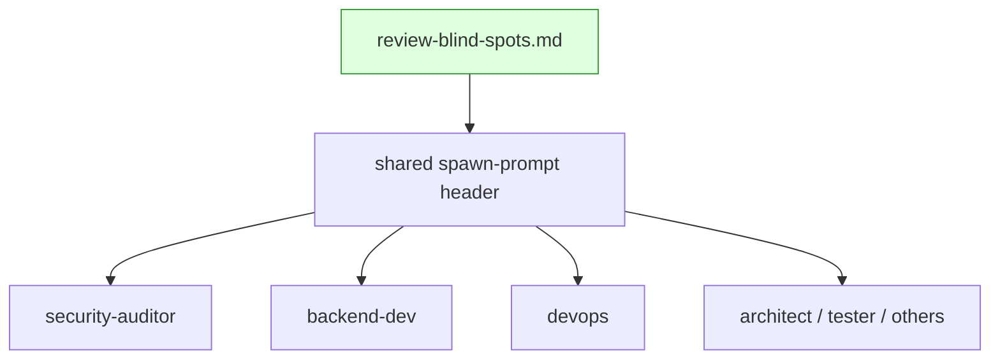

## Context

Source: `artifacts/frames/272-foldkit-ai-patterns-frame.mdx` (approved) + `~/projects/artifacts/foldkit-analysis/claude-assets.md` §4 (RETAIN LIST). Issue #272 adopts R1–R7 — the high-value subset. R1–R3 are new machine enforcement closing prose-only gaps; R4–R7 calibrate dev-core skill quality. Revised after a 4-reviewer expert pass (architect/doc-writer/product-lead/devops).

Calibration facts (verified against the tree, 2026-06-10):
- Only `dev-core/.claude-plugin/plugin.json` carries a `version` (`0.6.2`); the other 9 plugins are SHA-based (no `version` field).
- No plugin has a top-level `plugins/<name>/commands/` dir today (`dev-core/cli/commands/` is internal CLI, NOT the plugin-commands path). R2's `commands/` watch is forward-compatible and must tolerate the dir being absent.
- The only tracked `CLAUDE:` occurrence is prose in the #272 spec/frame. A source-scoped comment-leader grep `(#|//|/\*)[[:space:]]*CLAUDE:` over `*.ts/tsx/js/jsx/py/sh` matches 0 files today.
- `lefthook.yml` `pre-push` is `parallel: true` and currently runs `test` + `trufflehog`.
- `.claude/settings.json` is tracked and holds `enabledPlugins` + `extraKnownMarketplaces` (no `hooks` key yet).
- `stack.yml`: `commands.format: "bunx biome check --write"`, `commands.lint: "bunx biome check ."`.
- lefthook's two best-effort idioms: `|| true` (silence all) and `if [ -f .venv/... ]; then …; else echo SKIP >&2; fi` (distinguish missing toolchain from real failure). R3 uses the SKIP-style idiom.

## Goal

Convert 7 trust-only conventions into machine-enforced gates and concrete quality anchors, with zero false positives on the current clean tree.

## Users

- **Primary:** Mickael + contributors running the roxabi-plugins lefthook/pre-push pipeline and the dev-core dev lifecycle.
- **Secondary:** dev-core consumers — R4/R5/R6/R7 change `implement`/`dev`/`code-review` behavior for everyone who installs the plugin.

## Expected Behavior

- **R1 — `CLAUDE:` comment gate.** Pre-push, `git grep` scans **source files only** (`*.ts *.tsx *.js *.jsx *.py *.sh`) for comment-leader `CLAUDE:` markers (`#`, `//`, `/*`). Any hit → exit 1, push blocked, offending `file:line` printed. Because the scan is extension-scoped, prose in `*.md`/`*.mdx`/`artifacts/` cannot trip it; the gate script excludes itself.
- **R2 — skill-version gate.** Pre-push: `git fetch origin staging --quiet 2>/dev/null || true`, then for each plugin whose `skills/` or `commands/` changed on **this branch** (`git diff --name-only origin/staging...HEAD` — three-dot/merge-base, so upstream churn on staging is ignored), IF that plugin's `plugin.json` has a `version` field AND the HEAD version equals the `origin/staging` version → exit 1, push blocked, naming the plugin + telling the dev to bump. Plugins without a `version` field are skipped (SHA-based). Today: editing `plugins/dev-core/skills/**` without bumping `dev-core` version → blocked.
- **R3 — SessionStart drift hook.** On every Claude Code session start, `.claude/settings.json` runs a SKIP-wrapped command that calls `bun run sync:shared --check` then `bun run typecheck`, surfacing shared-source drift / type errors before work. On toolchain absence or failure it prints a `SKIP:`/warning line to stderr and exits 0 (session proceeds). Per Claude Code hook semantics exit 1 is non-blocking anyway (only exit 2 blocks); the SKIP wrapper keeps output legible.
- **R4 — named quality exemplar.** `implement` and `dev` SKILL.md gain a quality-bar statement — "would a careful reader believe this was hand-authored by the dev-core maintainer?" — naming `plugins/dev-core/` as the calibration reference, positioned in the quality-gate definition area as the **primary** quality bar (not an addendum); lint/typecheck/test become the mechanical floor, not the sole definition.
- **R5 — format-first gate ordering.** The `implement` quality gate runs `format → lint → typecheck → test` (format prepended) at every occurrence, with a one-line rationale (format must precede lint to avoid format-induced lint noise).
- **R6 — code-review blind-spots.** A new `review-blind-spots.md` resource enumerates ~15–20 Python/infra failure modes; the reference is injected into the **shared** code-review spawn-prompt header so **all** reviewer agents audit against it explicitly. Complements (does not replace) the `review-classes.yml` structural classes.
- **R7 — F-full architecture-sketch gate.** In the `dev` orchestrator, for tier F-full only, a **pre-plan** gate fires BEFORE the plan skill is invoked: present an architecture sketch (component boundaries, data flow per layer, state ownership, integration points) → wait for user confirmation → then plan. S/F-lite unaffected. The sketch gate is a user-facing confirmation, NOT a reasoning audit → it is explicitly excluded from the Step 6b `--audit`-replaces-gate rule (so `--audit` cannot silently bypass it).

## Data Model & Consumers

No new persistent data types — this is a tooling/skill change. The adapted diagrams show gate I/O flow and the blind-spots consumer map (the meaningful "data → consumer" relationships here); a `classDiagram` is N/A.

### Pre-push pipeline (R1 + R2 insertion)

### SessionStart drift hook (R3)

### Blind-spots resource consumer map (R6)

### Consumer summary

| Consumer | Consumes | When | Status |
|---|---|---|---|
| `lefthook pre-push` | R1 + R2 scripts | every `git push` | this issue |
| Claude Code session | R3 hook → sync:shared + typecheck | every session start | this issue |
| `implement` skill | R4 exemplar + R5 format-first QG | every implement run | this issue |
| `dev` skill | R4 exemplar + R7 F-full sketch gate | every dev run (sketch: F-full only) | this issue |
| code-review agents (all) | R6 `review-blind-spots.md` via shared header | every multi-domain review | this issue |

## Breadboard

### Affordances

| ID | Affordance | Location | Trigger | Handler → Effect |
|----|-----------|----------|---------|------------------|
| N1 | `scripts/check-no-claude-comments.sh` | `scripts/` | pre-push | `git grep -nE '(#\|//\|/\*)[[:space:]]*CLAUDE:' -- '*.ts' '*.tsx' '*.js' '*.jsx' '*.py' '*.sh' ':(exclude)scripts/check-no-claude-comments.sh'` → exit 1 + print on any hit, else exit 0 |
| N2 | `scripts/check-skill-version.sh` | `scripts/` | pre-push | `git fetch origin staging --quiet 2>/dev/null \|\| true`; `changed=$(git diff --name-only origin/staging...HEAD -- 'plugins/*/skills/' 'plugins/*/commands/')`; per affected plugin P: `pj=plugins/P/.claude-plugin/plugin.json`; `base=$(git show origin/staging:$pj 2>/dev/null \| jq -r '.version // empty')`; `cur=$(jq -r '.version // empty' $pj)`; if `cur` non-empty AND `base == cur` → exit 1 (`echo "P: skills changed without version bump"`). Missing dir/file/jq value → skip P gracefully. |
| N3 | R1+R2 wiring | `lefthook.yml` `pre-push.commands` | pre-push | add `check-no-claude-comments` + `check-skill-version` commands alongside `test`/`trufflehog` (parallel-safe) |
| N4 | SessionStart hook | `.claude/settings.json` `hooks.SessionStart` | session start | command: `bun run sync:shared --check && bun run typecheck || echo "SKIP: R3 drift check (toolchain absent or drift) >&2"` (exits 0; SKIP-style, visible) |
| U1 | quality-bar phrase (R4) | `implement/SKILL.md` (after the `QG :=` Let-block) + `dev/SKILL.md` (Step 1 context block) | read at impl/dev time | exemplar text names `plugins/dev-core/` as primary quality bar |
| U2 | format-first QG (R5) | `implement/SKILL.md` — all `{commands.lint}`/`{lint}` sites (grep to locate: `Let` block ~L13/21, Pre-flight `V :=` line, Step 5 bash block) | quality gate | prepend `{commands.format} &&` before lint at every site + rationale line |
| N5 | `review-blind-spots.md` (R6) | `code-review/` + shared spawn-prompt header (§ "Spawn template") | review | resource file + one header line referencing it (all agents) |
| U3 | F-full sketch gate (R7) | `dev/SKILL.md` Step 6 gate table (new pre-plan row) + Step 6b note | S* == plan ∧ τ == F-full | present arch sketch → confirm → then plan; excluded from `--audit` replacement |
| N6 | dev-core version bump | `dev-core/.claude-plugin/plugin.json` | this PR | 0.6.2 → 0.7.0 (satisfies N2 for this PR) |

**R2 documented constraints (script comments):** (a) plugin rename — renaming a versioned plugin may not fire the gate on the renaming push (old path's version not carried to the new name); acceptable in sole-operator context. (b) `commands/` watch is forward-compatible (no plugin has the dir yet); the glob tolerates absence. (c) requires a recently-fetched `origin/staging`; the `git fetch || true` prefix refreshes it best-effort.

## Slices

| Slice | Increment | Affordances | Coupling | Independently demo-able |
|-------|-----------|-------------|----------|-------------------------|
| S1 | Pre-push machine gates (R1 + R2) | N1, N2, N3 | **ships with S3** (N6 makes R2 self-pass) | `git push` blocked on planted `# CLAUDE:` + on dev-core skill edit w/o version bump; passes clean |
| S2 | SessionStart drift hook (R3) | N4 | independent | new session prints sync:shared + typecheck (or SKIP) |
| S3 | dev-core skill calibration (R4 + R5 + R7) | U1, U2, U3, N6 | **ships with S1** (N6 unblocks R2) | read updated SKILL.md sections; version bumped 0.7.0 |
| S4 | code-review blind-spots (R6) | N5 | independent | shared spawn header references `review-blind-spots.md`; resource lists ~15–20 modes |

All four slices ship in one PR (one F-lite issue). S1↔S3 are hard-coupled (the N6 bump is what makes S1's R2 gate pass on this very PR); S2 and S4 are independent but bundled.

## Success Criteria

- [ ] **R1a:** `scripts/check-no-claude-comments.sh` exits 0 on the current tree and exits 1 (printing `file:line`) when a `# CLAUDE: x` comment is planted in a `.ts`/`.py`/`.sh` file.
- [ ] **R1b:** a `CLAUDE:` string in a `*.md`/`*.mdx` file or under `artifacts/` does NOT cause a non-zero exit (extension-scoped grep proven by a planted-then-removed test).
- [ ] **R2a:** `scripts/check-skill-version.sh` exits 1 when `plugins/dev-core/skills/**` differs from `origin/staging` (three-dot) and `dev-core` `plugin.json` version equals the `origin/staging` version.
- [ ] **R2b:** exits 0 for a SHA-based plugin (no `version` field) whose skills changed (e.g. a hypothetical `compress` skill edit).
- [ ] **R2c:** exits 0 once `dev-core` version is bumped above the `origin/staging` value.
- [ ] **R2d:** the version comparison reads the base from `git show origin/staging:<plugin.json>` (not HEAD-vs-HEAD); a missing base file / missing `jq` value skips the plugin without error.
- [ ] **N3:** R1 + R2 are wired into `lefthook.yml` `pre-push` and run on `git push`.
- [ ] **R3a:** `.claude/settings.json` contains a `hooks.SessionStart` entry whose command runs `bun run sync:shared --check` and `bun run typecheck`.
- [ ] **R3b:** when `bun` is absent or the checks fail, the hook prints a `SKIP`/warning line to stderr and exits 0 (session proceeds) — verified by running the hook command with `bun` shadowed.
- [ ] **R4:** `implement/SKILL.md` and `dev/SKILL.md` name `plugins/dev-core/` as the quality calibration reference in/adjacent to the quality-gate definition, positioned as the primary quality bar (lint/typecheck/test framed as the mechanical floor, not the sole bar).
- [ ] **R5:** the `implement` quality gate reads `format → lint → typecheck → test` (format first) at every occurrence, with a rationale line; located via grep for `{commands.lint}`/`{lint}`.
- [ ] **R6:** `plugins/dev-core/skills/code-review/review-blind-spots.md` exists with ≥15 enumerated Python/infra failure modes, and the shared code-review spawn-prompt header references it (all agents receive it).
- [ ] **R7a:** `dev/SKILL.md` adds a pre-plan gate (new Step 6 gate-table row) firing only for τ == F-full, BEFORE the plan skill, with named coverage (boundaries, data flow, state ownership, integration points).
- [ ] **R7b:** `dev/SKILL.md` Step 6b notes the F-full sketch gate is excluded from the `--audit`-replaces-gate rule (audit cannot bypass it).
- [ ] **N6:** `dev-core` `plugin.json` version bumped (0.6.2 → 0.7.0); the change passes its own R2 gate.
- [ ] **QG:** full lefthook pre-commit + pre-push pipeline green on the final diff; `bun run typecheck` + `bun run test` pass.
