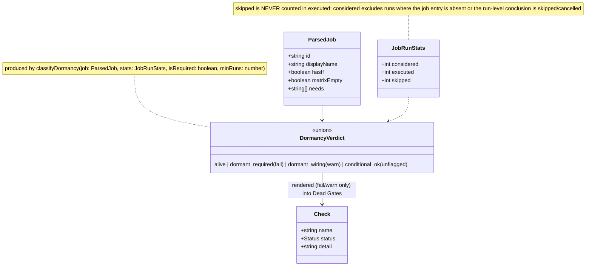
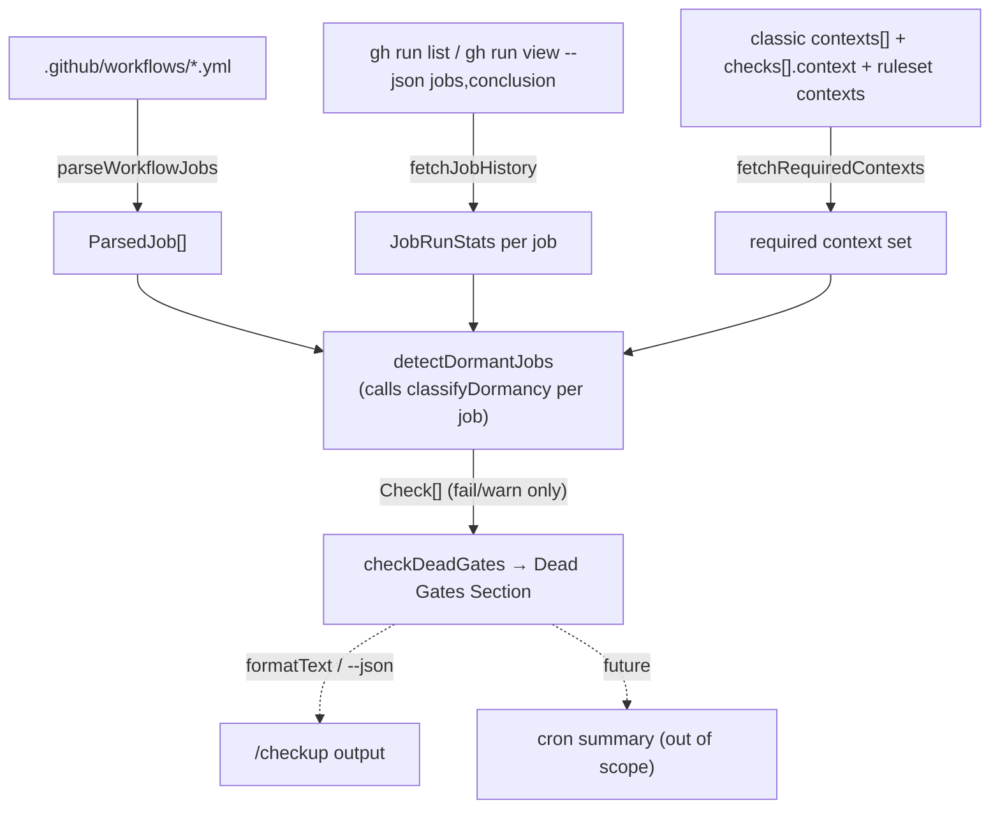

## Context

Source: [frame](../frames/288-conditional-job-skip-rate-frame.mdx) (analyze skipped — F-lite).

#278 shipped `checkDeadGates()` in `plugins/dev-core/skills/checkup/doctor-github.ts` with two
sub-checks: **(A)** token taxonomy (static YAML scan via `detectUnsafeTokenInTriggeredWorkflow`)
and **(B)** push-gate merge-relative history. Both operate at the **workflow** level. This spec adds
sub-check **(C)**: a **per-job dormancy** pass that flags a job which was eligible to run (its
workflow ran) yet executed **0 times** across the observation window — the #579 signature, where a
required e2e job was filtered out every run and 4 regressions shipped under a green check.

Reuses (do not duplicate): `STANDARD_WORKFLOWS`, `PROTECTED_BRANCHES`, `DEFAULT_RULESET`
(from `github-infra`), the grace-window helpers `workflowAgeOk`/`repoAgeOk`, `ageInDays`, and the
`spawnSync`/`Check`/`Section`/`Status` primitives from `doctor-shared`.

> Expert-review-driven refinements (panel 2026-06-12): eligibility semantics pinned (run-level skip
> exclusion + `skipped` never counts as executed + absent-job exclusion), matrix-leg matching
> anchored on static job names, required-context resolution unions classic `contexts[]` +
> `checks[].context` + **ruleset** contexts, and `--repo owner/repo` made explicit on all `gh` calls.
> Probe note: on roxabi-plugins the required `ci` check lives in **classic protection** (`contexts`
> *and* `checks` both list `ci`); its `staging` ruleset carries **no** `required_status_checks` rule
> (merge-method + thread-resolution only). So AC-7 escalation is live here via the classic source; the
> ruleset union is defensive coverage for repos that register required checks via rulesets.

## Goal

`/checkup` flags any CI **job** that never runs across ≥N eligible workflow runs, escalating to a
failure when that job is also a required status check (a merge gate that proves nothing), while not
false-flagging genuinely-conditional jobs whose paths simply weren't exercised in-window.

## Users

- **Primary:** Roxabi maintainers running `/checkup` (manual + cron) — receive a new per-job finding
  group under the existing `Dead Gates` section.
- **Secondary:** any `dev-core:checkup` consumer with conditional CI jobs (`if:`, matrix, path-gated
  via `dorny/paths-filter` + `if:`).

## Expected Behavior

For each protected branch × each standard workflow that **is alive at the workflow level** (has push
runs — a dormant job only matters inside a workflow that actually runs):

1. **Static parse** (`parseWorkflowJobs`) enumerates each job: its YAML key (`id`), display name
   (`name:` or `id`), whether it carries a job-level `if:`, whether its `strategy.matrix` is
   statically empty, and its `needs:` list. No execution — pure string parse, like
   `detectUnsafeTokenInTriggeredWorkflow`.
2. **Run-history cross-ref** (`fetchJobHistory`) samples the last `DORMANCY_RUN_LIMIT` push runs
   (`gh run list --repo <owner>/<repo> --event push`) and, per run, reads
   `gh run view <id> --repo <owner>/<repo> --json jobs,conclusion`. **Eligibility semantics (pinned):**
   - A run whose **run-level** `conclusion` is `skipped` or `cancelled` is **excluded** — the whole
     workflow was a no-op (path filter / concurrency cancel), so its jobs prove nothing. (This is the
     robust guard for workflow-level `on.push.paths` gating: a never-matched path produces no run, and
     a phantom skipped-run is excluded here — no separate `workflowPathsGated` flag, which would
     false-negative a genuinely-broken single job.)
   - `considered` counts only retained runs **in which the job entry appears** (a job added mid-window
     is absent from older runs → those runs do not inflate `considered`).
   - `executed` counts retained runs where the job's `conclusion` is **not** `skipped` (i.e.
     `success`/`failure`/`cancelled`/`timed_out`/`action_required`).
   - `skipped` counts retained runs where the job `conclusion == 'skipped'` (`if:` evaluated false /
     `needs` upstream skipped). **`skipped` is never counted as `executed`** — a job that skips every
     run has `executed == 0`.
   - Matrix legs (history name `"<job> (<leg>)"`) aggregate under their base job by **anchored prefix
     match**: a history entry belongs to static job J iff `historyName === J.displayName` **or**
     `historyName.startsWith(J.displayName + ' (')`. Anchoring on the known static display name avoids
     misattributing a job whose own name contains ` (` (e.g. `Build (debug)`).
3. **Required-check lookup** (`fetchRequiredContexts`, memoized per branch) unions three sources so
   the escalation path is live regardless of how the repo enforces checks:
   - classic protection `required_status_checks.contexts[]`,
   - classic protection `required_status_checks.checks[].context` (modern Checks-API registration),
   - **ruleset** `required_status_checks` rule contexts (`gh api .../rules/branches/<branch>`).
   Any endpoint 404 / absent rule → contributes nothing (fail-open: a missing protection response
   never *escalates*). A job is *required* if its display name — or any matrix-leg history name —
   matches a context in the union.
4. **Verdict** (`classifyDormancy`, pure) per job:
   - `considered < DORMANCY_MIN_RUNS` → **alive** (insufficient history — fail-open, never flag).
   - `executed > 0` → **alive** (it ran at least once).
   - else (`executed == 0`, enough history):
     - required check → **`fail`** (`dormant_required`): *required status check never runs — merge gate proves nothing (#579).*
     - statically-empty matrix → **`warn`** (`dormant_wiring`): *matrix expands to 0 legs — job can never run.*
     - no `if:` (should always run) → **`warn`** (`dormant_wiring`): *job skipped in all N runs — dead wiring (broken `needs`/empty matrix).*
     - has `if:`, not required → **not flagged** (`conditional_ok` — legitimate rare path, AC-3/AC-8).
5. **Grace window:** the pass is gated by `workflowAgeOk(owner, repo, wf)` (recently-added workflow
   excused) and by the `considered ≥ DORMANCY_MIN_RUNS` floor (recently-added job has too little
   history). A young job is therefore skipped by construction.
6. **Render contract:** `detectDormantJobs` emits a `Check` **only** for `dormant_required` (`fail`)
   and `dormant_wiring` (`warn`); `alive` and `conditional_ok` emit nothing. Checks are named
   `"<wf>:<branch>:<job> dormancy"`, sub-grouped by job, appended to the existing `Dead Gates`
   section. The section's existing `checks.length === 0` fallback then covers sub-checks B **and** C:
   the single clean-state `pass` ("per-job dormancy: no dormant jobs") fires only when neither
   produced a finding. Read-only — no `git`/`gh` mutation, no run re-trigger.

## Data Model & Consumers

### Data structures

### Consumer map

### Consumer summary

| Consumer | Fields consumed | When | Status |
|---|---|---|---|
| `classifyDormancy` | `ParsedJob.{hasIf,matrixEmpty}`, `JobRunStats.{considered,executed}`, `isRequired`, `minRuns` (C1) | per job | this issue |
| `detectDormantJobs` | `DormancyVerdict`, job/wf/branch labels | per job | this issue |
| `checkDeadGates` (Section C) | `Check[]` from `detectDormantJobs` (fail/warn only) | per `/checkup` | this issue |
| `formatText` / `--json` renderer | `Check.{name,status,detail}` | render | existing (#278) |
| cron summary roll-up | `Check.status` | future | out of scope |

## Breadboard

### Affordances — new symbols in `doctor-github.ts`

| ID | Affordance | Kind | Wiring |
|---|---|---|---|
| N1 | `parseWorkflowJobs(content): ParsedJob[]` | pure parser | called by N4 per workflow file |
| N2 | `fetchJobHistory(owner, repo, wf, branch, jobs, limit): Map<string,JobRunStats>` | runtime (gh) | called by N4; `--repo owner/repo` on every call; run-level skip exclusion + anchored matrix-leg match |
| N3 | `fetchRequiredContexts(owner, repo, branch): Set<string>` | runtime (gh) | called by N4 once per branch (memoized); unions classic `contexts[]` + `checks[].context` + ruleset contexts; any 404 → contributes ∅ |
| N4 | `detectDormantJobs(ghOk, owner, repo): Check[]` | runtime orchestrator | invoked by N5; iterates `PROTECTED_BRANCHES` × `STANDARD_WORKFLOWS` |
| N5 | `checkDeadGates(...)` Section C | integration point | appends `...detectDormantJobs(ghOk, owner, repo)` after sub-check B, before the shared `checks.length === 0` pass fallback |
| N6 | `classifyDormancy(job, stats, isRequired, minRuns): DormancyVerdict` | pure verdict | called by N4 per job; emits a `Check` only for `fail`/`warn` verdicts |
| C1 | `DORMANCY_MIN_RUNS = 5` | const | floor for `considered` |
| C2 | `DORMANCY_RUN_LIMIT = 10` | const | `gh run` sample size per wf/branch |

### Wiring narrative

`checkDeadGates` (N5) — after sub-check B, before the final `pass` fallback — calls
`detectDormantJobs` (N4) and pushes its `Check[]` into the section's `checks`. N4 reuses the existing
`ghOk`/`repoAgeOk` guards already evaluated in B (skip the whole pass when `!ghOk` or `!repoAgeOk`).
For each branch that exists × each workflow with `countPushRuns > 0` (alive) and `workflowAgeOk`, N4:
parses the local workflow file → N1; resolves required contexts → N3 (memoized per branch); samples
history for the parsed jobs → N2; per job → N6; maps `fail`/`warn` verdicts to a `Check`
(`alive`/`conditional_ok` emit nothing). Pure logic (N1, N6) is unit-tested directly; N4 is
integration-tested via the doctor subprocess like the existing `checkDeadGates` block.

## Slices

| # | Slice | Demo-able outcome |
|---|---|---|
| S1 | `parseWorkflowJobs` (N1) + `ParsedJob` type | unit test: parses `if:`, empty matrix, `needs`, display name from fixtures (incl. a name containing ` (`) |
| S2 | `classifyDormancy` (N6) + verdict type + constants | unit test: full verdict matrix (alive / insufficient-history / required-fail / wiring-warn / empty-matrix-warn / conditional-unflagged) |
| S3 | `fetchJobHistory` (N2) + `fetchRequiredContexts` (N3) | runtime helpers: run-level skip exclusion, absent-job exclusion, `skipped`≠`executed`, anchored matrix-leg aggregation; required-context union of classic+checks+ruleset with 404 fail-open |
| S4 | `detectDormantJobs` (N4) wired into `checkDeadGates` (N5) | integration test (subprocess): Dead Gates renders per-job dormancy sub-grouped by job; clean-state pass; read-only |

## Success Criteria

> New AC labels start at **AC-6** — `dead-gate.test.ts` already uses AC-1…AC-5 (+AC-3b) for #278.

- [ ] **AC-6 (issue AC-1):** an unconditional job (no `if:`) or statically-empty matrix with `executed == 0` across `≥ DORMANCY_MIN_RUNS` retained runs → `warn` (`dormant_wiring`) — unit-tested + asserted in rendered Check status.
- [ ] **AC-7 (issue AC-2):** a job with `executed == 0` across `≥ DORMANCY_MIN_RUNS` runs that **is a required status check** → `fail` (`dormant_required`, "merge gate proves nothing / #579") — unit-tested; takes precedence over the `conditional_ok` path even when `hasIf == true` (the #579 e2e case: required + skipped-every-run).
- [ ] **AC-8 (issue AC-3):** a conditional job (`hasIf == true`) that is **not** required and skips every run (`executed == 0, skipped > 0`) → **not flagged** (no Check emitted) — unit-tested.
- [ ] **AC-9 (issue AC-4):** grace window — a workflow failing `workflowAgeOk` is skipped entirely; a job with `considered < DORMANCY_MIN_RUNS` (incl. mid-window additions counted only in runs where the job appears) → **alive**, not flagged — unit-tested.
- [ ] **AC-10 (issue AC-5):** `detectDormantJobs` output renders inside the existing `Dead Gates` section, named `"<wf>:<branch>:<job> dormancy"`, sub-grouped by job (no new top-level section); read-only (no `git`/`gh` mutation, no run re-trigger) — integration-tested via the existing read-only guard pattern.
- [ ] **AC-11 (required-context resolution):** `fetchRequiredContexts` unions classic `contexts[]` + `checks[].context` + ruleset `required_status_checks` contexts; an endpoint 404 contributes ∅ and **never escalates** a job to `fail` (fail-open) — unit-tested with fixture responses for each source and the 404 case.
- [ ] **Parser:** `parseWorkflowJobs` enumerates `{id, displayName, hasIf, matrixEmpty, needs}` from a workflow YAML string (pure, no I/O), including a display name containing ` (` — unit-tested against fixtures.
- [ ] **Eligibility semantics:** `fetchJobHistory` excludes runs whose run-level `conclusion ∈ {skipped, cancelled}` and runs where the job entry is absent from `considered`; counts `conclusion == 'skipped'` into `skipped` (never `executed`); aggregates matrix legs by anchored prefix — unit-tested.
- [ ] **Clean state:** when no job is `dormant_*`, the existing `checks.length === 0` fallback emits exactly one `pass` Check covering sub-checks B+C — integration-tested.
- [ ] **`--repo` correctness:** every `gh run list` / `gh run view` call in N2 passes `--repo <owner>/<repo>` (cron-safe from arbitrary cwd) — asserted by inspection/test.
- [ ] `bun run lint`, `bun run typecheck`, and `bun test` (checkup suite) all pass.

## Notes / Deferred

- **Per-job git-blame age** (precise "job younger than window" vs the workflow-age proxy) is deferred;
  the `workflowAgeOk` + absent-job-aware `considered ≥ DORMANCY_MIN_RUNS` floor is the F-lite grace gate.
- **Matrix-leg name format** `"<job> (<leg>)"` is an observed GitHub Actions display convention, not a
  documented `gh run view --json jobs` API contract. If it changes, anchored matching degrades to
  treating legs as top-level jobs (false negatives, not false positives) — documented inline in N2.
- **AC-7 end-to-end on roxabi-plugins:** probe (2026-06-12) confirms the required `ci` check is in
  **classic protection** (`required_status_checks.contexts:["ci"]` and `.checks:[{context:"ci"}]`);
  the `staging` ruleset has no `required_status_checks` rule. So the classic source already makes the
  `fail` escalation live in production; the ruleset union (AC-11) is defensive for ruleset-enforced
  repos. The unit test proves the `classifyDormancy(isRequired=true)→fail` logic with a synthetic
  stats fixture (no dependence on live protection state).
- **`gh` call budget:** ≤ `|PROTECTED_BRANCHES| × |STANDARD_WORKFLOWS| × DORMANCY_RUN_LIMIT` run-view
  calls (≤80), bounded further by alive-workflow + branch-exists gating + per-branch memoized N3.
  Acceptable for read-only cron.
