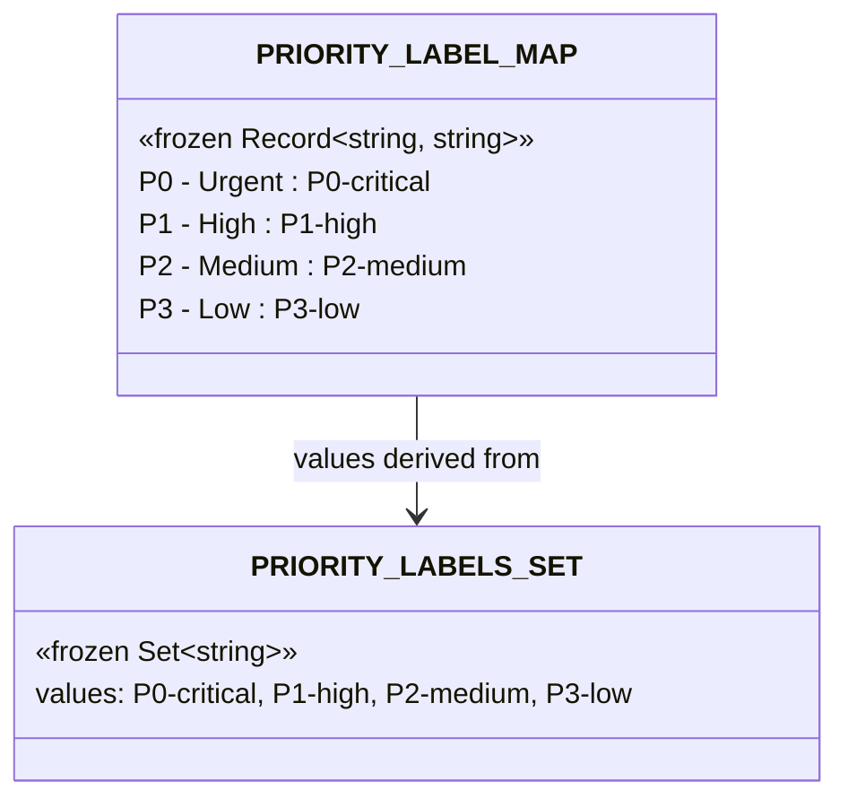
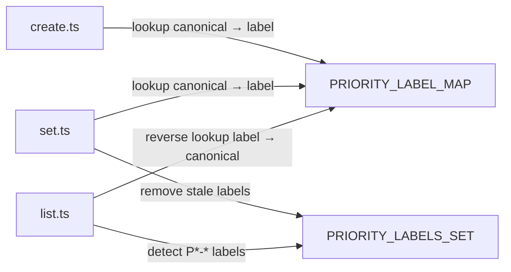

## Context

Promoted from [frame #37](../frames/37-triage-priority-sync-frame.mdx). Priority lives in two places (GitHub labels and Project V2 fields) with no sync. `triage.ts` already owns the project field writes — this spec adds label sync as a side-effect of those writes so triage becomes the single source of truth.

## Goal

When `triage.ts` sets or changes a priority, automatically sync the corresponding GitHub label — ensuring labels and project fields always agree.

## Users

- **Primary:** Dev-core users running `/issue-triage create`, `/issue-triage set`, `/issues`
- **Secondary:** GitHub UI users filtering issues by priority label

## Expected Behavior

1. **Create with priority:** `triage.ts create --title "Bug" --priority P1` creates the issue, sets the Project V2 Priority field to `P1 - High`, **and** applies the `P1-high` label.

2. **Change priority:** `triage.ts set 42 --priority P2` updates the Project V2 field to `P2 - Medium`, **removes** any existing `P*-*` priority labels (`P0-critical`, `P1-high`, `P3-low`), and **adds** `P2-medium`.

3. **List with mismatch warning:** `triage.ts list` compares each issue's project Priority field against its labels. If they disagree, appends a `⚠` marker in the output table.

4. **Non-fatal:** If label sync fails (e.g., label doesn't exist in repo, permissions), the project field update still succeeds. A warning is printed to stderr.

## Data Model & Consumers

### Priority label mapping

### Consumer map

### Consumer summary

| Consumer | Fields consumed | When | Status |
|----------|----------------|------|--------|
| `create.ts` | `PRIORITY_LABEL_MAP[canonical]` | After project field set, when `--priority` present | This issue |
| `set.ts` | `PRIORITY_LABEL_MAP[canonical]`, `PRIORITY_LABELS_SET` | After project field set, when `--priority` present | This issue |
| `list.ts` | `PRIORITY_LABEL_MAP` (reverse), `PRIORITY_LABELS_SET` | During list rendering, for mismatch detection | This issue |

## Breadboard

### Affordances

| ID | Element | Location |
|----|---------|----------|
| U1 | `--priority P` flag | `create.ts` CLI args |
| U2 | `--priority P` flag | `set.ts` CLI args |
| U3 | `⚠` mismatch marker | `list.ts` table output |

### Handlers

| ID | Handler | Trigger |
|----|---------|---------|
| H1 | `syncPriorityLabel(issueNumber, canonical)` | After project field write in create/set |
| H2 | `detectPriorityMismatch(issue)` | During list rendering per issue |

### Data

| ID | Source | Shape |
|----|--------|-------|
| D1 | `PRIORITY_LABEL_MAP` | `Record<string, string>` — canonical priority → label name |
| D2 | `PRIORITY_LABELS_SET` | `Set<string>` — all priority label names (for removal) |

### Wiring

| Flow | Path |
|------|------|
| Create + priority | U1 → parse → project field write → H1(issueNumber, canonical) → `gh issue edit --add-label D1[canonical]` |
| Set + priority | U2 → parse → project field write → H1(issueNumber, canonical) → `gh issue edit --remove-label {stale from D2} --add-label D1[canonical]` |
| List mismatch | fetch issues (extend `TRIAGE_QUERY` / `RawItem` to include `content.labels`) → per issue: H2 compares project priority vs labels against D1 → U3 if mismatch |

## Slices

| # | Slice | Deliverable | Demo |
|---|-------|-------------|------|
| 1 | Constants + helper | `PRIORITY_LABEL_MAP`, `PRIORITY_LABELS_SET`, `syncPriorityLabel()` in `config-helpers.ts` + standalone `updateLabels()` export in `github-adapter.ts` | Unit test: mapping correctness |
| 2 | Create sync | Wire `syncPriorityLabel` into `create.ts` after project field write | `triage.ts create --title "Test" --priority P1` → issue has `P1-high` label |
| 3 | Set sync | Wire `syncPriorityLabel` into `set.ts` after project field write, with stale label removal | `triage.ts set 42 --priority P2` → old label removed, `P2-medium` added |
| 4 | List mismatch | Extend `TRIAGE_QUERY` + `RawItem` to include `content.labels`. Add `⚠` column/marker in `list.ts` when label vs field disagree | `triage.ts list` shows `⚠` next to mismatched issues |

## Success Criteria

- [ ] `triage.ts create --priority P1` applies `P1-high` label to the created issue
- [ ] `triage.ts set N --priority P2` removes any existing `P0-critical`/`P1-high`/`P3-low` labels and adds `P2-medium`
- [ ] `triage.ts set N --priority P2` when issue already has `P2-medium` label does not error (idempotent)
- [ ] Label sync failure does not prevent project field update (non-fatal, warning to stderr)
- [ ] `triage.ts list` shows `⚠` marker when issue has priority label that disagrees with project field
- [ ] `triage.ts create` without `--priority` does not add any priority label (no change to existing behavior)
- [ ] All existing tests pass (`bun test`)
- [ ] New unit tests cover the priority-to-label mapping and `syncPriorityLabel` helper
