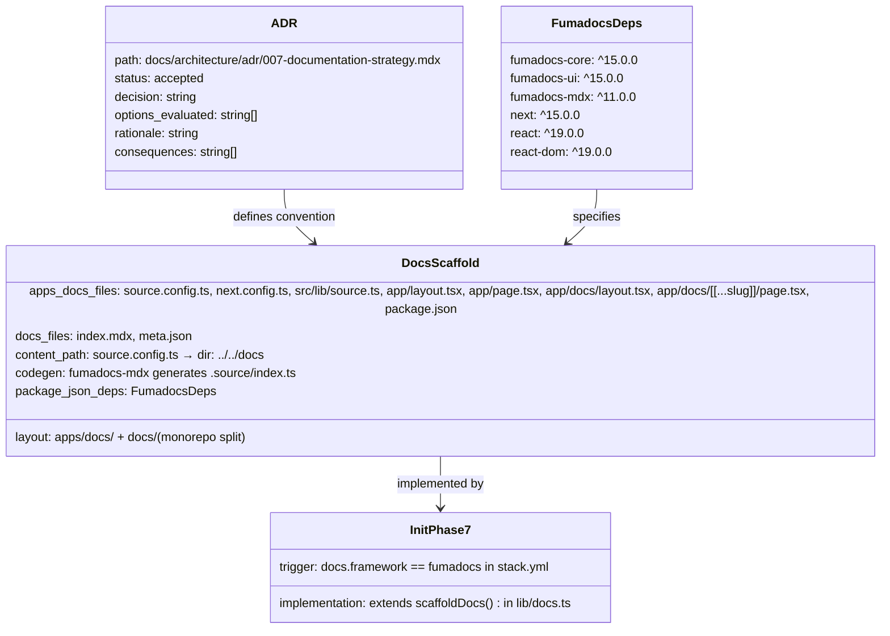
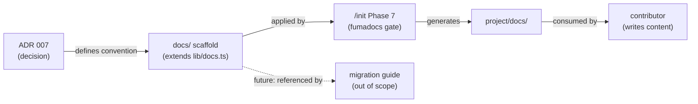

## Context

Promoted from approved frame: [`artifacts/frames/38-documentation-strategy-frame.mdx`](../frames/38-documentation-strategy-frame.mdx).

Five Roxabi projects (roxabi-plugins, lyra, voiceCLI, roxabi-dashboard, roxabi_site) lack a shared documentation strategy — inconsistent tooling, structure, and no agreed hosting model. **Fumadocs is a pre-existing constraint** (already in use in some projects; not open for replacement).

**Reference implementation:** `roxabi_boilerplate` (`apps/docs/` + `docs/`) — this is the pattern to standardize.

## Goal

Record the documentation architecture decision in an ADR (adopting the `roxabi_boilerplate` monorepo split pattern as the standard), define the scaffold convention, and extend `/init` Phase 7 to implement it automatically when `docs.framework: fumadocs` is set in `stack.yml`.

## Users

- **Primary:** Roxabi core contributors starting a new project — run `/init` and get a ready-to-scaffold Fumadocs setup automatically
- **Note:** Existing project adoption is intentionally deferred. The ADR migration notes section serves as a placeholder for future work.

## Expected Behavior

A contributor running `/init` on a new project with `docs.framework: fumadocs` in `stack.yml` gets the standard `docs/` directory structure, config files, and correct Fumadocs dependencies added automatically. No manual setup.

The ADR documents why the chosen architecture was selected and why the alternatives were ruled out, given the Fumadocs constraint. It is not a genuinely open evaluation — the decision is recorded, not made here.

This spec does **not** author documentation content and does **not** establish an adoption path for existing projects (deferred).

## Data Model & Consumers





| Consumer | Fields consumed | When | Status |
|----------|----------------|------|--------|
| `/init` Phase 7 | `DocsScaffold.structure`, config files, `FumadocsDeps` | On project init (when fumadocs gate active) | This issue |
| Contributors | ADR decision + rationale | When setting up docs | This issue |
| Migration guide | `DocsScaffold.structure` | When migrating existing projects | Future (out of scope) |

## Breadboard

### Affordances

| ID | Affordance | Handler | Data |
|----|-----------|---------|------|
| U1 | Read ADR | `docs/architecture/adr/007-documentation-strategy.mdx` | ADR document |
| U2 | Run `/init` on new project (fumadocs) | Phase 7 in init SKILL.md — `scaffoldDocs()` in `lib/docs.ts` | `DocsScaffold` |
| U3 | Browse generated docs structure | `project/docs/` directory | Files + config |
| N1 | Option: centralized portal (ruled out) | ADR analysis section | Pros/cons, why ruled out |
| N2 | Option: per-project (ruled out or chosen) | ADR analysis section | Pros/cons, why ruled out |
| N3 | Option: hybrid (ruled out or chosen) | ADR analysis section | Pros/cons, why ruled out |
| S1 | `/init` creates `docs/` structure | Phase 7 fumadocs branch in `scaffoldDocs()` | directory tree |
| S2 | `/init` installs Fumadocs deps | Phase 7 `bun add` in `docs/` | `FumadocsDeps` |
| S3 | `/init` writes config files | Phase 7 template writes | `source.config.ts`, `next.config.ts` |

### Wiring

```
ADR (N1, N2, N3) → decision → scaffold convention → lib/docs.ts extension (S1, S2, S3)
                                                              ↓
                                              /init Phase 7 fumadocs gate (U2)
                                                              ↓
                                              project/docs/ (U3)
```

## Slices

| # | Slice | Affordances | Deliverable | Demo |
|---|-------|------------|-------------|------|
| 1 | Write ADR | N1, N2, N3, U1 | `docs/architecture/adr/007-documentation-strategy.mdx` (status: accepted) — create `docs/architecture/adr/` directory if not exists | Read ADR: decision is explicit, three options evaluated with clear ruling, rationale tied to Fumadocs constraint |
| 2 | Define scaffold convention | S1, S2, S3, U3 | Convention documented in `plugins/dev-core/references/docs-scaffold.md` + Fumadocs template strings added to `lib/docs.ts` | `lib/docs.ts` contains templates for: `apps/docs/source.config.ts`, `apps/docs/next.config.ts`, `apps/docs/src/lib/source.ts`, `apps/docs/app/layout.tsx`, `apps/docs/app/page.tsx`, `apps/docs/app/docs/layout.tsx`, `apps/docs/app/docs/[[...slug]]/page.tsx`, `docs/index.mdx`, `docs/meta.json`; `docs-scaffold.md` lists all files and dep versions |
| 3 | Extend `/init` Phase 7 | U2 | Updated `plugins/dev-core/skills/init/SKILL.md` Phase 7 gated on `docs.framework: fumadocs`; updated `lib/docs.ts` `scaffoldDocs()` with fumadocs branch that creates the monorepo split layout | Run `/init` on a project with `docs.framework: fumadocs` → `apps/docs/` + `docs/` created; `bun install` succeeds in `apps/docs/` |

## Success Criteria

- [ ] ADR exists at `docs/architecture/adr/007-documentation-strategy.mdx` with `status: accepted`
- [ ] ADR evaluates all three options (centralized portal, per-project, hybrid), documenting why alternatives were ruled out given the Fumadocs constraint
- [ ] ADR states the chosen architecture with clear rationale
- [ ] Scaffold convention reference exists at `plugins/dev-core/references/docs-scaffold.md` listing all generated files and required dep versions
- [ ] `lib/docs.ts` `scaffoldDocs()` contains a fumadocs branch that generates the monorepo split: `apps/docs/` (Next.js app with `source.config.ts`, `next.config.ts`, `src/lib/source.ts`, app routes) + `docs/` (content with `index.mdx`, `meta.json`)
- [ ] `/init` Phase 7 is gated: Fumadocs scaffolding only runs when `docs.framework: fumadocs` is present in `stack.yml`
- [ ] `/init` Phase 7 installs `fumadocs-core@^15`, `fumadocs-ui@^15`, `fumadocs-mdx@^11`, `next@^15`, `react@^19`, `react-dom@^19` in `apps/docs/` (not project root)
- [ ] Running `/init` with fumadocs gate active creates the correct directory structure (structural completeness: all expected files present in `apps/docs/` and `docs/`)
- [ ] `bun install` succeeds in the generated `apps/docs/` directory (smoke test — advisory, not blocking)
- [ ] All five Roxabi projects are listed in the ADR as in-scope for the strategy
- [ ] If a file in `docs/` already exists, scaffold skips it and emits a warning — does not overwrite (additive only)
