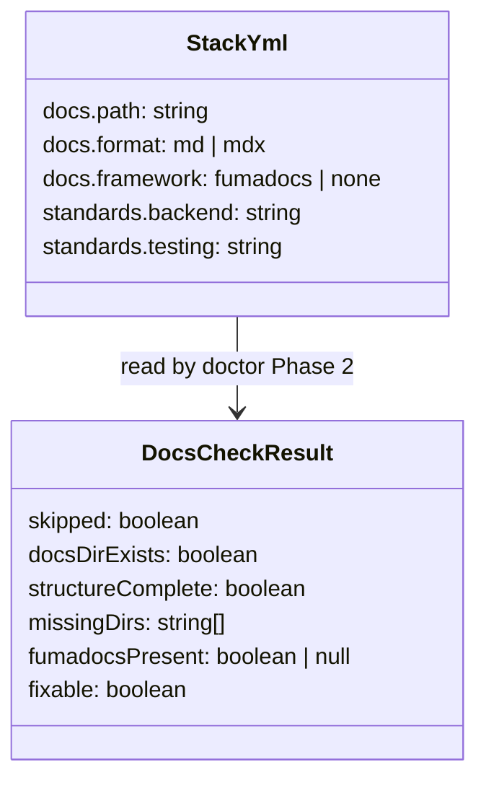
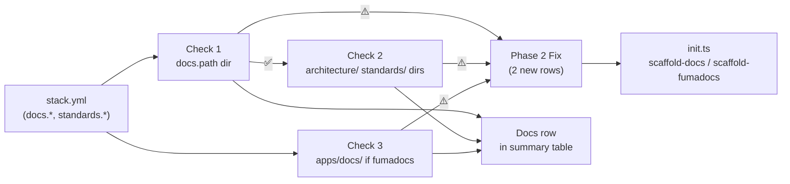

## Context

Extends `/doctor` Phase 2 (Stack configuration health check) with documentation structure validation. Promoted from frame `40-doctor-doc-pointers-frame.mdx`. Related: #38 (scaffold-docs + scaffold-fumadocs).

Note: Phase 2 already checks `standards.*` file paths individually (each path listed in stack.yml is verified with `existsSync`). This issue does NOT change those checks — it adds a complementary structural check (do the scaffold-created directories exist at all) and a Fumadocs app check.

## Goal

Doctor reports whether the project's documentation structure is set up and healthy, and offers to scaffold it if missing — all within Phase 2, non-destructively.

## Users

- **Primary:** Developer running `/doctor` after `/init` (or on a project that skipped Phase 7) who wants a full health picture including docs.
- **Secondary:** dev-core agents (backend-dev, fixer, tester) that read `standards.*` paths — they get silent failures today when those files don't exist.

## Expected Behavior

During Phase 2, after the existing `standards.*` path checks, doctor runs three new checks:

**Check 1 — docs.path directory exists:**
Read `docs.path` from stack.yml. If `docs.path` is absent from stack.yml → skip all three checks (⏭). Otherwise check the directory exists on disk.
- ✅ `docs/ directory found`
- ⚠️ `docs.path not found on disk: {path}` → auto-fixable (scaffold-docs)

**Check 2 — docs directory structure present:**
Only runs if Check 1 passes. Checks that scaffold-docs created its two top-level directories. Uses `existsSync` on directories, NOT individual files — avoids duplication with the existing `standards.*` per-file checks.
- Check `{docs.path}/architecture/` directory exists
- Check `{docs.path}/standards/` directory exists
- ✅ `Docs structure present (architecture/, standards/)`
- ⚠️ `Docs structure incomplete — missing: {list of dirs}` → auto-fixable (scaffold-docs)

Note: individual standards file checks are already handled by the existing `standards.*` path check loop. Check 2 only validates directory presence to confirm scaffold-docs was run.

**Check 3 — Fumadocs app present (conditional):**
Only runs if `docs.framework: fumadocs` in stack.yml. Checks `apps/docs/source.config.ts` exists (stable path — always generated by scaffold-fumadocs at this location regardless of docs.path).
- ✅ `Fumadocs app found (apps/docs/)`
- ⚠️ `Fumadocs app missing — apps/docs/ not scaffolded` → auto-fixable (scaffold-fumadocs)

**Phase 2 Fix — repair offer:**
The three new checks feed into the existing Phase 2 Fix flow. Phase 2 Fix table in SKILL.md gains two new rows:

| Issue | Fix command |
|-------|-------------|
| `docs.path missing / structure incomplete` | `bun "${CLAUDE_PLUGIN_ROOT}/skills/init/init.ts" scaffold-docs --format {docs.format} --path {docs.path}` |
| `Fumadocs app missing` | `bun "${CLAUDE_PLUGIN_ROOT}/skills/init/init.ts" scaffold-fumadocs --root {cwd} --docs-path {docs.path}` |

These rows take precedence over the existing `standards.*` advisory ("edit manually") when the missing paths match scaffold-docs output patterns — i.e., when the file doesn't exist because scaffold-docs was never run, offer scaffold-docs instead of asking the user to edit manually.

After each fix: re-run only the three docs checks (targeted, not full Phase 2) and display updated status.

**Format fallback:**
When checking for `architecture/` directory, accept the directory if it exists regardless of format. File-level format checks are out of scope — only directory presence matters.

**Summary table — Docs row:**
The Phase 2 summary gains a `Docs` line. Examples:

```
# fumadocs project, all present:
Docs          ✅ docs/ present, structure complete, Fumadocs ✅

# non-fumadocs project, all present:
Docs          ✅ docs/ present, structure complete

# docs.path directory missing:
Docs          ⚠️ docs/ not found on disk — run scaffold-docs to fix

# structure incomplete:
Docs          ⚠️ docs structure incomplete (missing: architecture/) — run scaffold-docs

# docs.path not set in stack.yml:
Docs          ⏭ docs.path not set in stack.yml
```

## Data Model & Consumers





| Consumer | Fields read | When | Status |
|----------|-------------|------|--------|
| Doctor Phase 2 | `docs.path`, `docs.format`, `docs.framework` | Health check | This issue |
| Phase 2 Fix | `docs.path`, `docs.format`, `docs.framework` | Repair | This issue |
| dev-core agents | `standards.*` (already checked) | Every agent run | Existing — untouched |

## Breadboard

| Affordance | Handler | Data |
|------------|---------|------|
| U1: docs.path dir check | `existsSync(docs.path)` | `stack.yml → docs.path` |
| U2: architecture/ + standards/ dir check | `existsSync` ×2 dirs | `docs.path` |
| U3: fumadocs app check | `existsSync('apps/docs/source.config.ts')` | `docs.framework == fumadocs` |
| U4: repair offer (scaffold-docs) | `init.ts scaffold-docs` | `docs.path, docs.format` |
| U5: repair offer (scaffold-fumadocs) | `init.ts scaffold-fumadocs` | `docs.path` |
| U6: Docs row in summary | inline display | DocsCheckResult |

Wiring:
- Phase 2 → U1 → (✅) U2 → U3 (if fumadocs) → collect fixable → Phase 2 Fix → U4/U5 → targeted re-check → U6

## Slices

| # | Slice | Affordances | Demo |
|---|-------|-------------|------|
| V1 | Docs checks + summary row | U1, U2, U3, U6 | `/doctor` shows Docs row with ✅/⚠️/⏭ |
| V2 | Repair offer + re-check | U4, U5 | Phase 2 Fix offers scaffold-docs / scaffold-fumadocs; re-checks docs after fix |

## Success Criteria

- [ ] Doctor Phase 2 reads `docs.path` from stack.yml; if absent → all docs checks are ⏭ (not an error)
- [ ] Doctor checks `{docs.path}` directory exists on disk (Check 1)
- [ ] Doctor checks `{docs.path}/architecture/` and `{docs.path}/standards/` directories exist (Check 2 — directory-level only, no file-level duplication with existing `standards.*` checks)
- [ ] When `docs.framework: fumadocs` in stack.yml, doctor checks `apps/docs/source.config.ts` exists (Check 3)
- [ ] All three failing checks appear in Phase 2 Fix as auto-fixable items
- [ ] Phase 2 Fix table in SKILL.md gains two new rows: scaffold-docs (for Check 1/2 failures) and scaffold-fumadocs (for Check 3 failures)
- [ ] Phase 2 Fix runs `scaffold-docs --format {docs.format} --path {docs.path}` when docs.path or structure missing
- [ ] Phase 2 Fix runs `scaffold-fumadocs --root {cwd} --docs-path {docs.path}` when Fumadocs app missing
- [ ] After each repair, doctor re-runs only the three docs checks (not full Phase 2) and displays updated Docs row
- [ ] Doctor Phase 2 summary includes a `Docs` line — omits Fumadocs segment when `docs.framework` is not fumadocs
- [ ] All checks are non-destructive — no files written unless user selects a fix in Phase 2 Fix
