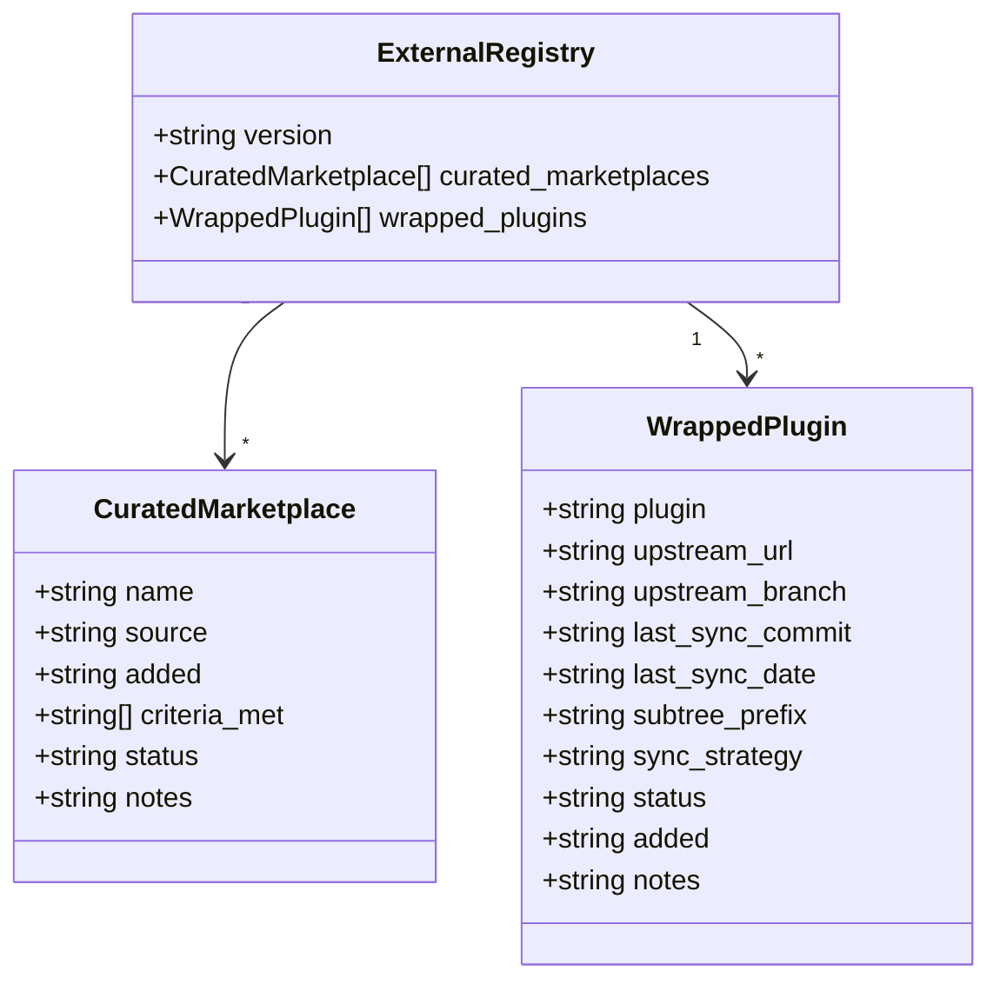
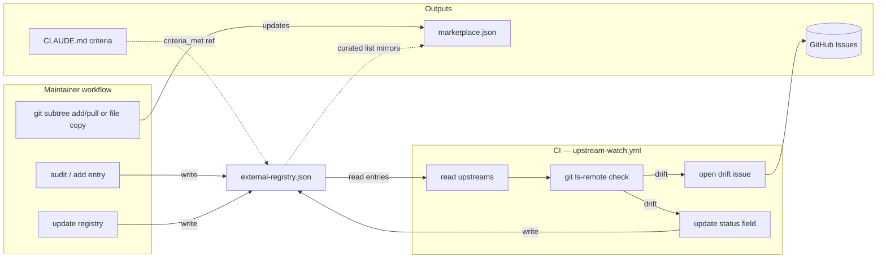

## Context

Promoted from: `artifacts/analyses/62-external-ecosystem-maintenance-analysis.mdx`
Shape selected: **Shape 3 — two-step rollout** (registry JSON + CI watch this cycle; TypeScript CLI deferred to Step B when first real entry is added)

## Goal

Define and implement a framework for managing the external Claude Code ecosystem: explicit decision criteria for three cases (curated marketplaces, wrapped plugins, native plugins), a machine-readable registry tracking all external sources, a CI workflow that detects upstream drift without auto-merging, and CLAUDE.md documentation that makes the full workflow self-contained for a solo maintainer.

## Users

- **Primary:** Roxabi maintainer (Mickael) — adds/updates/deprecates external plugins
- **Secondary:** Plugin users — benefit from endorsed external content staying current and safe

---

## Data Model & Consumers

### Core types



- `status` ∈ `active | drift_detected | deprecated`
- `sync_strategy` ∈ `subtree | copy`
- `criteria_met` — array of criterion IDs from CLAUDE.md qualify checklist

### Consumer map



### Consumer summary

| Consumer | Fields read | When | Status |
|----------|-------------|------|--------|
| `upstream-watch.yml` | `wrapped_plugins[*].upstream_url/branch/last_sync_commit/status`, `curated_marketplaces[*].source` | Weekly cron + manual dispatch | This issue |
| Maintainer (manual) | All fields | When adding/updating/deprecating | This issue |
| `marketplace.json` | `wrapped_plugins[*].plugin` (name sync) | When wrapping a plugin | This issue |
| `tools/external.ts` (Step B CLI) | All fields | When first real entry is added (deferred) | Future |

---

## Expected Behavior

### Adding a curated marketplace

1. Maintainer verifies repo manually: confirm it exists, ships `marketplace.json`, has working install mechanism, last commit ≤90 days ago, content quality, <50% overlap with native plugins
2. Maintainer adds entry to `external-registry.json` under `curated_marketplaces`, populating `criteria_met`
3. Maintainer updates `curated-marketplaces.json` (existing file) — or CLAUDE.md documents that `external-registry.json` is the authoritative source and `curated-marketplaces.json` is kept in sync
4. CI next run confirms new entry is watched

### Wrapping an external plugin (copy strategy)

1. Maintainer verifies repo: SKILL.md quality, maintained ≤90 days, gap fill, compatible license
2. Decides `sync_strategy: copy` (flat SKILL.md files, no meaningful directory structure)
3. Copies SKILL.md into `plugins/<name>/skills/<name>/SKILL.md`, rewrites frontmatter, adds README, adds to `marketplace.json`
4. Adds entry to `external-registry.json` with `last_sync_commit` = current upstream HEAD SHA, `sync_strategy: copy`
5. CI watches `upstream_url` weekly; on drift → opens issue with instructions for maintainer to review + re-copy

### Wrapping an external plugin (subtree strategy)

Same as above but step 3 uses `git subtree add --prefix=plugins/<name> <url> <branch> --squash`. `subtree_prefix` field in registry enables future `git subtree pull`.

### CI upstream watch (weekly)

1. `upstream-watch.yml` runs on schedule: `cron: '0 9 * * 1'` (Mondays 09:00 UTC)
2. Reads `external-registry.json` — all `active` entries (skips `deprecated`)
3. For each wrapped plugin: `git ls-remote --refs <upstream_url> refs/heads/<upstream_branch>` → compare SHA to `last_sync_commit`
4. For each curated marketplace: `git ls-remote --refs <source>.git HEAD` → compare to last known SHA (stored in `last_checked_commit` field)
5. On drift: opens GitHub issue with title `upstream drift: <plugin>`, body summarizing old vs new SHA, labels `upstream-update`, assigns maintainer
6. Does NOT auto-merge, auto-PR, or modify plugin files

### Deprecating a plugin

1. Condition met (archived upstream, >12 months no commit, superseded, license change)
2. Maintainer sets `status: deprecated` in `external-registry.json`
3. Removes entry from `marketplace.json` (wrapped) or `curated-marketplaces.json` (curated)
4. Optionally removes plugin directory (wrapped only, with `git rm -r`)
5. Adds deprecation note with date + reason in registry `notes` field

---

## Breadboard

### Affordances

| ID | Affordance | Handler | Data |
|----|-----------|---------|------|
| U1 | Read decision criteria | CLAUDE.md criteria section | D4 |
| U2 | Add curated marketplace | Manual JSON edit + CLAUDE.md steps | D1, D2 |
| U3 | Wrap a plugin (copy) | Manual copy + JSON edit + CLAUDE.md steps | D1, D3 |
| U4 | Wrap a plugin (subtree) | `git subtree add` + JSON edit | D1, D3 |
| U5 | Review drift alert | GitHub issue → inspect + decide | D5 |
| U6 | Update wrapped plugin | `git subtree pull` or re-copy + JSON edit | D1 |
| U7 | Deprecate an entry | JSON edit (`status: deprecated`) + marketplace.json cleanup | D1, D3 |
| N1 | Weekly upstream check | `upstream-watch.yml` cron | D1 |
| N2 | Open drift issue | `gh issue create` in workflow | D5 |
| N3 | Validate registry schema | `validate_plugins.py` extension (optional) | D1 |

### Data

| ID | Data | Location |
|----|------|---------|
| D1 | External registry | `.claude-plugin/external-registry.json` |
| D2 | Curated marketplaces list | `.claude-plugin/curated-marketplaces.json` |
| D3 | Plugin marketplace | `.claude-plugin/marketplace.json` |
| D4 | Decision criteria + workflow | `CLAUDE.md` |
| D5 | Drift alert issues | GitHub Issues (label: `upstream-update`) |

### Wiring

```
U1(read criteria D4) → decision: add / wrap / skip
U2(add curated) → write D1 + D2
U3/U4(wrap plugin) → write D1 + D3 + plugin directory
N1(cron) → read D1 → compare SHAs → N2(open D5) + write D1.status
U5(review D5) → U6(update) or U7(deprecate) or close-no-action
U6(update) → write D1.last_sync_commit + D1.last_sync_date
U7(deprecate) → write D1.status=deprecated + clean D3
```

---

## Slices

| # | Slice | Affordances | Deliverable | Demo test |
|---|-------|-------------|-------------|-----------|
| S1 | Registry schema + CLAUDE.md | U1, U2, U3, U4, U6, U7 | `external-registry.json` (empty arrays, documented schema) + CLAUDE.md criteria section + manual workflow commands (add, update, deprecate) | File exists; schema validates; CLAUDE.md has all 3 case criteria + update/deprecate commands |
| S2 | CI upstream watch | N1, N2, U5 | `.github/workflows/upstream-watch.yml` (weekly cron + manual dispatch, GITHUB_TOKEN, `refs/heads/` check) | Workflow runs on manual dispatch with empty registry → succeeds with "no entries" message; with a test entry → drift opens issue |
> **S3 + S4 (initial audit) split to sub-issue** — see #63 (or next created issue). Framework must be in place before the audit runs.

---

## Success Criteria

- [ ] `external-registry.json` exists at `.claude-plugin/` with schema version `1.0` and both arrays (`curated_marketplaces`, `wrapped_plugins`)
- [ ] Wrapped plugin entries support all required fields: `upstream_url`, `upstream_branch`, `last_sync_commit`, `last_sync_date`, `subtree_prefix`, `sync_strategy` (`subtree|copy`), `status` (`active|drift_detected|deprecated`)
- [ ] Curated marketplace entries support all required fields: `name`, `source`, `added`, `criteria_met`, `status`
- [ ] `upstream-watch.yml` runs on weekly cron (`0 9 * * 1`) and `workflow_dispatch`
- [ ] Watch workflow authenticates with `GITHUB_TOKEN`, checks `refs/heads/{upstream_branch}` (not bare `HEAD`)
- [ ] On drift detected: workflow opens a GitHub issue with label `upstream-update` and body containing old vs new SHA; does NOT auto-merge or auto-PR
- [ ] CLAUDE.md updated with: qualify checklist for curated marketplaces, qualify checklist for wrapped plugins, deprecation trigger list, and manual subtree/copy workflow commands

<!-- complexity: 7 -->
