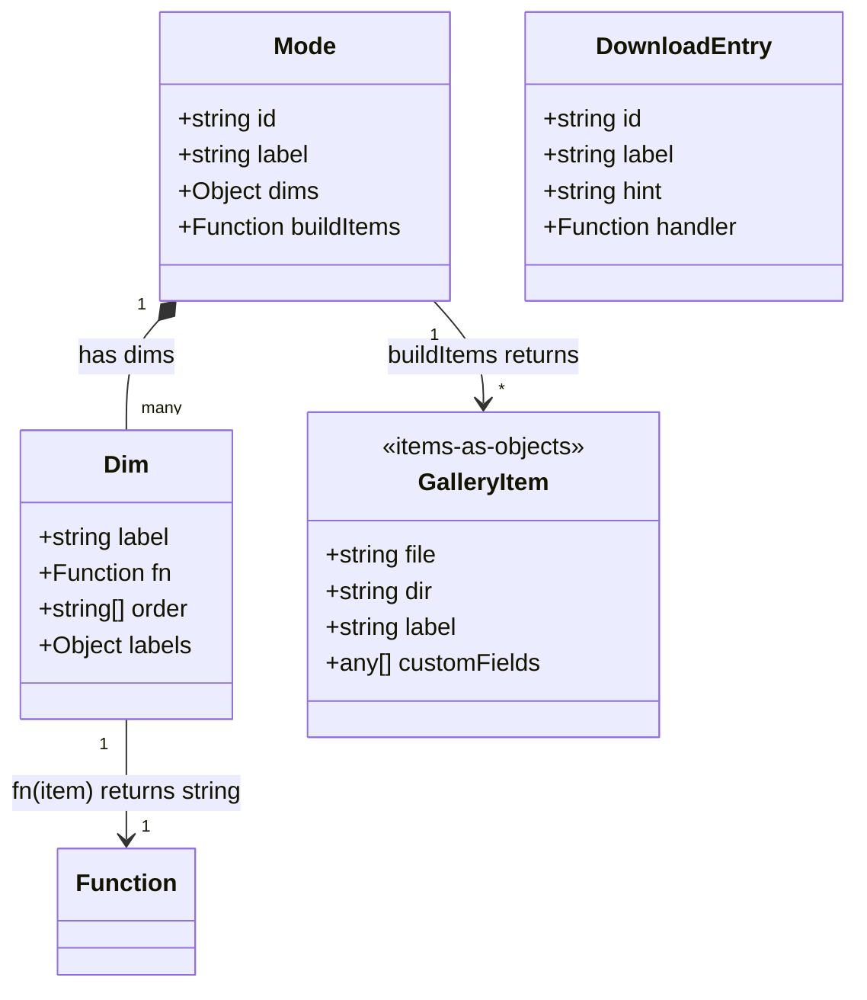
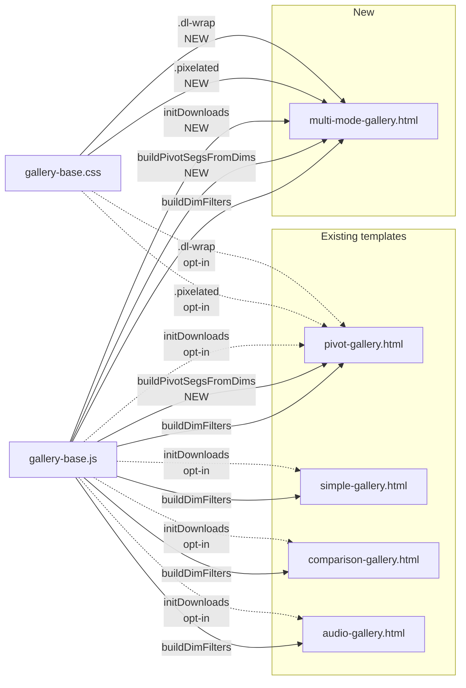

## Context

Promoted from:
- Frame: `artifacts/frames/73-forge-gallery-multi-mode-frame.mdx`
- Analysis: `artifacts/analyses/73-forge-gallery-multi-mode-analysis.mdx`

Reference implementation: `~/.roxabi/forge/pi-buddy/prompt-gallery.html` (deployed at https://a3bb4350.diagrams-1ul.pages.dev/pi-buddy/prompt-gallery.html).

Chosen shape: **Shape 1 — Promote-and-document**. Key finding: `buildDimFilters`/`applyDimFilters` are already implicitly dual-API — 3 of 4 templates already pass objects. Only `pivot-gallery.html` uses filename strings. The "dual-API" deliverable collapses to docs clarification + JSDoc. The other 6 deliverables proceed as-is.

## Goal

Gallery authors can build multi-dataset visualizations (sprite browsers, A/B dataset comparisons, mode-based tabs) and add download dropdowns in a single session, without writing mode-switching scaffolding, download logic, pixel-art CSS, or stale-filter-state bug mitigations from scratch. The four patterns proven by PI Buddy ship as reusable building blocks in the `forge-gallery` plugin; existing single-dataset templates render pixel-identically.

## Users

- **Primary:** Gallery authors building multi-dataset visualizations (sprite sets, A/B/C dataset comparisons, mode-based browsers). PI Buddy is the immediate reference consumer.
- **Secondary:** Gallery authors with existing single-dataset galleries who want to add a second mode — via the incremental upgrade path documented in the README.
- **Tertiary:** Maintainers of the 3 object-based templates (simple, comparison, audio) who benefit from clearer dual-API docs without any code change to their templates.

## Expected Behavior

### Scenario A: New multi-mode gallery author

1. Author runs the `/forge-gallery` skill with args like `pi-buddy sprite-gallery multi-mode`.
2. Skill copies `multi-mode-gallery.html` to `~/.roxabi/forge/pi-buddy/sprite-gallery.html`.
3. Author fills in `{{PLACEHOLDERS}}`: title, date, accent color.
4. Author edits the `MODES` array — one entry per dataset, each with `{id, label, dims, buildItems}`.
5. Author switches between modes in the UI; Col/Row pivot controls rebuild themselves per mode's DIMS; filter state resets cleanly.
6. Author clicks Downloads dropdown; `initDownloads` config yields playbook download + lazy-loaded JSZip bundle of all images.
7. If gallery is pixel-art, author adds `class="pixelated"` on the image elements; sprites render crisply at any size.

### Scenario B: Existing gallery author wants to add a mode

1. Author has an existing `pivot-gallery.html`-based gallery with one dataset.
2. Author reads the "Incremental upgrade path" section in `gallery-templates/README.md`.
3. Author wraps their existing rendering in a `MODES = [{id:'main', ...}]` array.
4. Author swaps hardcoded `<button class="seg" data-v="batch">Batch</button>` HTML for a `buildPivotSegsFromDims(DIMS, 'colSegs', 'rowSegs', onChange)` call.
5. Author adds a second mode entry when ready; no rewrite needed.

**Critical failure mode to surface in the README:** if the author forgets to reset `filters`, `colDim`, and `rowDim` inside `switchMode()`, the gallery will show zero results after mode switch (stale-key bug — old dim keys silently filter out every item in the new mode). The README upgrade path must include an explicit warning + the 5-step atomic `switchMode()` sequence as a code block.

### Scenario C: Unchanged single-dataset author

1. Author runs the skill as before.
2. Skill copies one of pivot/simple/comparison/audio templates.
3. Template renders **pixel-identically** to the pre-refactor version.
4. Author's code doesn't use `initDownloads` / `buildPivotSegsFromDims` / `.pixelated` — all are opt-in.

### Scenario D: Author with stricter CSP blocks JSZip

*(Promoted from analysis Open Question #2 on CSP handling — not in the original frame deliverables list, but necessary for the "downloads as first-class feature" goal to be production-safe.)*

1. Author configures `initDownloads` with a zip-type entry.
2. User clicks "Download all images".
3. `initDownloads` attempts to dynamically load JSZip from `cdn.jsdelivr.net`.
4. CSP blocks the script load.
5. `initDownloads` catches the error, shows a visible error toast naming the CSP directive required, logs to console.
6. User sees actionable feedback instead of a silently broken button.

### Scenario E: Cache sync partial failure

1. Author finishes implementation + commits to repo source.
2. Runs `./sync-plugins.sh --local` to propagate changes to `~/.claude/plugins/cache/`.
3. Sync fails partway (e.g. rsync permission error on one file).
4. Expected: author sees a non-zero exit code + clear stderr message naming the unsynced file(s). Repo source remains consistent.
5. Author can re-run sync after fixing the root cause; partial state is idempotent and safe to retry.

This scenario is a **check on the existing sync tooling**, not a new feature. The spec must verify the existing script handles this — not fix it if it doesn't (fixing sync-plugins is out of scope).

## Data Model & Consumers

### Core types (F-full requires this diagram)



**Frozen (do not mutate):** `Dim.fn`, `Dim.order` — library assumes these are stable across renders.
**Mutable:** `filters` Set values (populated by `buildDimFilters`, modified on click).

### Consumer map



Solid = consumed by this issue. Dashed = available but opt-in (existing templates not forced to consume).

### Consumer summary

| Consumer | New helpers used | Behavior change |
|----------|-----------------|-----------------|
| `pivot-gallery.html` | `buildPivotSegsFromDims` (mandatory refactor) | None externally — same rendered DOM, same DIMS, same data |
| `simple-gallery.html` | None (just a comment flagging `DIMS_WRAPPED` as legacy) | None |
| `comparison-gallery.html` | None | None |
| `audio-gallery.html` | None | None |
| `multi-mode-gallery.html` | All four (`buildPivotSegsFromDims`, `initDownloads`, `.pixelated`, dual-API dim.fn) | New file — no prior behavior to preserve |

## Breadboard

### UI affordances (`multi-mode-gallery.html`)

| ID | Element | Handler | Data source |
|----|---------|---------|-------------|
| U1 | Mode tab bar (top) | `switchMode(modeId)` | `MODES[]` array |
| U2 | Col/Row segmented controls | `onPivotChange(axis, dimKey)` → `render()` | `MODES[activeMode].dims` via `buildPivotSegsFromDims` |
| U3 | Sort segs | `onSortChange(mode)` → `render()` | Mode-agnostic |
| U4 | Size +/− | `resizeThumb(delta)` → `render()` | Mode-agnostic |
| U5 | Search input | `oninput=render()` | Mode-agnostic, filters on `item.label` / `item.file` |
| U6 | Dynamic filter bar (rarity/stage/style/species buttons) | per-dim toggle → `render()` | `buildDimFilters` + `MODES[activeMode].dims` |
| U7 | Downloads dropdown (top-right) | Click entry → `handler()` | `initDownloads` config |
| U8 | Image grid / matrix cell thumbnails | Click → `openLightbox(idx)` | `visibleItems` (sorted + filtered) |
| U9 | Lightbox | Escape / arrow keys → close/navigate | `visibleItems`, `lbIndex` |
| U10 | Theme toggle | `initTheme(storeKey)` | localStorage |

### New runtime affordances (`gallery-base.js`)

| ID | Function | Signature | Behavior |
|----|----------|-----------|----------|
| N1 | `initDownloads` | `(config: {dropdownId: string, toggleId: string, menuId: string, entries: Array<{id, label, hint, handler}>}) => void` | Wires dropdown toggle (click toggles `.open` on menu), attaches click handlers to entries, handles outside-click-close. Loading-state mechanism: handler button sets `data-loading="true"` attribute for the duration of async work; CSS handles visual (spinner or dim state) via attribute selector. `innerHTML` / label / hint text are **preserved** — no string mutation. On handler rejection, catches error and calls `showToast(errorMsg, 'error')` + `console.error(err)`. Loading state is cleared in `finally`. |
| N2 | `buildPivotSegsFromDims` | `(dims: Object, colBarId: string, rowBarId: string, onChange: (axis: 'col'\|'row', dimKey: string) => void) => void` | Rebuilds `innerHTML` of col/row seg bars. Auto-prepends a "None" button (data-v="none", initially `.on`). Subsequent buttons are `Object.entries(dims).map(([key, dim]) => <button class="seg" data-v={key}>{dim.label}</button>)`. Wires click handlers via existing `wireSegs` pattern, which handles `.on` class toggling. **Active-state behavior:** every call resets active to "None"; caller is responsible for restoring active state externally if invoking outside of a mode switch (e.g., after a search refresh). In practice the only caller is `switchMode`, which resets to None anyway. |
| N3 | `showToast` | `(message: string, variant?: 'info'\|'error', duration?: number) => void` | Appends a toast div to document body with `.toast` + `.toast-{variant}` classes. Auto-dismisses after `duration` ms (default 3000). Multiple toasts stack vertically. Reused by `initDownloads` for CSP failure feedback; also exported for general use. |

### New CSS utilities (`gallery-base.css`)

| ID | Class | Purpose |
|----|-------|---------|
| C1 | `.pixelated` | `image-rendering: pixelated` on `` elements for sprite galleries |
| C2 | `.dl-wrap` | Positioning wrapper for downloads dropdown (relative positioning) |
| C3 | `.dl-toggle` | Dropdown toggle button (styled like theme-btn) |
| C4 | `.dl-menu` | Dropdown panel (absolute position, hidden by default, `.open` class reveals) |
| C5 | `.dl-item` | Individual dropdown entry (hover state + `.dl-hint` sub-label) |
| C6 | `.toast` | Toast container (fixed bottom-right, fade in/out) |

### Wiring

- **Mode switch (U1 → U2, U6, U8, U9)** is the critical sequence. Must be atomic — all six steps in order, no early return:
  1. `activeMode = newMode`
  2. `filters = {}` (reset — prevents stale dim-key bug in `applyDimFilters`)
  3. `colDim = 'none'` (reset — old dim key may not exist in new mode's dims)
  4. `rowDim = 'none'` (same)
  5. `visibleItems = []` (reset lightbox state — U8/U9; prevents out-of-bounds `lbIndex` after switch)
  6. `buildPivotSegsFromDims(MODES[activeMode].dims, 'colSegs', 'rowSegs', onPivotChange)` (rebuild Col/Row)
  7. Clear + re-call `buildDimFilters(items, MODES[activeMode].dims, filters, 'filterBar', render)` (rebuild filter bar — must clear the `filterBar` container innerHTML before calling, since buildDimFilters inserts rather than replaces)
  8. `render()` (apply)
- **Pivot change (U2 → U8)**: update `colDim`/`rowDim` state → `render()`. Filters are **not** reset on pivot change (only on mode change).
- **Downloads click (U7 → N1)**: handler runs; on async errors, `showToast` (N3) surfaces the error; button `data-loading` attribute cleared in `finally`.
- **Lightbox state (U8 → U9)**: `visibleItems` and `lbIndex` live at the gallery level and must be reset on every mode switch (see step 5 above).

## Slices

Vertical increments, each independently demo-able. **Canonical test environment:** Chromium 124+ on Linux. Firefox is a secondary target — tested manually but not in binary acceptance criteria (vendor-prefixed CSS differences are acceptable as long as rendering is functional).

| # | Slice | Files | Demo |
|---|-------|-------|------|
| 1 | **Shared runtime foundation** | `gallery-base.js` (add N1, N2, N3 + dual-API JSDoc), `gallery-base.css` (add C1–C6) | Open pivot-gallery.html → confirm unchanged; open a scratch HTML that calls `initDownloads` + `buildPivotSegsFromDims` + `showToast` in isolation and verify dropdown opens, seg buttons build from a sample DIMS, toast appears and auto-dismisses after 3s |
| 2 | **Refactor pivot-gallery to use new helper** | `pivot-gallery.html` (replace hardcoded seg HTML with `buildPivotSegsFromDims` call) | Before/after semantic equality check via querySelector (see Slice 2 AC below). Interact with pivot axes — filter counts and rendered matrix unchanged. |
| 3 | **New multi-mode template** | `multi-mode-gallery.html` (new file, ~550–600 lines) | Template exists; placeholders present; inline MODES example compiles |
| 3.5 | **Smoke test gate** (blocks 4, 5, 6) | No file changes; manual gate | Configure a 2-mode test instance of multi-mode-gallery.html with distinct DIMS per mode. Tab between modes. Verify: (a) filter bar rebuilds, (b) Col/Row segs rebuild, (c) lightbox state resets, (d) no console errors in Chromium, (e) no stale-key symptom (switching mode shows the new mode's full set, not zero). |
| 4 | **Legacy comment on simple-gallery** | `simple-gallery.html` (add `/* LEGACY */` comment above `DIMS_WRAPPED`) | Open the file — comment visible; template still renders identically |
| 5 | **Docs** | `gallery-templates/README.md` (add multi-mode section, items-as-objects pattern with 2 worked examples, incremental upgrade path with 5-step `switchMode` code block + stale-key warning, pixel-art note, downloads helper + CSP directive, dynamic pivot pattern), `forge-gallery/SKILL.md` (template picker update + guidance) | Render README — new sections appear; template picker table includes multi-mode row; all 5 README subsections present |
| 6 | **Cache sync + follow-up** | Run `./sync-plugins.sh --local`, verify cache is updated. File follow-up GitHub issue for gallery-base.js unit tests. | `ls ~/.claude/plugins/cache/roxabi-marketplace/forge/*/references/gallery-templates/multi-mode-gallery.html` shows the new file. Follow-up issue URL returned. |

**Dependencies (DAG):**
- Slice 1 blocks Slices 2, 3 (they need the new helpers)
- Slice 3 blocks Slice 3.5 (smoke test needs the template)
- Slice 3.5 (gate) blocks Slices 4, 5, 6 (nothing else proceeds until smoke passes)
- Slice 5 additionally blocks on Slice 2 (docs reference the pivot-gallery refactor upgrade path) — enforced implicitly by the 3.5 gate
- Slices 4, 5, 6 run in parallel after 3.5 passes

## Success Criteria

Binary pass/fail checks. All must be true before PR merges. Canonical test environment: **Chromium 124+ on Linux**.

### Runtime foundation (Slice 1)
- [ ] `gallery-base.js` defines `initDownloads`, `buildPivotSegsFromDims`, `showToast` as named functions; loadable via `<script src>` in any of the 4 existing templates without syntax errors
- [ ] `buildDimFilters` JSDoc has an explicit `@remarks` block documenting the dual-API contract (string items OR object items, caller decides)
- [ ] `applyDimFilters` JSDoc has the same dual-API clarification
- [ ] `gallery-base.css` contains `.pixelated`, `.dl-wrap`, `.dl-toggle`, `.dl-menu`, `.dl-item`, `.toast`, `.toast-info`, `.toast-error` — verified by grep
- [ ] No duplicate/conflicting selectors — verified by grep for each new class across all existing templates' inline `<style>` blocks
- [ ] `bun lint` passes on modified files
- [ ] `showToast('msg', 'info')` appears and auto-dismisses after 3000ms (default) in a scratch HTML smoke test
- [ ] `showToast('msg', 'error', 5000)` accepts a custom duration and dismisses after 5000ms
- [ ] Multiple concurrent toasts stack vertically (verified visually in scratch HTML)

### Pivot-gallery refactor (Slice 2)
- [ ] The hardcoded `<button class="seg" data-v="...">` HTML inside `colSegs`/`rowSegs` containers is **removed**; containers are present but empty, populated at boot by `buildPivotSegsFromDims`
- [ ] **Semantic seg equality check** — before and after refactor, running this in devtools produces identical output:
  ```js
  JSON.stringify(
    Array.from(document.querySelectorAll('#colSegs .seg, #rowSegs .seg'))
      .map(b => [b.dataset.v, b.className.trim(), b.textContent.trim()])
  )
  ```
- [ ] Clicking a Col/Row axis updates the rendered matrix identically before/after
- [ ] Opening pivot-gallery in Chromium 124+ produces zero console errors (errors, not warnings)
- [ ] Existing live gallery `v20-gallery.html` (copy of pivot-gallery) continues to function when pointed at the refactored `gallery-base.js` — spot-checked by opening the deployed URL and clicking through filters

### Multi-mode template (Slice 3)
- [ ] `multi-mode-gallery.html` exists at `plugins/forge/references/gallery-templates/multi-mode-gallery.html`
- [ ] Template includes `MODES` array config with inline comments demonstrating a 3-mode example (PI Buddy pattern)
- [ ] `switchMode()` executes the 8-step atomic sequence from the Wiring section in order (verified by reading the function source + line-by-line comment)
- [ ] Template uses `buildPivotSegsFromDims`, `initDownloads`, `.pixelated`, dual-API items-as-objects
- [ ] Template has placeholder markers `{{TITLE}}`, `{{DATE}}`, `{{COLOR}}`, `{{ACCENT_COLOR}}`, `{{SUBTITLE}}` — each referenced in the README's "How to customise" section
- [ ] Opens in Chromium 124+ with zero console errors on initial load

### Smoke test gate (Slice 3.5) — **blocks Slices 4, 5, 6**
- [ ] Configure a test instance of `multi-mode-gallery.html` with 2 modes where mode B has a dim key that does NOT exist in mode A (e.g. Mode A has `{rarity, stage}`, Mode B has `{rarity, class, level}`)
- [ ] Click Mode A; apply a filter on `stage`; click Mode B
- [ ] **Assertion: Mode B shows its full item set (not zero)** — this is the stale-key bug check
- [ ] Open lightbox on an item in Mode A; close; switch to Mode B; open lightbox — `lbIndex` refers to a valid Mode B item (no out-of-bounds)
- [ ] Zero console errors during the entire sequence in Chromium 124+

### Legacy comment (Slice 4)
- [ ] `simple-gallery.html` has a `/* LEGACY WORKAROUND — items-as-objects preferred; see README */` comment above the `DIMS_WRAPPED` block — verified by grep
- [ ] Running the same `querySelectorAll('#filterBar .check-btn').length` before/after yields the same count (template still renders identically)

### Docs (Slice 5)
- [ ] `gallery-templates/README.md` has a new row in the templates table for `multi-mode-gallery.html` — verified by grep
- [ ] README has an "Items-as-objects vs filename-strings" subsection containing **at least 2** code-block examples (one string-based, one object-based)
- [ ] README has an "Incremental upgrade path" subsection containing a numbered list of exactly **5 steps** for migrating a single-mode gallery to multi-mode
- [ ] Upgrade path section contains the full atomic `switchMode()` code block (8-step sequence from Wiring) + an explicit warning about the stale-key bug
- [ ] README has a "Dynamic pivot seg construction" subsection documenting `buildPivotSegsFromDims` signature + example call
- [ ] README has a "Downloads dropdown helper" subsection documenting `initDownloads` signature, the `data-loading` attribute convention, and the required CSP directive `script-src 'self' https://cdn.jsdelivr.net`
- [ ] README has a "Pixel-art rendering" subsection documenting the `.pixelated` class + when to use it
- [ ] `forge-gallery/SKILL.md` Phase 2 template picker table includes a `multi-mode-gallery.html` row
- [ ] `forge-gallery/SKILL.md` has a "When to use items-as-objects vs filename-strings" paragraph (≥3 sentences)

### CSP / error handling (cross-slice)
- [ ] `initDownloads` handler with a zip entry catches thrown errors in a try/catch and calls `showToast(msg, 'error')` + `console.error(err)` in the same code path
- [ ] Simulating a CSP block (loading gallery with devtools "Block request URL" for jsdelivr) produces a visible toast naming the missing CSP directive

### Integration (Slice 6)
- [ ] `./sync-plugins.sh --local` runs with exit code 0
- [ ] New file visible at `~/.claude/plugins/cache/roxabi-marketplace/forge/*/references/gallery-templates/multi-mode-gallery.html`
- [ ] If the sync script ever reports a non-zero exit, stderr names the specific file(s) that failed — verified by inspecting the existing script's error-handling code path (no fix required if it doesn't; document the limitation as a follow-up)
- [ ] Follow-up GitHub issue filed: "test(forge-gallery): add unit tests for gallery-base.js helpers"
- [ ] All existing CI checks pass: `bun lint`, `bun typecheck`, `bun test`

## Open clarifications

None blocking. Defaults selected in analysis Open Questions apply:
- `multi-mode-gallery.html` uses inline `MODES` config (not external JSON)
- Downloads dropdown visible but empty by default
- `buildPivotSegsFromDims` auto-prepends a "None" button
