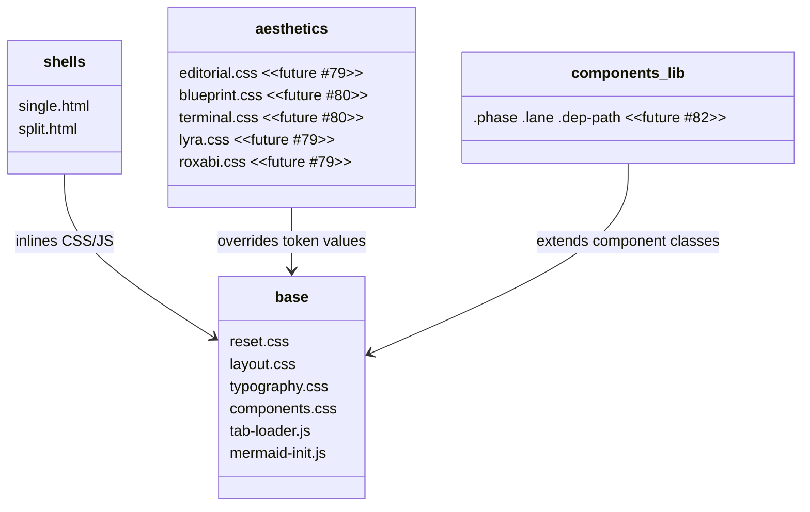
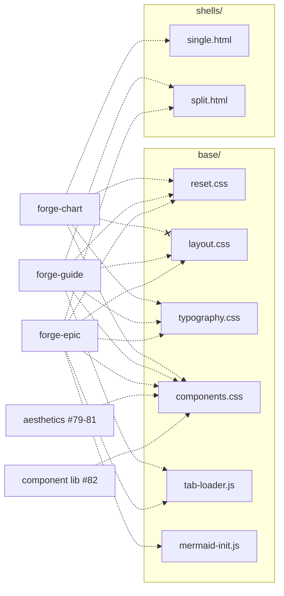

## Context

Promoted from [frame](../frames/78-forge-foundation-base-shells-frame.mdx). Epic analysis: [forge-design-system-evolution-analysis](../analyses/forge-design-system-evolution-analysis.mdx). Architecture: [ADR-011](../../docs/architecture/adr/011-forge-design-system-extraction.mdx).

Forge's diagram/guide CSS lives as fenced code blocks in `tokens.md` (~113 lines) and `split-file.md` (~324 lines). Claude re-reads and re-derives CSS every invocation → drift + token waste. The gallery side (`gallery-base.css/js`) already solved this with actual code files. This issue extends that pattern to the diagram/guide side.

**ADR-011 supersession note:** ADR-011 line 82 describes `split.html` as "CSS link + JS src; requires HTTP serve." This spec supersedes that: all CSS/JS is inlined in both shells for consistency with the `file://`-safe model. Split-file outputs still require HTTP for tab fragment `fetch()`, but the shell itself contains no `<link>` or `<script src>` tags to base/ files.

## Goal

Create `plugins/forge/references/base/` and `plugins/forge/references/shells/` — 8 actual code files extracted from `tokens.md` and `split-file.md` — so forge skills read and inline verbatim instead of re-deriving from prose.

## Users

- **Primary:** Mickael — all forge diagram/guide output across lyra, roxabi-plugins, voiceCLI, 2ndBrain
- **Secondary:** Issues #79–#83 — aesthetics override base tokens, components extend base classes, skill rewrites reference base files

## Expected Behavior

### Before (current)

```
forge-guide invocation
  → read tokens.md (113 lines of prose + code blocks)
  → read split-file.md (324 lines of prose + code blocks)
  → re-derive CSS from prose descriptions
  → re-derive JS from prose descriptions
  → generate output (visual drift possible)
```

### After

```
forge-guide invocation
  → read base/reset.css, layout.css, typography.css, components.css
  → read base/tab-loader.js (+ mermaid-init.js if needed)
  → read shells/split.html
  → inline CSS into output, substitute {PLACEHOLDER}s in shell
  → generate output (verbatim copy, no drift)
```

Skills treat base/ files as **generation source** — read once, inline into `<style>`/`<script>` blocks. Never `<link>` or `<script src>` to base/ files (breaks `file://` for forge-chart).

## Data Model & Consumers

### File structure



### Token contract

`reset.css` contains Lyra theme tokens only as the default aesthetic block. Roxabi theme values are deferred to `aesthetics/roxabi.css` in issue #79. Every base/ CSS file and every future aesthetic file must define or inherit these custom properties:

| Token | Purpose | Default (Lyra dark) |
|-------|---------|---------------------|
| `--bg` | Page background | `#0a0a0f` |
| `--surface` | Card/nav background | `#18181f` |
| `--border` | Dividers, card borders | `#2a2a35` |
| `--text` | Headings, primary UI (18:1) | `#fafafa` |
| `--text-muted` | Body text (8:1 AA) | `#9ca3af` |
| `--text-dim` | Metadata only (4.3:1) | `#6b7280` |
| `--accent` | Brand color | `#e85d04` |
| `--accent-dim` | Accent background tint | `#7c2d0e` |

Semantic tokens (in `components.css`, for future component library #82):

| Token | Purpose | Default dark | Default light |
|-------|---------|-------------|---------------|
| `--success` | Complete, healthy | `#34d399` | `#047857` |
| `--success-dim` | Success background | `rgba(52,211,153,0.12)` | `rgba(4,120,87,0.1)` |
| `--warning` | Caution, in-progress | `#fbbf24` | `#d97706` |
| `--warning-dim` | Warning background | `rgba(251,191,36,0.12)` | `rgba(217,119,6,0.1)` |
| `--error` | Failure, critical | `#f87171` | `#dc2626` |
| `--error-dim` | Error background | `rgba(248,113,113,0.12)` | `rgba(220,38,38,0.1)` |
| `--info` | Informational | `#60a5fa` | `#2563eb` |
| `--info-dim` | Info background | `rgba(96,165,250,0.12)` | `rgba(37,99,235,0.1)` |

Light mode tokens (in `reset.css`, `[data-theme="light"]` block — Lyra theme only; Roxabi light variants in `aesthetics/roxabi.css` #79):

| Token | Default (Lyra light) |
|-------|---------------------|
| `--bg` | `#fafaf9` |
| `--surface` | `#f4f4f0` |
| `--border` | `#d1ccc7` |
| `--text` | `#1c1917` |
| `--text-muted` | `#57534e` |
| `--text-dim` | `#78716c` |
| `--accent` | `#c2410c` |
| `--accent-dim` | `#fef2e8` |

### Consumer map



### Consumer summary

| Consumer | Files consumed | When | Status |
|----------|---------------|------|--------|
| forge-chart | reset.css, typography.css, components.css, single.html (omits layout.css — no tab nav in single-file output) | Every chart generation | future (#83) |
| forge-guide | reset.css, layout.css, typography.css, components.css, tab-loader.js, split.html | Every guide generation | future (#83) |
| forge-epic | reset.css, layout.css, typography.css, components.css, tab-loader.js, mermaid-init.js, split.html | Every epic generation | future (#83) |
| aesthetics (#79-81) | Override tokens defined in reset.css + semantic tokens in components.css | At aesthetic authoring time | future |
| component library (#82) | Extend classes in components.css | At component authoring time | future |

## Breadboard

### B1: base/ files

| Affordance | Handler | Data |
|------------|---------|------|
| U1: Skill reads reset.css | Inline into `<style>` first | box-sizing, margin reset, antialiasing, base + light token blocks |
| U2: Skill reads layout.css | Inline into `<style>` after reset | .topnav, .tabs, .tab-btn, .theme-btn, .panel, .cards grid, responsive |
| U3: Skill reads typography.css | Inline into `<style>` after layout | font-family rules, h1-h4, p, ul/ol, code/pre, type scale |
| U4: Skill reads components.css | Inline into `<style>` after typography | .card, .card.accent, .card-label, .table-wrap, table + semantic tokens + anti-pattern block |
| U5: Skill reads tab-loader.js | Substitute `{NAME}`, inline into `<script>` | loadPanel(), activate(), tab click wiring, first-tab auto-load |
| U6: Skill reads mermaid-init.js | Inline verbatim into `<script>` when Mermaid tabs exist (no `{NAME}` placeholder — stateless) | window.__postLoad, mermaid import, render, optional __initPanZoom |

### B2: shells/

| Affordance | Handler | Data |
|------------|---------|------|
| S1: Skill reads single.html | Substitute all `{PLACEHOLDER}`s | Self-contained shell: inline `<style>`, inline `<script>`, `{CONTENT}` area, theme toggle inline |
| S2: Skill reads split.html | Substitute all `{PLACEHOLDER}`s | Multi-tab shell: inline `<style>`, inline `<script>`, `{TABS}` nav buttons, `{PANELS}` containers, theme toggle inline. Shells must NOT contain `<link rel=stylesheet>` or `<script src>` to base/ files — all styles and scripts inline. |

### Shell placeholders

**single.html:**

| Placeholder | Description | Example |
|-------------|-------------|---------|
| `{TITLE}` | Diagram title | `NATS Architecture` |
| `{DATE}` | ISO date | `2026-04-09` |
| `{CATEGORY}` | diagram-meta category | `architecture` |
| `{CAT_LABEL}` | Category display label | `Architecture` |
| `{COLOR}` | Category color | `#e85d04` |
| `{BADGES}` | diagram-meta badges (hardcoded to `latest` in shell — skills override if needed) | `latest` |
| `{HEAD_EXTRAS}` | Optional `<head>` tags (e.g., svg-pan-zoom CDN script for Mermaid pan/zoom). Empty string if unused. | `<script src="https://cdn.jsdelivr.net/npm/svg-pan-zoom@3.6.2/..."></script>` |
| `{BASE_STYLES}` | Concatenated base/*.css in order: reset → layout → typography → components | (inlined CSS) |
| `{AESTHETIC_STYLES}` | Aesthetic CSS override (empty if none) | (inlined CSS) |
| `{EXTRA_STYLES}` | Diagram-specific CSS additions | (inlined CSS) |
| `{NAME}` | Kebab-case slug for theme key | `nats-arch` |
| `{CONTENT}` | Diagram HTML body | `<div class="cards">...` |
| `{EXTRA_SCRIPTS}` | Mermaid init or custom JS (optional) | (inlined JS) |

**split.html:**

| Placeholder | Description | Example |
|-------------|-------------|---------|
| `{TITLE}` | Guide/epic title | `Lyra User Guide` |
| `{DATE}` | ISO date | `2026-04-09` |
| `{CATEGORY}` | diagram-meta category | `guide` |
| `{CAT_LABEL}` | Category display label | `Guide` |
| `{COLOR}` | Category color | `#e85d04` |
| `{BADGES}` | diagram-meta badges (hardcoded to `latest` in shell — skills override if needed) | `latest` |
| `{HEAD_EXTRAS}` | Optional `<head>` tags (e.g., svg-pan-zoom CDN script for Mermaid pan/zoom). Empty string if unused. | (see single.html) |
| `{BASE_STYLES}` | Concatenated base/*.css in order: reset → layout → typography → components | (inlined CSS) |
| `{AESTHETIC_STYLES}` | Aesthetic CSS override (empty if none) | (inlined CSS) |
| `{EXTRA_STYLES}` | Guide-specific CSS additions | (inlined CSS) |
| `{NAME}` | Kebab-case slug (used in tab-loader fetch paths and theme key) | `lyra-user-guide` |
| `{TABS}` | Tab button elements | `<button class="tab-btn" data-tab="overview">Overview</button>` |
| `{PANELS}` | Panel container elements | `<div class="panel" data-panel="overview"></div>` |
| `{TAB_LOADER_JS}` | tab-loader.js content with `{NAME}` already substituted. Runs AFTER theme-toggle JS in document order (theme toggle appears first in the shell's inline `<script>`) | (inlined JS) |
| `{EXTRA_SCRIPTS}` | mermaid-init.js or custom JS (optional) | (inlined JS) |

## Slices

| # | Slice | Files | Demo | Deps |
|---|-------|-------|------|------|
| 1 | base/ layer | reset.css, layout.css, typography.css, components.css, tab-loader.js, mermaid-init.js | Concatenate base/*.css in order (reset → layout → typography → components) → valid CSS with all token definitions, no syntax errors; tab-loader.js is valid JS with `{NAME}` placeholder; mermaid-init.js is valid JS with no placeholders | — |
| 2 | shells/ | single.html, split.html | Substituting all `{PLACEHOLDER}`s with example values from the placeholder tables produces valid HTML that loads without console errors in a browser | Slice 1 |

## Success Criteria

- [ ] `base/reset.css` exists with box-sizing reset, antialiasing, base token block (`:root, [data-theme="dark"]`), and light token block (`[data-theme="light"]`)
- [ ] `base/layout.css` exists with `.topnav`, `.tabs`, `.tab-btn`, `.theme-btn`, `.panel`, `.cards` grid, and responsive breakpoint
- [ ] `base/typography.css` exists with Google Fonts preconnect comment, font-family rules, heading/paragraph/list/code/pre styles
- [ ] `base/components.css` exists with `.card`, `.card.accent`, `.card-label`, `.card-title`, `.card-body`, `.table-wrap`, `table` styles, semantic color token declarations (`--success/warning/error/info` + dim variants), and anti-pattern comment block
- [ ] `base/tab-loader.js` exists with `loadPanel()`, `activate()`, tab click wiring, first-tab auto-load; contains `{NAME}` placeholder in fetch URL; does NOT contain theme toggle code
- [ ] `base/mermaid-init.js` exists with `window.__postLoad` and optional `window.__initPanZoom`
- [ ] `shells/single.html` is valid HTML with diagram-meta markers, all placeholders (`{TITLE}`, `{NAME}`, `{BASE_STYLES}`, `{CONTENT}`, etc.), theme toggle inline JS (~15 lines), and placeholder comments explaining each slot
- [ ] `shells/split.html` is valid HTML with diagram-meta markers, all placeholders (`{TITLE}`, `{NAME}`, `{TABS}`, `{PANELS}`, `{TAB_LOADER_JS}`, etc.), theme toggle inline JS, and placeholder comments explaining each slot
- [ ] No hardcoded color values in any base/ CSS file — all colors use CSS custom properties
- [ ] Anti-pattern block present at top of `components.css` matching the 6 rules from ADR-011
- [ ] Concatenating base/ CSS in order reset → layout → typography → components produces valid CSS with no duplicate selector conflicts
- [ ] `base/` content is traceable to existing patterns in `tokens.md` and `split-file.md` — no new tokens, classes, or behaviors introduced beyond what those files contain (semantic color tokens are the exception: declared as contract for #82)
- [ ] `gallery-templates/` directory is unchanged — zero modifications to gallery-base.css/js or any gallery template
- [ ] All files work in the `plugins/forge/references/` directory structure
