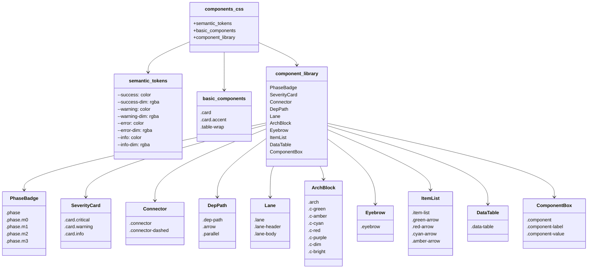
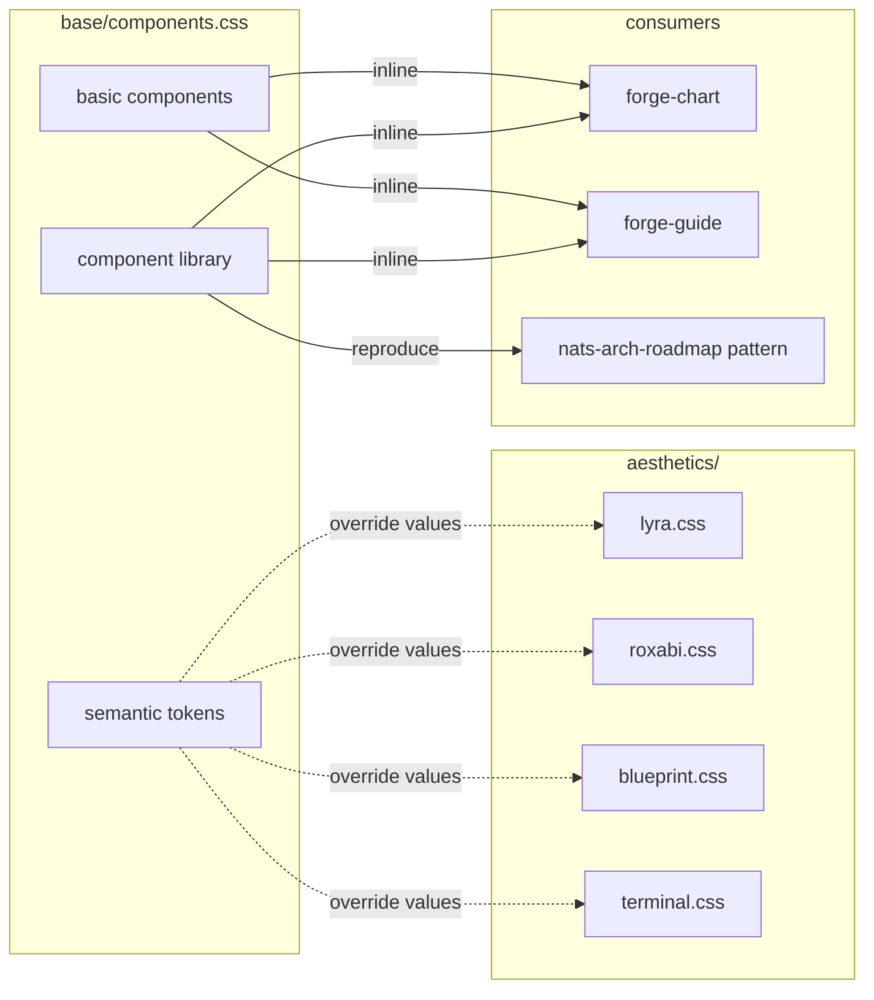

## Context

Promoted from [frame](../frames/82-forge-component-library-frame.mdx). Epic analysis: [forge-design-system-evolution-analysis](../analyses/forge-design-system-evolution-analysis.mdx). Architecture: [ADR-011](../../docs/architecture/adr/011-forge-design-system-extraction.mdx).

The forge foundation (#78) established `base/components.css` with semantic color tokens and basic card/table components. This issue adds 10 component types needed to reproduce `nats-arch-roadmap`-quality architecture diagrams.

## Goal

Extend `base/components.css` with the full component vocabulary so forge skills can generate production-quality architecture diagrams programmatically.

## Users

- **Primary:** Developers using forge skills to generate architecture diagrams via LLM prompts
- **Secondary:** Consumers of forge-generated diagrams (team members, stakeholders viewing docs)

## Expected Behavior

### Before (current)

`base/components.css` contains:
- Semantic color tokens (`--success`, `--warning`, `--error`, `--info` + dim variants)
- Basic cards (`.card`, `.card.accent`, `.card-label`, `.card-title`, `.card-body`)
- Basic tables (`.table-wrap`, `table`, `thead`, `tbody`)

Missing components force hand-building of complex diagrams like `nats-arch-roadmap.html`.

### After

`base/components.css` contains all 10 component types:

1. **Phase badge** — milestone/status pills, color-coded by phase (M0–M3)
2. **Severity card** — left-border colored cards by severity (critical/warning/info)
3. **Connector** — CSS lines between components (solid/dashed)
4. **Dependency path** — sequential (→) and parallel (∥) dependency chains
5. **Lane container** — parallel work stream visualization
6. **Architecture block** — colored ASCII architecture diagrams
7. **Eyebrow header** — uppercase monospace meta label above title
8. **Item list** — lists with color-coded arrow bullets
9. **Data table** — sticky header, row hover, alternating rows, monospace numbers
10. **Component box** — blueprint-style labeled boxes

Forge skills can reproduce any pattern from `nats-arch-roadmap.html` using these classes.

## Data Model & Consumers

### Component Taxonomy

### Consumer Map

### Consumer Summary

| Consumer | Classes Used | When | Status |
|----------|--------------|------|--------|
| forge-chart | All component classes + semantic tokens | Every chart generation | future (#83) |
| forge-guide | All component classes + semantic tokens | Every guide generation | future (#83) |
| aesthetics (#79-81) | Override semantic token values | At aesthetic authoring time | done |
| nats-arch-roadmap | Phase badge, severity card, lane, dep-path, arch, item-list, data-table | Reference pattern | target |

## Breadboard

### B1: Phase Badge

| Affordance | Handler | Data |
|------------|---------|------|
| U1: Render M0 milestone | `.phase.m0` → green background/text | `M0` |
| U2: Render M1 milestone | `.phase.m1` → amber background/text | `M1` |
| U3: Render M2 milestone | `.phase.m2` → cyan background/text | `M2` |
| U4: Render M3 milestone | `.phase.m3` → purple background/text | `M3` |
| U5: Generic phase | `.phase` → neutral styling | `Draft` |

### B2: Severity Card

| Affordance | Handler | Data |
|------------|---------|------|
| U6: Critical severity | `.card.critical` → red left border | `
...
` |
| U7: Warning severity | `.card.warning` → amber left border | `
...
` |
| U8: Info severity | `.card.info` → blue left border | `
...
` |

### B3: Connector

| Affordance | Handler | Data |
|------------|---------|------|
| U9: Solid connector | `.connector` → 1px solid line | `

` |
| U10: Dashed connector | `.connector-dashed` → 1px dashed line | `

` |

### B4: Dependency Path

| Affordance | Handler | Data |
|------------|---------|------|
| U11: Sequential dep | `.dep-path .arrow` → amber "→" | `
A → B
` |
| U12: Parallel dep | `.dep-path .parallel` → cyan "∥" | `
A ∥ B
` |

### B5: Lane Container

| Affordance | Handler | Data |
|------------|---------|------|
| U13: Lane wrapper | `.lane` → flex column with border | `
...
` |
| U14: Lane header | `.lane-header` → colored bg, bold text | `
Stream A
` |
| U15: Lane body | `.lane-body` → content area | `
...
` |

### B6: Architecture Block

| Affordance | Handler | Data |
|------------|---------|------|
| U16: ASCII diagram | `pre.arch` → monospace, colored via `.c-*` | `<pre class="arch">● Node</pre>` |
| U17: Green text | `.c-green` → var(--success) | `green text` |
| U18: Amber text | `.c-amber` → var(--warning) | `amber text` |
| U19: Cyan text | `.c-cyan` → var(--info) | `cyan text` |
| U20: Red text | `.c-red` → var(--error) | `red text` |
| U21: Purple text | `.c-purple` → additional semantic | `purple text` |
| U22: Dim text | `.c-dim` → var(--text-dim) | `dim text` |
| U23: Bright text | `.c-bright` → var(--text) | `bright text` |

### B7: Eyebrow Header

| Affordance | Handler | Data |
|------------|---------|------|
| U24: Meta label | `.eyebrow` → uppercase, mono, dim | `
ARCHITECTURE
` |

### B8: Item List

| Affordance | Handler | Data |
|------------|---------|------|
| U25: Arrow list | `.item-list` → ul/ol with arrow bullets | `<ul class="item-list">...</ul>` |
| U26: Green arrow | `.green-arrow::before` → green "→" | `<li class="green-arrow">Item</li>` |
| U27: Red arrow | `.red-arrow::before` → red "→" | `<li class="red-arrow">Item</li>` |
| U28: Cyan arrow | `.cyan-arrow::before` → cyan "→" | `<li class="cyan-arrow">Item</li>` |
| U29: Amber arrow | `.amber-arrow::before` → amber "→" | `<li class="amber-arrow">Item</li>` |

### B9: Data Table

| Affordance | Handler | Data |
|------------|---------|------|
| U30: Styled table | `.data-table` → sticky header, hover, alt rows | `<table class="data-table">...</table>` |
| U31: Monospace numbers | `td.num` → tabular-nums, right-align | `<td class="num">1,234</td>` |

### B10: Component Box

| Affordance | Handler | Data |
|------------|---------|------|
| U32: Blueprint box | `.component` → bordered box | `
...
` |
| U33: Label slot | `.component-label` → top-left label | `
SERVICE
` |
| U34: Value slot | `.component-value` → main content | `
api-gateway
` |

## Slices

| # | Slice | Files | Demo | Deps |
|---|-------|-------|------|------|
| 1 | Phase + Severity | `.phase`, `.phase.m0–m3`, `.card.critical/warning/info` | M0–M3 badges render with correct colors; severity cards show colored left borders | — |
| 2 | Lane + Dep-path | `.lane`, `.lane-header`, `.lane-body`, `.dep-path`, `.arrow`, `.parallel` | Lane containers with colored headers; dependency chains show → and ∥ correctly | — |
| 3 | Arch + Eyebrow | `.arch`, `.c-*` colors, `.eyebrow` | ASCII architecture with colored elements; eyebrow labels above titles | — |
| 4 | Item-list + Data-table | `.item-list`, arrow variants, `.data-table`, `.num` | Lists with colored arrows; tables with sticky headers, hover, alt rows | — |
| 5 | Connector + Component-box | `.connector`, `.connector-dashed`, `.component`, `.component-label`, `.component-value` | Solid/dashed connectors; blueprint-style labeled boxes | — |

## Success Criteria

- [ ] `.phase` and `.phase.m0` through `.phase.m3` classes exist and render with correct semantic colors (green/amber/cyan/purple)
- [ ] `.card.critical`, `.card.warning`, `.card.info` classes exist and show colored left borders (--error/--warning/--info)
- [ ] `.connector` and `.connector-dashed` classes exist with 1px border styling
- [ ] `.dep-path`, `.arrow`, and `.parallel` classes exist with correct text colors
- [ ] `.lane`, `.lane-header`, `.lane-body` classes exist with flex layout and header color variants (`.green-h`, `.amber-h`, `.cyan-h`, `.purple-h`, `.red-h`)
- [ ] `pre.arch` and `.c-green`, `.c-amber`, `.c-cyan`, `.c-red`, `.c-purple`, `.c-dim`, `.c-bright` classes exist for colored ASCII
- [ ] `.eyebrow` class exists with uppercase, monospace, dim styling
- [ ] `.item-list` class exists with arrow bullet styling and color variants (`.green-arrow`, `.red-arrow`, `.cyan-arrow`, `.amber-arrow`)
- [ ] `.data-table` class exists with sticky header, alternating rows, and row hover
- [ ] `.component`, `.component-label`, `.component-value` classes exist for blueprint-style boxes
- [ ] All components use semantic color tokens (no hardcoded hex colors except in token declarations)
- [ ] Hover transitions are ≤0.15s, opacity/color only (no transforms)
- [ ] Components render correctly in all 5 aesthetics (lyra, roxabi, blueprint, terminal, editorial)
- [ ] `nats-arch-roadmap.html` can be reproduced using forge + these components
