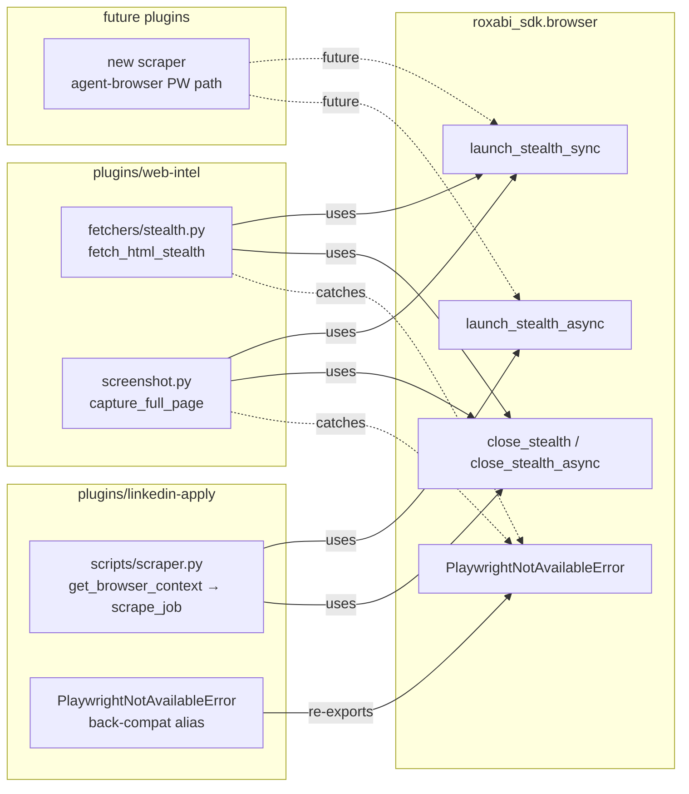

## Context

Issue #93 — three call sites hand-roll the same `playwright` + `playwright-stealth` bootstrap:
- `plugins/web-intel/scripts/fetchers/stealth.py:122-199` (sync, ephemeral, `(html, error)` tuple return)
- `plugins/web-intel/scripts/screenshot.py:70-117` (sync, ephemeral, `(success, msg)` tuple return)
- `plugins/linkedin-apply/scripts/scraper.py:265-321` (async, `launch_persistent_context`, raises `PlaywrightNotAvailableError`)

Analysis ([93-extract-browser-bootstrap-analysis.mdx](../analyses/93-extract-browser-bootstrap-analysis.mdx)) selected **Shape 1** — two free functions + typed error + `close_stealth` helper, unified on `Stealth().apply_stealth_{sync,async}(context)`. The refactor also fixes two latent bugs discovered during analysis:

1. **`linkedin-apply/scraper.py:306` raises `AttributeError` in `playwright-stealth==2.0.2`.** Empirically verified: `Stealth().use_async(async_playwright())` returns `AsyncWrappingContextManager`, which has no `.start()` method — only `__aenter__`.
2. **web-intel's two launches are missing the `--disable-blink-features=AutomationControlled`, `--no-first-run`, `--no-default-browser-check` launch args** that linkedin-apply passes. Parity fix comes for free when both plugins share the same launcher.

Settled design decisions from analysis (not open for re-litigation):

| # | Decision |
|---|---|
| 1 | Module lives in `roxabi_sdk/browser.py` (not `plugins/shared/python/`) — guarded import keeps SDK importable without playwright |
| 2 | `PlaywrightNotAvailableError` subclasses `RuntimeError` (not `ImportError`) |
| 3 | Uniform 3-tuple return `(playwright, context, page)` + `close_stealth(playwright, context)` helper — not a 4-tuple, not a context manager |
| 4 | Stealth idiom = `Stealth().apply_stealth_{sync,async}(context)` — the one v2 API that works for both ephemeral and persistent contexts and sidesteps the broken `use_async().start()` path |

## Goal

Replace every hand-rolled `playwright + playwright-stealth` bootstrap across the three call sites with a single `roxabi_sdk.browser` module that all of them import.

## Users

This is a pure maintainability refactor — no end-user-facing behavior changes. The change benefits plugin maintainers who today must mirror every stealth-related fix across three files, and it leaves a discoverable import path (`from roxabi_sdk.browser import launch_stealth_sync`) for any future plugin that needs a stealth-patched Chromium.

## Expected Behavior

After this change:

1. `roxabi_sdk/browser.py` exists with `launch_stealth_sync`, `launch_stealth_async`, `close_stealth`, `close_stealth_async`, and `PlaywrightNotAvailableError`.
2. All three call sites delegate to the new module. None contain their own `try: from playwright... / except ImportError` guard, their own `Stealth()` instantiation, their own `launch_args` list, or their own UA/viewport defaults.
3. `plugins/web-intel/scripts/fetchers/stealth.py::fetch_html_stealth()` still returns `(html, error)` — the 11 existing tests in `test_stealth.py` pass without modification.
4. `plugins/web-intel/scripts/screenshot.py::capture_full_page()` still returns `(success, msg)` — `test_screenshot.py` still passes.
5. `plugins/linkedin-apply/scripts/scraper.py::get_browser_context()` becomes a thin wrapper around `launch_stealth_async(user_data_dir=LINKEDIN_PROFILE_DIR, ...)`; the preexisting `AttributeError` is gone; `scrape_job` still returns a `LinkedInJob` against a known-good URL without triggering re-login.
6. web-intel's launches now carry the three anti-detection launch args (latent parity bug closed).
7. `roxabi_sdk/browser.py` is automatically rsynced into every plugin cache dir by `sync-plugins.sh` lines 72 and 157 — zero changes to the sync pipeline.
8. `bun test`, `bun lint`, `bun typecheck` and `pytest plugins/web-intel/tests` all pass.

Non-behaviors (explicit):
- `fetch_html_stealth` retry logic, anti-bot markers, and timeout constants are untouched.
- LinkedIn scraper selectors, delays, `check_login` logic, and `try_selector` helper are untouched.
- No Turnstile solving, no new stealth flags beyond current parity.
- No new dependencies. `playwright` / `playwright-stealth` remain optional (`web-intel[twitter]` extra; `linkedin-apply` README instructions).

## Data Model & Consumers

The new module's surface is specified in the Breadboard table (N1–N6) below. The consumer topology is the interesting part — it shows which plugins catch the typed error, which re-export it as a back-compat alias, and which only touch the launchers.

### Consumer map

Solid edges = in this issue. Dashed = out of scope today but the API must be discoverable (import path, docstring, README mention).

### Consumer summary

| Consumer | Uses | When | Contract caller preserves | Status |
|---|---|---|---|---|
| `web-intel/fetchers/stealth.py` | `launch_stealth_sync`, `close_stealth`, catches `PlaywrightNotAvailableError` | `fetch_html_stealth(url)` invoked as anti-bot fallback | returns `(html, error)` tuple — test at `test_stealth.py:100-109` must still pass | this issue |
| `web-intel/screenshot.py` | `launch_stealth_sync`, `close_stealth`, catches `PlaywrightNotAvailableError` | `capture_full_page(url, out)` CLI | returns `(success, msg)` tuple — exit codes 0/1 preserved | this issue |
| `linkedin-apply/scripts/scraper.py` | `launch_stealth_async(user_data_dir=LINKEDIN_PROFILE_DIR)`, `close_stealth_async` | `scrape_job(url)` | returns `(playwright, context)` from `get_browser_context` — every caller in `scrape_job` and friends keeps the same signature | this issue |
| `linkedin-apply.PlaywrightNotAvailableError` | alias class | import site for existing `except` clauses | alias must still be catchable by `except PlaywrightNotAvailableError` and by `except LinkedInScraperError` | this issue |
| future scraper / agent-browser | either launcher | TBD | — | future (dashed) |

## Breadboard

### Module: `roxabi_sdk/browser.py`

| ID | Affordance | Signature | Notes |
|---|---|---|---|
| N1 | `launch_stealth_sync` | `(*, user_data_dir, headless, user_agent, viewport, locale, stealth_flags, launch_args) -> (Playwright, BrowserContext, Page)` | Keyword-only args. `user_data_dir=None` → ephemeral (`launch` + `new_context`); path → persistent (`launch_persistent_context`). Raises `PlaywrightNotAvailableError` on missing dep. |
| N2 | `launch_stealth_async` | `async (*, same kwargs) -> (Playwright, BrowserContext, Page)` | Same semantics, async. Uses caller's running event loop — does not call `asyncio.run`. |
| N3 | `close_stealth` | `(playwright, context) -> None` | `if context.browser: context.browser.close() else: context.close(); playwright.stop()` |
| N4 | `close_stealth_async` | `async (playwright, context) -> None` | Same with `await` on both calls. |
| N5 | `PlaywrightNotAvailableError` | `class(RuntimeError)` | Raised by both launchers when `playwright` or `playwright-stealth` is not importable, or when launch fails before a context is returned. Message must contain install hint. |
| N6 | `_raise_if_unavailable` | `() -> None` | Module-private probe. `try: import playwright, playwright_stealth / except ImportError → raise PlaywrightNotAvailableError`. Called at the start of both launchers. **Not connected to web-intel's module-level `PLAYWRIGHT_AVAILABLE` flag** — that flag remains a separate `try/except ImportError` probe at the top of `stealth.py` / `screenshot.py` so the `monkeypatch.setattr(stealth, "PLAYWRIGHT_AVAILABLE", False)` test at `test_stealth.py:104` continues to work unchanged. Implementers must not unify these two code paths. |

### Call-site edits: `plugins/web-intel/scripts/fetchers/stealth.py`

| ID | Affordance | Edit |
|---|---|---|
| S1a | Module-level import guards (lines 80-92) | Delete direct `from playwright.sync_api import sync_playwright` / `from playwright_stealth import Stealth` guards. Replace with `from roxabi_sdk.browser import launch_stealth_sync, close_stealth, PlaywrightNotAvailableError`. Keep `PLAYWRIGHT_AVAILABLE` module attribute as a thin probe so `test_stealth.py:104`'s `monkeypatch.setattr(stealth, "PLAYWRIGHT_AVAILABLE", False)` continues to work unchanged. |
| S1b | `fetch_html_stealth` launch block (lines 156-183) | Replace with `try: pw, ctx, page = launch_stealth_sync() / except PlaywrightNotAvailableError as exc: return None, str(exc)` then the existing `page.goto` + marker re-check. Use `close_stealth(pw, ctx)` in `finally` instead of `browser.close()`. |
| S1c | `PLAYWRIGHT_AVAILABLE` pre-flight (line 141) | Keep. Still the first thing `fetch_html_stealth` checks. When `False`, return tuple-error with the same message the test expects (must contain `"playwright not installed"` and `"uv sync"`). |

### Call-site edits: `plugins/web-intel/scripts/screenshot.py`

| ID | Affordance | Edit |
|---|---|---|
| S2a | Import guards (lines 55-67) | Same treatment as S1a — import from `roxabi_sdk.browser`, keep `PLAYWRIGHT_AVAILABLE` probe. |
| S2b | `capture_full_page` launch block (lines 96-113) | Replace `sync_playwright() / chromium.launch() / new_context() / use_sync(page)` with `pw, ctx, page = launch_stealth_sync()`. Screenshot call (`page.screenshot`) and `close_stealth(pw, ctx)` move into `try/finally`. |
| S2c | Error tuple preserved | `except PlaywrightNotAvailableError as exc: return False, str(exc)`. Keep the module's existing `"Playwright not installed. Run: uv sync …"` fallback string if the probe short-circuits. |

### Call-site edits: `plugins/linkedin-apply/scripts/scraper.py`

| ID | Affordance | Edit |
|---|---|---|
| S3a | Error class (line 184) | Replace local `class PlaywrightNotAvailableError(LinkedInScraperError)` with an alias: `from roxabi_sdk.browser import PlaywrightNotAvailableError as _SdkPWError` and `class PlaywrightNotAvailableError(LinkedInScraperError, _SdkPWError): pass`. Multiple-inheritance keeps existing `except PlaywrightNotAvailableError` and `except LinkedInScraperError` clauses working. MRO is left-first so `__init__` resolves to `LinkedInScraperError.__init__(message, url=None)` — add a one-line class docstring noting that `self.url` will silently be `None` for browser-bootstrap errors, which is harmless but non-obvious to a future reader. |
| S3b | `get_browser_context` body (lines 284-321) | Replace entire body with `pw, ctx, page = await launch_stealth_async(user_data_dir=LINKEDIN_PROFILE_DIR, headless=headless)` + `return pw, ctx`. **Fixes the latent `AttributeError` from the broken `stealth.use_async(...).start()` call.** Preserves the `(playwright, context)` return signature so every caller (including `scrape_job` at line 415) is untouched. |
| S3c | `os.makedirs(LINKEDIN_PROFILE_DIR, ...)` (line 294) | Move into the SDK launcher when `user_data_dir` is provided — the launcher creates the directory with `exist_ok=True`. Scraper no longer needs the `os.makedirs` call. |

### Tests: `tests/test_browser.py` (new, repo-root)

| ID | Affordance | Edit |
|---|---|---|
| T1 | `test_missing_playwright_raises_typed_error` | Monkeypatch `roxabi_sdk.browser._raise_if_unavailable` to raise `PlaywrightNotAvailableError("installed hint")`. Call `launch_stealth_sync` → expect the error. Assert message contains `"playwright"` and `"install"`. |
| T2 | `test_close_stealth_ephemeral_closes_browser` | Use `unittest.mock.MagicMock` for `playwright` and `context`. Set `context.browser` to a Mock. Call `close_stealth(pw, ctx)`. Assert `context.browser.close.called` and `pw.stop.called`, and `ctx.close` NOT called. |
| T3 | `test_close_stealth_persistent_closes_context` | Mock with `context.browser = None`. Call `close_stealth`. Assert `context.close.called` and `pw.stop.called`, and `context.browser` path not reached. |
| T4 | `test_close_stealth_async_ephemeral_awaits_close` | `async` variant of T2 with `AsyncMock`. |
| T5 | `test_close_stealth_async_persistent_awaits_close` | `async` variant of T3. |
| T6 | `test_launch_kwargs_defaults_applied` | Mock playwright factory. Call `launch_stealth_sync()` with no args. Inspect the mock call args: `launch_args` must include the 3 anti-detection flags; `viewport` must be `{1280, 900}`; `locale` must be `"en-US"`; stealth flags must include `navigator_webdriver=True` et al. |

## Pre-implementation gate — behavior-equivalence probe

**This gate runs before any code is written.** It confirms the one behavior-equivalence claim that Shape 1 rests on: `Stealth().apply_stealth_sync(context)` called before `context.new_page()` produces the same patched-navigator surface as web-intel's current `Stealth().use_sync(page)` call.

If the probe fails, `roxabi_sdk/browser.py` cannot use the `apply_stealth_*(context)` idiom and the spec must be revised (possibly falling back to Shape 1's original "per-page patch" sub-variant). It is therefore a precondition, not a deliverable.

**Probe steps** (scratch script, not committed):

1. Launch Chromium via `playwright.sync_api.sync_playwright()`, `chromium.launch(headless=True)`, `browser.new_context()`.
2. Apply stealth via the new idiom: `Stealth().apply_stealth_sync(context)` then `page = context.new_page()`.
3. Navigate to `about:blank` and read these properties via `page.evaluate`:
   - `navigator.webdriver` — must be `false` or `undefined`
   - `navigator.plugins.length` — must be ≥ 1
   - `navigator.languages` — must be a non-empty array
   - `window.chrome` — must be an object (not `undefined`)
4. Tear down, re-launch with the current idiom: `page = context.new_page()` then `Stealth().use_sync(page)`.
5. Read the same four properties.
6. Assert equality between the two readings (one property at a time — not a blanket dict compare, to catch which property drifts if any).
7. Paste the raw probe output (both readings + pass/fail line) into the PR description under a `### Behavior-equivalence probe` heading.

**Gate decision:** all four properties equal → proceed to Slice 1. Any mismatch → stop, reopen the spec with the mismatch detail, pick a new idiom.

## Slices

Vertical increments, each independently demo-able:

| # | Slice | Delivers | Demo |
|---|---|---|---|
| 1 | **SDK module + tests** (N1–N6 + T1–T6) | `roxabi_sdk/browser.py` with full API surface; pytest passes on `tests/test_browser.py` with no live Playwright required (all tests mock-based) | `pytest tests/test_browser.py -v` — all 6 tests green |
| 2 | **web-intel stealth.py migration** (S1a–S1c) | `fetch_html_stealth` uses the SDK launcher. `test_stealth.py` (11 tests) continues passing without edits. Latent parity bug closed (launch args now match linkedin-apply). | `pytest plugins/web-intel/tests/test_stealth.py -v` — 11/11 green. Manual: run `/scrape` against a Cloudflare-guarded URL, confirm fallback still works. |
| 3 | **web-intel screenshot.py migration** (S2a–S2c) | `capture_full_page` uses the SDK launcher. `test_screenshot.py` continues passing. | `pytest plugins/web-intel/tests/test_screenshot.py -v` green. Manual: `uv run python plugins/web-intel/scripts/screenshot.py https://example.com /tmp/shot.png` produces a PNG. |
| 4 | **linkedin-apply migration + bug fix** (S3a–S3c) | `get_browser_context` uses async SDK launcher. Preexisting `AttributeError` gone. `PlaywrightNotAvailableError` alias keeps all existing `except` clauses valid. | Manual LinkedIn smoke: `uv run python plugins/linkedin-apply/scripts/scraper.py <known-good-linkedin-job-url>` returns a `LinkedInJob` and its full JSON (all non-null fields) is pasted into the PR description. Must run against a job URL the user is already logged into via the persistent profile. |

Slice ordering rationale:
- The behavior-equivalence probe runs first (pre-implementation gate) because Slice 1's module is written around the `apply_stealth_*(context)` idiom — if that idiom is wrong, no code should exist yet.
- **Slice 1** has zero external dependencies once the gate passes — self-contained commit.
- **Slices 2 and 3** are independent and can be reordered. Each verifies its `(html, error)` / `(success, msg)` contract via its existing test suite.
- **Slice 4** is last because it's the only slice requiring manual verification (no CI LinkedIn test) and it fixes the highest-risk path (persistent context + auth).

## Success Criteria

- [ ] `roxabi_sdk/browser.py` exists with `launch_stealth_sync`, `launch_stealth_async`, `close_stealth`, `close_stealth_async`, `PlaywrightNotAvailableError` exported at module level
- [ ] `PlaywrightNotAvailableError` is a subclass of `RuntimeError` and its `str(exc)` contains both `"playwright"` and an install command (`"uv sync"` or `"pip install"`)
- [ ] `tests/test_browser.py` contains T1–T6 and all 6 tests pass with `pytest tests/test_browser.py` (no live Playwright required — mock-based)
- [ ] `plugins/web-intel/scripts/fetchers/stealth.py` imports `launch_stealth_sync`, `close_stealth`, `PlaywrightNotAvailableError` from `roxabi_sdk.browser` and no longer contains its own `from playwright.sync_api import sync_playwright` guard
- [ ] `plugins/web-intel/tests/test_stealth.py` passes without any modification (11 tests green, including the `monkeypatch.setattr(stealth, "PLAYWRIGHT_AVAILABLE", False)` test at line 104)
- [ ] `plugins/web-intel/scripts/screenshot.py` imports the same SDK surface and no longer contains its own playwright import guard
- [ ] `plugins/web-intel/tests/test_screenshot.py` passes without modification
- [ ] `plugins/web-intel/scripts/screenshot.py` CLI smoke: `python plugins/web-intel/scripts/screenshot.py https://example.com /tmp/shot.png` writes a PNG, exit code 0
- [ ] `plugins/linkedin-apply/scripts/scraper.py::get_browser_context` is ≤ 10 lines of body and delegates to `launch_stealth_async(user_data_dir=LINKEDIN_PROFILE_DIR, headless=headless)`
- [ ] `plugins/linkedin-apply/scripts/scraper.py::PlaywrightNotAvailableError` is an alias class (multiple inheritance from `LinkedInScraperError` + SDK error). A unit test in `plugins/linkedin-apply/tests/` constructs an instance and asserts `isinstance(exc, LinkedInScraperError)` AND `isinstance(exc, roxabi_sdk.browser.PlaywrightNotAvailableError)` both hold, proving both `except` paths still catch it.
- [ ] Preexisting `AttributeError` in the `stealth.use_async(async_playwright()).start()` path is gone — `grep -n "use_async\|\.start()" plugins/linkedin-apply/scripts/scraper.py` returns zero matches for those patterns
- [ ] Both web-intel launchers now pass `--disable-blink-features=AutomationControlled`, `--no-first-run`, `--no-default-browser-check` (verified by T6 default-kwargs test)
- [ ] **Manual LinkedIn smoke**: `uv run python plugins/linkedin-apply/scripts/scraper.py <known-good-linkedin-job-url>` returns a `LinkedInJob` and its full JSON dict is pasted into the PR description under a `### LinkedIn smoke` heading. The pasted JSON must show non-null `job_id`, `title`, and `company`. This is a manual attestation step — reviewers verify by re-reading the pasted output, not by re-running.
- [ ] No regression in non-bootstrap code: `grep -c 'ANTIBOT_STATUS_CODES\|CF_CHALLENGE_MARKERS\|MIN_USEFUL_CONTENT_LENGTH\|has_antibot_signature' plugins/web-intel/scripts/fetchers/stealth.py` matches pre-refactor count; `grep -c 'SELECTORS\|check_login\|try_selector\|human_delay' plugins/linkedin-apply/scripts/scraper.py` matches pre-refactor count
- [ ] `bun test`, `bun lint`, `bun typecheck` all pass
- [ ] `sync-plugins.sh` is unmodified — `git diff staging -- sync-plugins.sh` is empty
- [ ] `roxabi_sdk/browser.py` import guard: `python -c "from roxabi_sdk.browser import PlaywrightNotAvailableError"` succeeds **even with playwright uninstalled**
- [ ] Python packaging: `python -c "import roxabi_sdk.browser; print(roxabi_sdk.browser.__name__)"` prints `roxabi_sdk.browser` from both the repo root and from inside a synced plugin cache dir (verifies `sync-plugins.sh`'s rsync of `roxabi_sdk/` picks up the new file)
- [ ] Pre-implementation gate passed: probe output (both idiom readings + pass/fail line) pasted into PR description under `### Behavior-equivalence probe` heading
