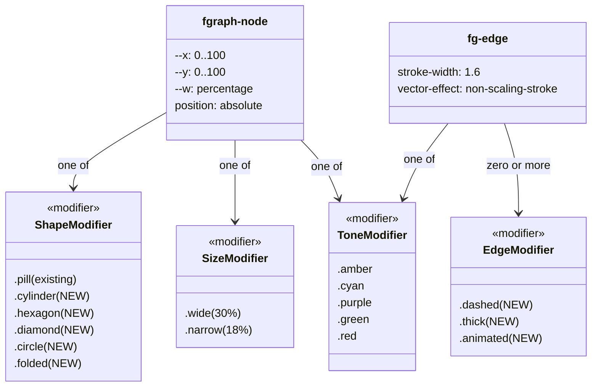
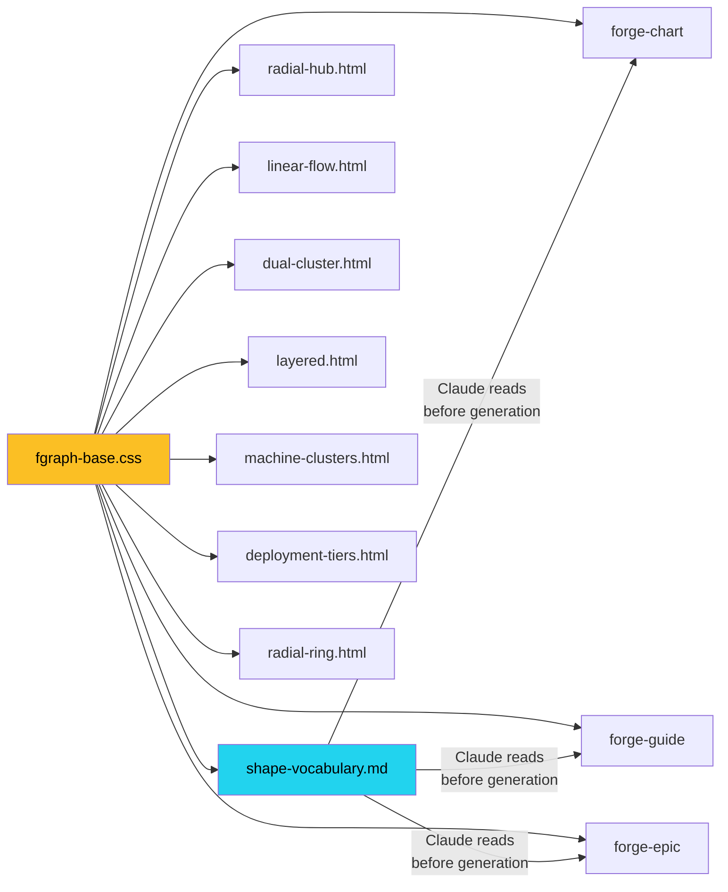

## Context

Promoted from [frame #95](../frames/95-fgraph-shape-primitives-frame.mdx). Analysis skipped (F-lite — single domain, known CSS patterns).

## Goal

Make fgraph nodes visually self-documenting by adding semantic shape modifiers (`.cylinder`, `.hexagon`, `.diamond`, `.circle`, `.folded`) and arrow modifiers (`.dashed`, `.thick`, `.animated`) as CSS primitives in `fgraph-base.css`, composable with all existing tones, content elements, and templates.

## Users

- **Primary:** Claude (forge-chart, forge-guide, forge-epic) — selects shape modifier based on node semantics during diagram generation
- **Secondary:** Mickael — reads generated diagrams, expects visual distinction at a glance

## Expected Behavior

1. Author writes `
` — node renders as a hexagon with amber tone, same content (title, sub, pill) inside
2. Author writes `<path class="fg-edge amber dashed" ...>` — arrow renders dashed with amber color
3. All 5 shapes × 5 tones = 25 combinations render correctly
4. All 3 arrow modifiers × 5 tones + `.dim` = 18 combinations render correctly
5. Hover states (border glow, translateY) work on all shapes
6. Light/dark theme toggle works on all shapes (CSS tokens inherited)
7. Claude reads `shape-vocabulary.md` during generation → picks the right shape for each node type

## Data Model & Consumers

### CSS class hierarchy

### Consumer map

### Consumer summary

| Consumer | What it uses | When | Status |
|----------|-------------|------|--------|
| `forge-chart` SKILL.md | Shape names in topology decision table | During diagram generation | This issue |
| `graph-templates/README.md` | Shape vocabulary section | Reference during authoring | This issue |
| `shape-vocabulary.md` | Full semantic mapping | Claude reads before picking shapes | This issue (new file) |
| All 7 graph templates | Shape classes on `.fgraph-node` | Template fill | This issue (available, not required) |
| `forge-guide`, `forge-epic` | Shapes in embedded diagrams | When guide/epic includes an fgraph | This issue (available via fgraph-base.css) |

## Breadboard

### Affordances

| ID | Element | Location |
|----|---------|----------|
| S1 | `.fgraph-node.cylinder` | fgraph-base.css |
| S2 | `.fgraph-node.hexagon` | fgraph-base.css |
| S3 | `.fgraph-node.diamond` | fgraph-base.css |
| S4 | `.fgraph-node.circle` | fgraph-base.css |
| S5 | `.fgraph-node.folded` | fgraph-base.css |
| A1 | `.fg-edge.dashed` | fgraph-base.css |
| A2 | `.fg-edge.thick` | fgraph-base.css |
| A3 | `.fg-edge.animated` | fgraph-base.css |
| D1 | Shape vocabulary reference | `references/shape-vocabulary.md` |
| D2 | README shape section | `references/graph-templates/README.md` |
| D3 | SKILL.md decision table update | `plugins/forge/skills/forge-chart/SKILL.md` |

### Wiring

| Affordance | Handler / Technique | Data |
|------------|-------------------|------|
| S1 `.cylinder` | `border-radius` top/bottom ellipse + `::before`/`::after` pseudo-elements for caps | Inherits `--bg-card`, tone border-color, tone background-tint |
| S2 `.hexagon` | `clip-path: polygon(25% 0%, 75% 0%, 100% 50%, 75% 100%, 25% 100%, 0% 50%)` | Needs `::before` for tone border (clip-path clips border). Or: outline approach with `drop-shadow` for tone |
| S3 `.diamond` | `clip-path: polygon(50% 0%, 100% 50%, 50% 100%, 0% 50%)` | Wider default `--w` to compensate for diagonal text area. Needs same border trick as hexagon |
| S4 `.circle` | `border-radius: 50%; aspect-ratio: 1` | Simplest — border works natively. Centered text via flexbox |
| S5 `.folded` | `clip-path` corner notch or `::after` positioned triangle | Corner fold = top-right triangle with contrasting fill |
| A1 `.dashed` | `stroke-dasharray: 4 3` | Composes with tone + existing stroke-width |
| A2 `.thick` | `stroke-width: 2.8` | Overrides default 1.6 |
| A3 `.animated` | `stroke-dasharray: 8 4; animation: fg-dash 1s linear infinite` | `@keyframes fg-dash { to { stroke-dashoffset: -12 } }` |
| D1 vocab ref | Markdown table: shape → semantic → when to use → example | Read by Claude before generation |
| D2 README | Add "Shape vocabulary" section after "Primitives" table | Links to D1 for full reference |
| D3 SKILL.md | Add shape guidance row in Phase 2 topology table | Claude picks shape when generating fgraph nodes |

### clip-path border problem

`clip-path` clips everything including `border`. Two approaches:

| Approach | Pros | Cons |
|----------|------|------|
| **A. `drop-shadow` filter** | Simple, 1 line per tone | Shadow ≠ true border, no hover border-width change |
| **B. Nested `::before` with slightly larger clip** | True border appearance, hover works | More CSS (~3 lines per shape) |
| **C. SVG background shape** | Pixel-perfect | Breaks pure-CSS constraint |

**Recommendation: B** — `::before` pseudo-element with the same clip-path, `inset: -2px`, filled with tone color, behind content. On hover, `inset: -3px` simulates border-width increase. Consistent with existing `.fgraph-node:hover { border-width: 2px }` pattern.

## Slices

| # | Slice | Affordances | Demo |
|---|-------|-------------|------|
| 1 | Circle + arrow modifiers | S4, A1, A2, A3 | Circle node with dashed/thick/animated arrows in radial-hub — simplest shape validates the full pattern |
| 2 | Hexagon + diamond (clip-path shapes) | S2, S3 | Hexagon agent + diamond decision node — validates clip-path border technique |
| 3 | Cylinder + folded (pseudo-element shapes) | S1, S5 | Cylinder DB + folded config node — validates pseudo-element approach |
| 4 | Documentation | D1, D2, D3 | Claude can read vocab ref and pick shapes during generation |

## Success Criteria

- [ ] `.fgraph-node.cylinder` renders with top/bottom ellipse caps, all 5 tones, hover glow
- [ ] `.fgraph-node.hexagon` renders as 6-sided polygon with tone border via `::before`, hover works
- [ ] `.fgraph-node.diamond` renders as rotated square with wider default width, tone border, hover
- [ ] `.fgraph-node.circle` renders as circle with `aspect-ratio: 1`, tone border, hover
- [ ] `.fgraph-node.folded` renders with corner notch, tone border, hover
- [ ] `.fg-edge.dashed` renders dashed stroke, composes with all tones
- [ ] `.fg-edge.thick` renders thicker stroke (2.8), composes with all tones
- [ ] `.fg-edge.animated` renders moving dash animation, composes with all tones
- [ ] All shapes display `.fgraph-title`, `.fgraph-sub`, `.fgraph-pill` content correctly
- [ ] Light/dark theme toggle works on all shapes (CSS token inheritance)
- [ ] `shape-vocabulary.md` documents all shapes with semantic mapping and when-to-use
- [ ] `graph-templates/README.md` includes shape vocabulary section
- [ ] `forge-chart/SKILL.md` topology table updated with shape guidance
