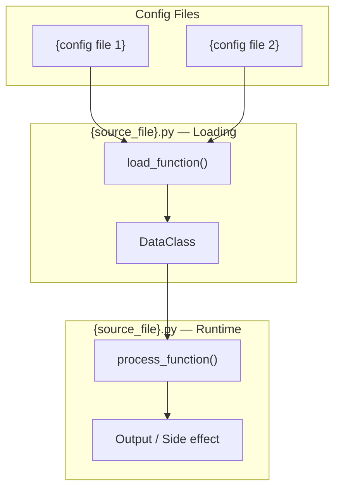
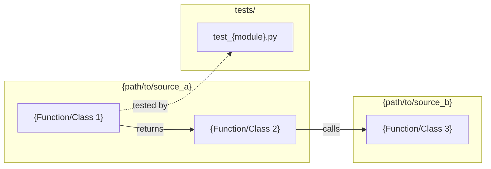

## Summary

{1-2 sentence overview of the feature and implementation approach}

## Architecture

### Data Flow

### File x Function Map

## Bootstrap Context

{Conclusions and selected shape from artifacts/analyses/{issue}-*.mdx, if exists. Omit section if no analysis.}

## Agents

| Agent | Task count | Files |
|-------|-----------|-------|
| {agent} | {N} | {comma-separated file list} |

## Wave Structure

{N} waves, max {K} parallel agents. Elapsed ~{X} weeks vs ~{Y} sequential.

| Wave | Trigger | Agents | Tasks |
|------|---------|--------|-------|
| 1 | start | {K} ∥ | {agent-A}: T{n} · {agent-B}: T{m} |
| 2 | Wave 1 done | {K} ∥ | {agent}: T{n}+T{m} |

## Consistency Report

- Criteria covered: {N}/{total}
- Uncovered criteria: {list or "none"}
- Tasks without spec backing: {list or "none"}
- Gold plating exemptions applied: {count}

## Micro-Tasks

{In fallback mode (no Breadboard/Slices), replace Slice headings with criteria groupings: ### Criteria SC-1: {description}, ### Criteria SC-2: {description}, etc.}

### Slice V1: {Description}

#### Task 1: {Description} [P] → {agent}
- **File:** {path}
- **Snippet:** `{code skeleton}`
- **Verify:** `{command}` ({ready|deferred|manual})
- **Expected:** {output}
- **Time:** {N} min
- **Difficulty:** {1-5}
- **Traces:** {SC-N, U1->N1->S1}
- **Phase:** {RED|GREEN|REFACTOR}

#### Task 2: {Description} → {agent}
- **File:** {path}
- **Snippet:** `{code skeleton}`
- **Verify:** `{command}` ({ready|deferred|manual})
- **Expected:** {output}
- **Time:** {N} min
- **Difficulty:** {1-5}
- **Traces:** {SC-N}
- **Phase:** {RED|GREEN|REFACTOR}

#### RED-GATE: RED complete V1 → tester
- **Verify:** All test tasks for V1 marked complete
- **Phase:** RED-GATE

> **Pre-#283:** The orchestrator manages RED-GATE ordering by spawning GREEN agents only after the tester completes RED tasks for each slice. Post-#283: Agents check the sentinel task status directly via TaskList.

### Slice V2: {Description}

...

## Task Seeding Blueprint

<!-- Used by /implement to seed TaskCreate calls on session start.
     Format: T{n} | agent-instance | blockedBy | subject
     blockedBy refs T-numbers within this list (not session task IDs).
     Agent instances are named (tester-A/B, backend-dev-A/B/C, devops-A/B)
     so parallel tasks map to distinct spawned agents.
     Seed in wave order; within a wave all rows are parallel (∥). -->

### Wave 1 — no deps, {K} agents ∥

| Task | Agent instance | blockedBy | Subject |
|------|---------------|-----------|---------|
| T1 | tester-A | — | {subject} |
| T2 | backend-dev-A | — | {subject} |

### Wave 2 — after Wave 1, {K} agents ∥

| Task | Agent instance | blockedBy | Subject |
|------|---------------|-----------|---------|
| T3 | devops-A | T2 | {subject} |
| T4 | tester-A | T3 | {subject} |
