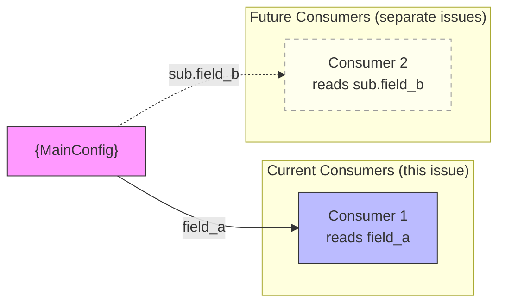

# Spec Templates

Let: N := issue number | τ := tier

Templates used by the spec skill for document generation.

## Spec Document Template

```mdx
---
title: "{title}"
description: "{one-line description}"
---

## Context

**Promoted from:** [{analysis title}]({relative path to analysis})
**GitHub issue:** #{N}

## Goal

{one sentence — what this builds and why}

## Users

{who is affected — role + workflow context}

## Expected Behavior

{narrative walkthrough from user perspective}

## Data Model & Consumers

### Data Structure

```mermaid
classDiagram
    class {MainConfig} {
        <<frozen>>
        +field_a: type
        +sub: SubConfig
    }

    class SubConfig {
        <<frozen>>
        +field_b: type
    }

    {MainConfig} *-- SubConfig
```

### Consumer Map



**Legend:** Solid = this issue. Dashed = future consumers.

| Consumer | Fields consumed | When | Status |
|----------|----------------|------|--------|
| Consumer 1 | field_a | {trigger} | This issue |
| Consumer 2 | sub.field_b | {trigger} | Future |

## Breadboard

### {Affordance Group 1}

| ID | Element | Handler | Data |
|----|---------|---------|------|
| U1 | {UI element} | {code handler} | {data store} |
| N1 | {API endpoint} | {controller} | {model} |
| S1 | {service/event} | {handler} | {store} |

### Wiring

{How IDs connect — e.g. "U1 triggers N1 which writes to S1"}

## Slices

| # | Name | Scope (IDs) | Demo criteria |
|---|------|-------------|---------------|
| 1 | {slice name} | U1, N1, S1 | {what you can demo} |
| 2 | {slice name} | U2, N2 | {what you can demo} |

## Success Criteria

- [ ] {binary criterion — passes or fails, no ambiguity}
- [ ] {binary criterion}
- [ ] {binary criterion}

## Open Questions

{Any [NEEDS CLARIFICATION: description] items unresolved. Max 5. Must resolve before /plan.}
```
