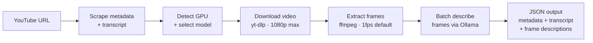

# web-intel

Multi-platform URL scraper and content analysis engine for Claude Code. Extracts structured content from Twitter/X, GitHub, YouTube, Reddit, and any webpage — then powers 8 analysis skills on top. Includes a headless-Chromium stealth fallback for anti-bot protected sites, full-page screenshots for visual critiques, and a video frame analysis pipeline with two-pass VLM classify + deep-OCR for deep visual understanding of YouTube videos.

## Skills

| Skill | Trigger | What it does |
|-------|---------|-------------|
| `/scrape <url>` | "scrape", "fetch url" | Raw structured extraction — returns JSON with content, metadata, platform-specific fields |
| `/summarize <url>` | "summarize url", "tldr" | Scrape → concise summary (key points, takeaways, who/what/why) |
| `/analyze-url <url>` | "analyze url", "deep dive url" | Scrape → deep analysis (fixed schema: tech stack, architecture, business model, competitive positioning) |
| `/explain <url> [prompt\|--concept\|--digest\|--steelman\|--compare]` | "explain url", "steelman", "digest url" | Scrape → apply custom prompt or preset (concept explainer · digest · steelman · compare two URLs) |
| `/roast <url>` | "roast", "critique site" | Scrape + screenshot → brutally honest critique (design, UX, copy, performance, a11y) |
| `/benchmark <url>` | "benchmark", "compare with" | Scrape + screenshot → compare against current repo (features, UI, stack, auth, UX). Gap report |
| `/adapt <url>` | "adapt", "inspire from" | Scrape → extract what works → suggest how to adapt patterns/copy/design for your project |
| `/video-analyze <url>` | "video analyze", "vlm video" | Scene-detect frames → two-pass VLM (classify → deep-OCR) → frame descriptions + OCR derivatives (text frames · terms · top-dense · digest) |

## Supported Platforms

| Platform | URLs | Key Fields |
|----------|------|------------|
| Twitter/X | x.com, twitter.com | text, author, thread reconstruction, articles |
| GitHub | github.com | README, stars, forks, language, topics |
| YouTube | youtube.com, youtu.be | title, description, author, view/like counts, upload date, duration, tags, categories, chapters, transcript (with timestamps) |
| Reddit | reddit.com, redd.it | post, top comments, score, subreddit |
| Webpage | any HTTP(S) URL | extracted article text, title, author, metadata |

## Prerequisites

- Python 3.11+
- [uv](https://docs.astral.sh/uv/) package manager

Optional — per-platform:
- `gh` CLI (for GitHub repo scraping)
- `playwright` + `playwright-stealth` (for X articles, `/scrape` stealth fallback, and `/roast`/`/benchmark` screenshots): `uv sync --extra twitter && uv run playwright install chromium`
- `yt-dlp` + `youtube-transcript-api` (for YouTube rich metadata + transcripts): `uv sync --extra youtube`
- `trafilatura` (for generic webpage extraction): `uv sync --extra scraper`

Optional — video analysis pipeline:
- `ffmpeg` — frame extraction: `sudo apt install ffmpeg`
- `ollama` — local VLM inference: [ollama.com](https://ollama.com/)
- NVIDIA GPU with `nvidia-smi` — required for VLM acceleration (2GB VRAM minimum)

## Setup

```bash
cd plugins/web-intel
uv sync --extra all                    # Install all optional dependencies
uv run playwright install chromium     # Required for X articles, stealth fallback, screenshots
```

## Doctor

Check that all dependencies are installed and working:

```bash
cd plugins/web-intel
uv run python scripts/doctor.py
```

The doctor checks:

**Core** (required): Python >= 3.11, uv, requests, httpx, filelock

**Optional** (per-platform):
- `trafilatura` — generic webpage extraction
- `playwright` + chromium — Twitter/X articles
- `yt-dlp` — YouTube rich metadata (description, view/like counts, upload date, tags, chapters, subtitles)
- `youtube-transcript-api` — YouTube transcripts (fallback when yt-dlp has no subtitles)
- `gh` CLI — GitHub repos and gists

**Video Analysis** (frame-by-frame descriptions):
- `ffmpeg` — video frame extraction
- `ollama` — local VLM inference server
- NVIDIA GPU — VLM acceleration (reports GPU name, total VRAM, free VRAM)

Doctor runs automatically on first use of any web-intel skill in a session. Run it manually at any time to diagnose issues.

## Usage

### CLI — Scraper

```bash
cd plugins/web-intel
SSL_CERT_FILE=/etc/ssl/certs/ca-certificates.crt uv run python scripts/scraper.py <url>
```

### CLI — Screenshot

Full-page PNG via headless Chromium + playwright-stealth. Used as a fallback by `/roast` and `/benchmark` when the `agent-browser` CLI is not installed.

```bash
cd plugins/web-intel
REQUESTS_CA_BUNDLE=/etc/ssl/certs/ca-certificates.crt uv run python scripts/screenshot.py <url> <output.png>
```

Exit codes: `0` on success (path printed to stdout), `1` on failure (actionable error on stderr).

### CLI — Video Analyzer

Analyze a YouTube video end-to-end: metadata + transcript + frame-by-frame visual descriptions.

```bash
cd plugins/web-intel

# Basic — auto-selects best model for your GPU
uv run python scripts/video_analyzer.py https://youtube.com/watch?v=<id>

# Custom frame rate (0.5 = one frame every 2 seconds)
uv run python scripts/video_analyzer.py https://youtube.com/watch?v=<id> --fps 0.5

# Override model (skip auto-detection)
uv run python scripts/video_analyzer.py https://youtube.com/watch?v=<id> --model qwen3-vl:8b

# Save output to file instead of stdout
uv run python scripts/video_analyzer.py https://youtube.com/watch?v=<id> --output /tmp/analysis.json

# Keep extracted frame files after analysis
uv run python scripts/video_analyzer.py https://youtube.com/watch?v=<id> --keep-frames
```

### CLI — GPU Detector

Check GPU availability and which vision model will be selected:

```bash
cd plugins/web-intel

# Full JSON report: GPU VRAM, Ollama models, selection decision
uv run python scripts/gpu_detector.py

# Quick readiness check (exit 0 if ready, 1 if not)
uv run python scripts/gpu_detector.py --check
```

### As Claude Code Skills

Once installed via the plugin, use any skill directly:

```
/scrape https://github.com/anthropics/claude-code
/summarize https://x.com/user/status/123
/roast https://competitor.com
/benchmark https://competitor.com --focus features
```

## Video Analysis Pipeline

The video analyzer performs a 6-step pipeline to produce a combined JSON output:



**Model selection** is automatic — `gpu_detector.py` queries `nvidia-smi` for free VRAM and picks the best `qwen3-vl` variant that fits:

| Model | Min VRAM | Quality |
|-------|----------|---------|
| `qwen3-vl:32b` | 20 GB | best |
| `qwen3-vl:8b` | 6 GB | high |
| `qwen3-vl:4b` | 3.5 GB | good |
| `qwen3-vl:2b` | 2 GB | basic |

Selection priorities:
1. Model already loaded in Ollama VRAM — zero extra memory cost, used immediately
2. Best already-pulled model that fits in free VRAM
3. Best model that fits (will be auto-pulled)

**Output schema:**

```json
{
  "url": "...",
  "pipeline": "web-intel/video-analyzer",
  "success": true,
  "model": "qwen3-vl:8b",
  "model_selection": { "quality": "high", "already_loaded": false, ... },
  "metadata": { "title": "...", "transcript": [...], ... },
  "extraction": { "frame_count": 120, "fps": 1.0 },
  "frame_descriptions": [
    { "frame": 1, "second": 0, "timestamp": "0:00", "description": "..." },
    ...
  ],
  "stats": { "total_frames": 120, "described": 118, "failed": 2, "avg_inference_ms": 340 }
}
```

## Architecture

```
scripts/
├── scraper.py           # Main entry point — URL routing + CLI
├── screenshot.py        # Full-page PNG CLI — Playwright + stealth (fallback for /roast, /benchmark)
├── doctor.py            # Dependency checker — core + optional + video status report
├── video_analyzer.py    # Video frame analysis pipeline — download → extract → describe
├── gpu_detector.py      # GPU/Ollama detection + qwen3-vl model selection
├── fetchers/            # Platform-specific extractors
│   ├── base.py          # Abstract base class + shared utilities
│   ├── stealth.py       # Headless-Chromium anti-bot fallback (reused by generic.py)
│   ├── twitter/         # Twitter/X (syndication API + FxTwitter + Playwright for articles)
│   ├── github.py        # GitHub (gh CLI)
│   ├── gist.py          # GitHub Gists (gh API)
│   ├── youtube.py       # YouTube (yt-dlp primary; oEmbed + transcript API fallback)
│   ├── reddit.py        # Reddit (JSON API)
│   └── generic.py       # Any webpage (Trafilatura + stealth fallback + metadata-only fallback)
├── utils/
│   └── url_detector.py  # URL type detection for routing
└── _shared/             # Vendored security + caching utilities
    ├── content_cache.py # File-based response cache (~/.cache/roxabi/scraper)
    ├── fetch_base.py    # SSRF-protected HTTP fetch
    ├── validators*.py   # URL, SSRF, subprocess validation
    ├── sanitizers.py    # HTML/Markdown XSS sanitization
    ├── retry.py         # Exponential backoff for transient errors
    └── timeouts.py      # Configurable timeout management
```

## Fetch strategy (generic webpages)

The generic fetcher runs a three-step chain, each step falling through only on failure:

```
1. Fast path   — safe_fetch (plain HTTPS) + Trafilatura extraction
         │
         │  anti-bot signature? (HTTP 403/429/503 · Cloudflare markers · <50 chars)
         ▼
2. Stealth     — headless Chromium + playwright-stealth + Trafilatura
         │
         │  still nothing extractable?
         ▼
3. Metadata    — synthesize text from Open Graph / Twitter Card tags
                 (for SPAs with empty bodies but rich meta tags)
         │
         ▼  final failure
   Error message concatenates every attempted step:
     "HTTP 403 · stealth retry fetched the page but extracted only 0 chars"
     "HTTP 503 · stealth retry failed: playwright not installed — install with …"
```

**Non-silent errors:** every failure mode surfaces its root cause. Stealth failures (missing dep, SSRF block, timeout, still-CF-blocked) are appended to the fast-path reason via `·` so the caller sees the full story, not just `HTTP 403`.

**When stealth does NOT fire:** genuine 5xx errors (500), DNS failures, connection errors — these aren't bot-protection signals and get the plain error. See `tests/test_generic_fallback.py::TestStealthSkipped`.

**Turnstile note:** the stealth fallback only bypasses plain-TLS / headless-fingerprint heuristics. It does *not* solve Cloudflare Turnstile challenges — if a site is still gated after the retry, the final error says so.

## Testing

```bash
cd plugins/web-intel
uv run --with pytest pytest tests/ -v
```

Coverage highlights:
- `test_generic_fallback.py` — pins the fast → stealth → meta chain against every branch, including the 5xx retry-exhausted regression (see commit `7f58dbd`)
- `test_stealth.py` — anti-bot signature detection (every CF marker, every status code, edge cases) + tuple contract for `fetch_html_stealth`
- `test_screenshot.py` — graceful degradation when Playwright is absent + CLI exit codes

## Cache

Responses are cached at `~/.cache/roxabi/scraper/` with configurable TTLs:
- Metadata: 1 hour
- Content: 24 hours

Configure via environment variables: `CACHE_DIR`, `CACHE_TTL_CONTENT`, `CACHE_ENABLED`.

## Security

- SSRF protection on all outbound requests
- Content size limits (5MB default)
- HTML/Markdown XSS sanitization on all extracted content
- URL shortener resolution with redirect limits
- No credentials stored from scraped sites
